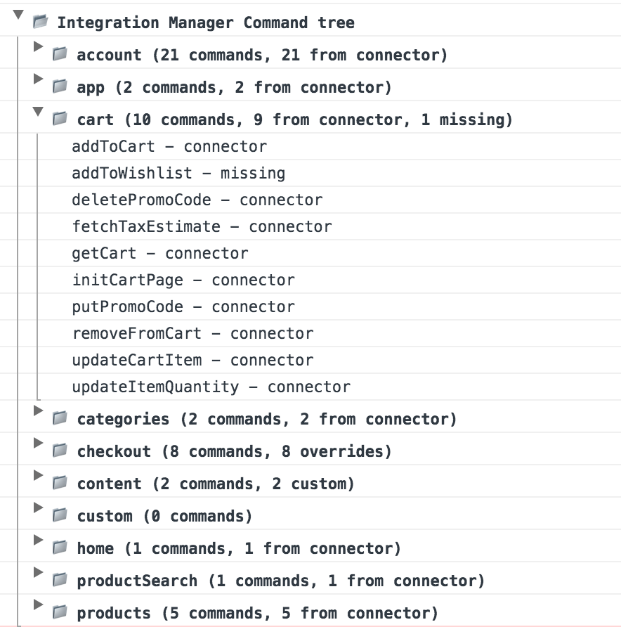

This guide is for projects upgrading from version 0.24.1 of the Progressive Web SDK, which did not have a separate Integration Manager module.

In the January 2018 release of the `progressive-web-sdk`, the Integration Manager v0.4 was released with
several breaking changes that improve the extensibility and usability.

## The NPM Package

Integration Manager is now available as a separate NPM package:
[mobify-integration-manager](https://www.npmjs.com/package/mobify-integration-manager).
Previously, it was a part of Mobify's Progressive Web SDK. By extracting the
Integration Manager into a separate module, we can provide developers with a
clear upgrade path without worrying about Progressive Web SDK breaking changes.

### Installation

To start using Integration Manager v0.4, you will need to install it in your
project:

```sh
npm install --save mobify-integration-manager
```

### Importing

With Integration Manager v0.4, you will need to update the import paths in your
project, for example:

```js
// Previous version
import { getCart } from "progressive-web-sdk/dist/integration-manager/cart/commands"

// New Integration Manager v0.4
import {IntegrationManager} from "mobify-integration-manager/dist/"
```

Note that you no longer need to import individual commands, import the
Integration Manager object instance instead.

## Integration Manager Object Instance

We've made significant changes to improve the accessibility of the Integration
Manager API. The Integration Manager command tree is exposed by a JavaScript
object instance. Integration Manager will construct the object by gathering
available commands from your choice of ecommerce connector ([Salesforce Commerce
Cloud](../../../resources/ecommerce-integrations/integrating-sfcc), [SAP Hybris](../../../resources/ecommerce-integrations/integrating-hybris) or custom
connector) and your Integration Manager extension.

### Initialization

To initialize the Integration Manager instance, use the Integration Manager's
`initialize` method. Here is an example of how to initialize with the
[Salesforce Commerce Cloud](../../../resources/ecommerce-integrations/integrating-sfcc) connector:

```js
import IntegrationManager from "mobify-integration-manager/dist";
import {Connector} from "mobify-integration-manager/dist/connectors/sfcc";

IntegrationManager.initialize(
  Connector({
    /* Salesforce Connector configuration */
  })
);
```

### Usage

To dispatch an Integration Manager command, you can access the commands through
Integration Manager instance:

```js
// Previous version
import { getCart } from "progressive-web-sdk/dist/integration-manager/cart/commands";
dispatch(getCart());

// New Integration Manager v0.4
import IntegrationManager from "mobify-integration-manager/dist/";
dispatch(IntegrationManager.cart.getCart());
```

Integration Manager commands are organized into branches or "command sets". The
built-in command sets are listed below.

* account
* app
* cart
* categories
* checkout
* home
* productSearch
* products

### Override/Custom Commands

To override an existing command or add a new custom commands, simply provide an
extension object to the `initialize` method. If you want to override an specific
command, use the same branch name and command name.

```js
import IntegrationManager from "mobify-integration-manager/dist/";
import { Connector } from "mobify-integration-manager/dist/connectors/sfcc";

const extension = {
  // Override the existing getCart command in cart branch
  cart: {
    getCart: () => (dispatch) { /* implementation */ }
  },
  // New custom commands
  customCommandSet1: { customCommand1, customCommand2 },
  customCommandSet2: { customCommand3, customCommand4 }
};

IntegrationManager.initialize(
  Connector({
    /* Salesforce Connector configuration */
  }),
  extension
);
```

To use override or custom commands, simply access the Integration Manager
instance just like the way you use built-in commands.

```js
import IntegrationManager from "mobify-integration-manager/dist/";
dispatch(IntegrationManager.cart.getCart());
dispatch(IntegrationManager.customCommandSet1.customCommand1());
dispatch(IntegrationManager.customCommandSet2.customCommand3());
```

### Debugging

Integration Manager v0.4 provides a debugging option that will output console
logs showing the entire command tree. Pass `{debug: true}` as the third
parameter to `initialize`.

```js
import IntegrationManager from "mobify-integration-manager/dist/";
import { Connector } from "mobify-integration-manager/dist/connectors/sfcc";

IntegrationManager.initialize(
  Connector({
    /* Salesforce Connector configuration */
  }),
  extension,
  { debug: true }
);
```

Here is an example of what to expect in your console when the app starts up or
when `console.log(IntegrationManager)`:


<figure class="u-text-align-center" style="background-color: #fafafa;">

  

</figure>

There are several "decorations" in the console output:

- `connector` - the command implementation comes from the configured connector
- `missing` - the command implementation is missing. You should update your
  connector or provide an implementation in your extension.
- `custom` - the command is a custom command that is not part of the core
  Integration Manager API
- `override` - the command comes from the extension and overrides the configured
  connector's implementation
- `deprecated` - the command is deprecated and should not be used. If you dispatch
  a deprecated command, you will receive console warning and a short message
  regards to how to upgrade the command

## Integration Manager API Update

We are in the process of deprecating "page" related commands with pure eCommerce
Network commands for easier customization. If you have custom implementations
(overrides) of any of these `init*Page` commands (listed below), you should move
the logic into the appropriate `actions.js` file in the container folders of the
project. Only use Integration Manager commands to populate data that is
retrieved from the back-end.

#### Account

**Deprecated commands**:

* initLoginPage
* initRegisterPage
* initAccountDashboardPage
* initAccountInfoPage
* initWishlistPage
* initAccountAddressPage
* initAccountOrderListPage
* initAccountViewOrderPage

**New commands**:

* getAccountInfo
* getWishlist
* getSavedAddresses
* getOrder
* getOrderList

#### Categories

**Deprecated commands**:

* initProductListPage

**New commands**:

* getCategory
* getCategories
