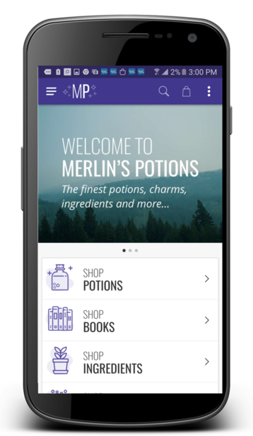
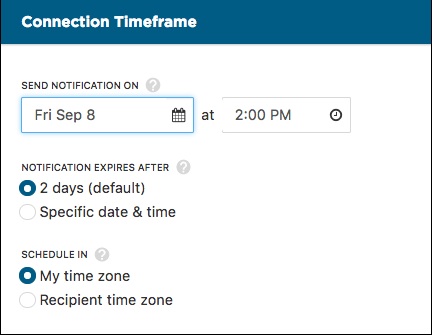
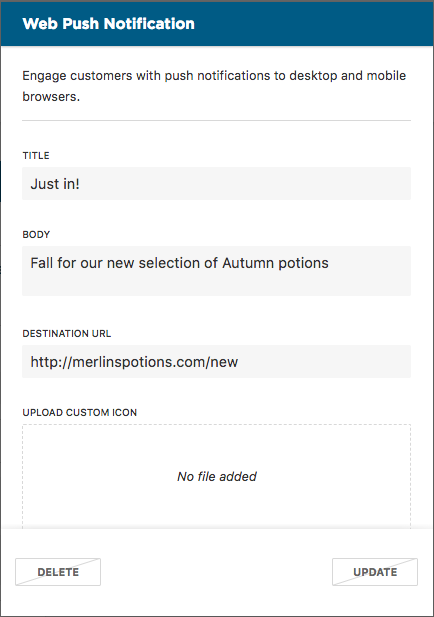
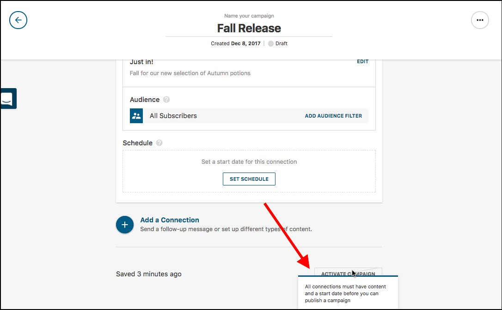

## Progressive Web Apps (PWA)

### Connector for SAP Hybris Commerce
A new [integration to SAP Hybris Commerce](../../resources/ecommerce-integrations/integrating-hybris) is available for developers. This connector aims to significantly reduce the complexity for projects integrating with [SAP Hybris Commerce](https://www.hybris.com/en/products/commerce) version 6 and above by providing an out of the box integration to the Open Commerce Connect APIs.

### Add to Home Screen Enhancements
When launching from the home screen, the browser URL bar disappears to create a native app-like experience. Navigation controls are no longer available in this mode as a result of removing the browser URL bar. To offset this, we've revamped our home screen experience to ensure all navigation functionality is still available.

<figure class="u-text-align-center">

<figcaption>Add to Homescreen mode</figcaption>

</figure>

<figure class="u-text-align-center">

<figcaption>PWA View</figcaption>

</figure>

### SEO Enhancements
PWAs now provide SEO best practices by default. This update includes ensuring important metadata and meta tags are in place, providing product and breadcrumb structured data, and more!

## Accelerated Mobile Pages (AMP)
A new addition into the Mobify platform arrives in the form of Accelerated Mobile Pages. AMP is an open-source technology which aims to quickly serve mobile content and maximize web performance via 3rd party caches. See up to 5x faster landing page load times, and enjoy lower bounce rates on your web apps through this new addition.

## Web Push Notifications

### New Web Push Clients
New web push clients are available for sending web push notifications. The previous web push clients have been deprecated, in favour of lower complexity and ease of setup.

## Developer Enhancements

### Mobify Tag version 8
A new version of the [Mobify tag](../../get-started/getting-started/installation#installing-the-mobify-tag) is available for projects, bringing us up to version 8 of our Mobify tag. The changes we've made in this version of the tag improve load times of the mobile experience, minimize the necessity for Mobify tag updates within projects, and aim to reduce code complexity and improve readability.

### Platform Generator
A new platform generator is available for teams starting new projects, which enables the generation of a new project repository that contains all of the features of the Mobify platform. Prior to the release of the platform generator, individual generators were needed for each major components of the Mobify platform. The new generator setup should reduce project setup times

## Connection Center

### UX Improvements
We've updated the design in Connection Center to add clarity in areas that our users often had questions about.
- For customers using Google Analytics, the option to include UTM parameters for your push notifications is now set once at a business level. This means you no longer need to check "Add UTM Parameters" with every message you send out.
- Our users were often unsure how long to set the expiry time for a push notification. We've added a default option of 2 days as a recommendation based on what we've seen in the past.

<figure class="u-text-align-center">

<figcaption>Schedule Push Notification</figcaption>

</figure>

- You will now see a radio button with two options for the timezone to send push notifications in. The goal of this change is to clarify exactly when your notification will be sent to your subscribers.
- You can now review the configurations for campaigns that are running or completed. Previously, you could see a summary of information, but now you can open up a read only view to see all configuration options filled out.

<figure class="u-text-align-center">

<figcaption>View Only Campaign</figcaption>

</figure>

- You will now find additional tooltips throughout campaign creation flow. Hovering over text and buttons will provide addition information to clarify configuration options and actions.

<figure class="u-text-align-center">

<figcaption>Hover Tooltip</figcaption>

</figure>

## Analytics

### PWA event tracking
By default, new Mobify projects will automatically track events important to monitor and improve the health of deployments. New events now available include:
- Tracking of add to home screen behavior
    - Tracking when add to home screen prompts appear
    - Tracking when users add to home screen
    - Tracking when users launch from the home screen
    - Tracking when users convert after launching from home screen
- Tracking of offline mode behavior
    - Tracking how long a user was offline for
    - Tracking pages users visit while offline
- Tracking of [Share component](../../apis-and-sdks/component-library/components/Share) behavior
    - Tracking what type of sharing a user performs
