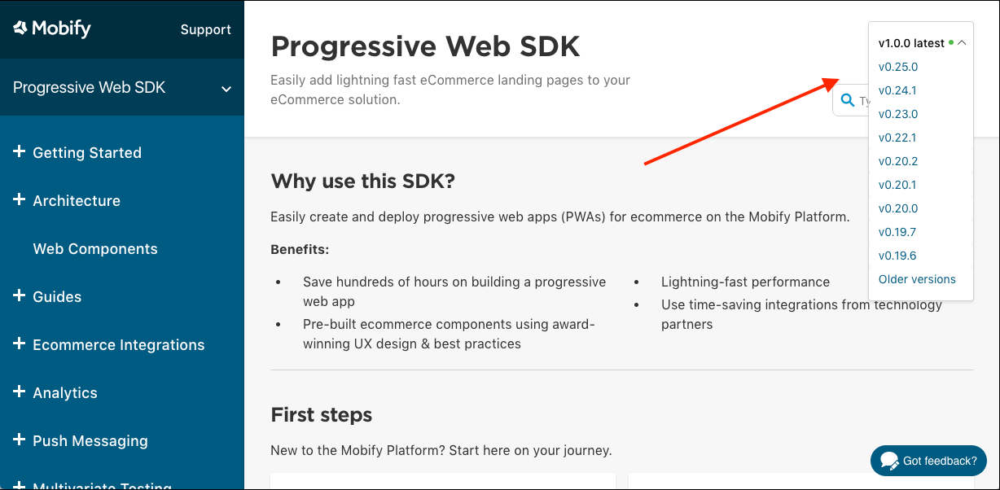
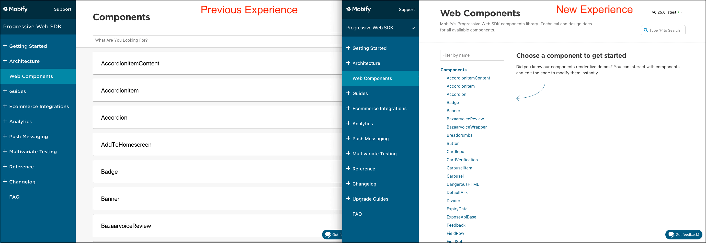
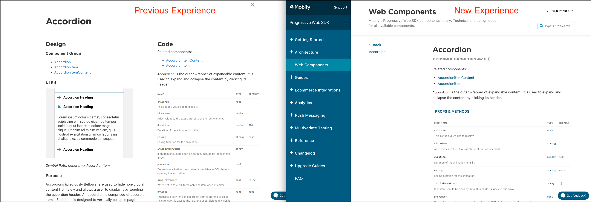

Features

### Progressive Web Apps

#### Samsung Internet support
We're constantly monitoring the browsers that people are using around the world. [Samsung Internet](https://play.google.com/store/apps/details?id=com.sec.android.app.sbrowser&hl=en), a browser which ships as the default browser for Samsung Android devices continues to hold a sizable market share ([5% worldwide](http://gs.statcounter.com/browser-market-share/mobile/worldwide)), especially in certain regions like Europe ([8%](http://gs.statcounter.com/browser-market-share/mobile/europe)). In an effort to maximize the potential reach for all of our customers Progressive Web Apps, we're officially adding support for Samsung Internet v4 and up. By default, Samsung Internet support is turned off. See our [instructions](../../get-started/faq/#browser-support) for context and details on how to enable Samsung Internet.

#### React 16
The Mobify platform provides the latest and greatest technologies and tools for developers to use. To stay true to that, we've upgraded our Progressive Web App SDK to use the latest version of React. [React 16 offers plenty of new improvements](https://reactjs.org/blog/2017/09/26/react-v16.0.html) over its predecessor:
- [Reduced file size](https://reactjs.org/blog/2017/09/26/react-v16.0.html#reduced-file-size)
- New features in [fragments](https://reactjs.org/blog/2017/09/26/react-v16.0.html#new-render-return-types-fragments-and-strings) and [portals](https://reactjs.org/blog/2017/09/26/react-v16.0.html#portals)
- [Support for custom DOM attributes](https://reactjs.org/blog/2017/09/26/react-v16.0.html#support-for-custom-dom-attributes)
- [Improved error handling](https://reactjs.org/blog/2017/09/26/react-v16.0.html#better-error-handling)
- [Improved server-side rendering](https://reactjs.org/blog/2017/09/26/react-v16.0.html#better-server-side-rendering)

To upgrade your Progressive Web App project to use React 16, refer to our [documentation](../../how-to-guides/categories/upgrades/react-16).

### Accelerated Mobile Pages

#### React 16
Along with the Progressive Web SDK, we've also upgraded our AMP SDK to React 16. [React 16 offers plenty of new improvements and features](https://reactjs.org/blog/2017/09/26/react-v16.0.html), and is also required in order to leverage [amp-bind](https://www.ampproject.org/docs/reference/components/amp-bind), an AMP component that enables interactive AMP pages. Interactive AMP pages via amp-bind is a feature we'll be releasing as part our next release. With amp-bind, AMP pages will be enabled to support user actions that were previously impossible like enabling product option selection and viewing more products directly on AMP. Customers interested in leveraging interactive AMP pages should look to upgrade to a React 16 compatible version of the Mobify platform. To upgrade your AMP project to use React 16, refer to our documentation.

### Platform Integrations
#### Accelerated Mobile Pages for Saleforce Commerce Cloud
When launching AMP pages on Salesforce Commerce Cloud, a new Mobify Integration cartridge is available to automatically generate AMP links in the HTML returned by SFCC, as well as set specific Products and Categories to be excluded from AMP via the Business Manager. Instructions are provided in the integration guide included in the cartridge. The cartridge is valiable upon request via your Customer Success Manager, and will be available shortly via the [LINK marketplace](https://www.demandware.com/link-marketplace/mobify).

Updates

### Platform

#### Mobify Platform Documentation

We've updated our documentation site to improve your experience searching & reading articles to help with your Mobify project.

- **Site search**. We’ve improved our indexing and the UI for search! Type “f” on any docs page, and you’ll be brought into the search bar. We’ve also improved the search rules, adding synonyms and acronyms along with a rating to put your most desired articles first.
- **Mobile friendly**. At Mobify, we know the importance of a great experience on mobile. We’ve improved the Mobify Platform Documentation on mobile to help you browse, search and scroll through articles on your phone.
- **Versioning**. You can now select which version of a feature you’d like to see docs for. So if you’re working on a project using an older version of PWA or AMP, you'll know the instructions and information are relevant to your project.

<figure class="u-text-align-center">
    

        
    

    <figcaption>Version Picker</figcaption>
</figure>

- **Feedback**. How does Mobify ensure our partners love developing on our platform? By asking you! We love hearing your feedback and want to make it easy for you to provide feedback in the moment. To help, we've added an area on all documentation articles to jot down a quick thought, then continue on your current task. The feedback goes to our Product Management team and is shared with others at Mobify to brainstorm what we can do about it. You can also access the form through out [feedback portal page](../../get-started/support/feedback)

<figure class="u-text-align-center">
    

        
    

    <figcaption>Feedback Modal</figcaption>
</figure>

- **Component Documentation Update**. We've updated the look and feel for both our AMP and PWA component documentation.
We've introduced parent sections to the component list. This allows us to separate the components from the templates and design patterns. We've also moved from displaying component cards to a simplified text list. The simplified text list should reduce the amount of scrolling required to find components.

    

We also received feedback that we could improve transitioning between the component list view to the detailed component view. We're now maintaining the column layout to allow easier access between components. The design documentation has been moved below the code documentation to give developers a more focused view on the content they're most interested in.

    

Bug Fixes

* Various fixes to the PWA SDK. 
* Various fixes to the Integraton Manager. 
