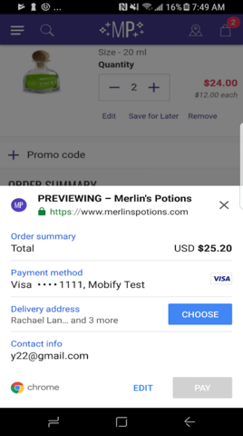

Features

### Progressive Web Apps

#### Payment Request API
We’ve added support for Payment Request API, a [W3C standard](https://www.w3.org/TR/payment-request/) candidate meant to eliminate checkout forms. Traditional checkout forms are typically difficult to use, slow, and require multiple steps to complete. Eliminate all these pains for your shoppers by providing them a standardized one step checkout through the Payment Request API. The API is [currently supported](https://caniuse.com/#feat=payment-request) on Chrome for Desktop and Android, Microsoft Edge, and Samsung Internet, with support coming soon for Safari and iOS Safari.

We’ve built a reference implementation for developers to leverage. Existing projects should generate a new project to view the reference implementation or refer to our [documentation](../../how-to-guides/categories/guides/payments#payment-request-api).

<figure class="u-text-align-center" style="background-color: #fafafa;">

</figure>

### Accelerated Mobile Pages

#### Dynamic AMP Pages
Traditionally, AMP pages were very static in nature and had little to no dynamic elements within them due to AMP component limitations. [amp-bind](https://www.ampproject.org/docs/reference/components/amp-bind) is a new AMP component that unlocks the ability to add basic interactivity to AMP pages beyond AMP’s pre-built components. With amp-bind, we’re now able to provide a better shopper experience, offering features such as product option selection, add to cart, and add to wishlist directly on AMP. We’ve built in support for leveraging amp-bind into our AMP SDK to enable all of our projects to have interactive and dynamic AMP pages.

<figure class="u-text-align-center" style="background-color: #fafafa;">

</figure>

### Native apps

#### Native App Enhancements
We’ve bolstered our native app framework to better handle integrations with Progressive Web Apps. We added support for synchronizing Redux stores between multiple WebViews. This will help apps which support multiple tabs to remain consistent to the end shopper.

We also want to support our developers by providing them the latest tools to work with. Included in this release is support for xCode 9, iOS 11 SDK, Android Studio v3.0.1, and Gradle v4.6.

Expect more enhancements to be made here in our next upcoming release!

### Integrations

#### Support for Salesforce Mobile-First Reference Architecture
Salesforce Commerce Cloud is rolling out a new Mobile-First Reference Architecture to provide a better starting point for creating new storefronts. To support customers starting on this new reference architecture, a new Mobify cartridge is available that simplifies the setup of the Mobify tag, Service Worker and AMP links. This updated cartridge is compatible with our existing [Salesforce Commerce Cloud connector](../../resources/ecommerce-integrations/integrating-sfcc).

The updated cartridge will be available via the [Link Marketplace](https://www.demandware.com/link-marketplace) when MFRA is released. Customers can contact their Customer Success Manager for early access.

Bug Fixes

* Fixed an issue with our native [Secure Store](http://astro.mobify.com/1.0/api-reference/secure-store/) which was crashing on certain Android devices preventing login credentials to be saved.
