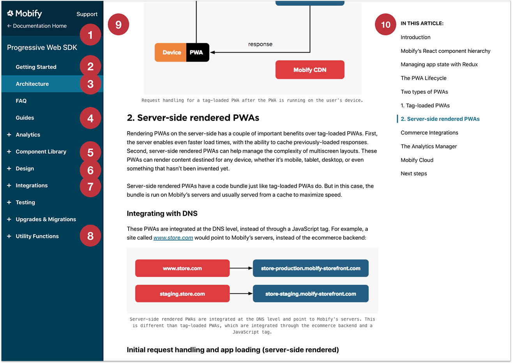
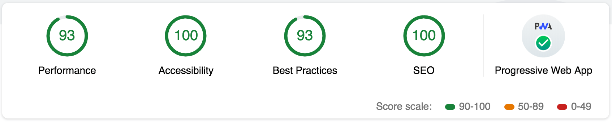

In the 2019 March 28th release, we've made improvements made to Progressive Web Apps, and the New Scaffold (Early Access).

- `progressive-web-sdk @1.9.0`
- `mobify-amp-sdk @1.2.0`
- `mobify-progressive-app-sdk @3.0.5`
- `@mobify/commerce-integrations @1.1.0`

Updates

### Progressive Web Apps (PWA)

#### Documentation Updates

Based on your feedback, we've made a lot of changes to our documentation!

Let's take a look at the changes...

1. **Sidebar navigation**. The categories have been reorganized to put the
   content you care about most on top. We also shrunk the size of the links so
   you can fit more onscreen!
2. **Getting Started page**. All the Getting Started content is now on one
   easy-to-follow page. Also, we updated the installation instructions to cover
   our latest technologies.
3. **Architecture page**. This new overview page will introduce you to all of
   our new technologies, including Server-Side Rendering and Commerce
   Integrations.
4. **Guides**. We added 5 new hands-on guides, including [A/B Testing Your
   PWA](../../how-to-guides/categories/guides/ab-testing) and [Introduction to PWA
   Analytics](../../how-to-guides/categories/guides/pwa-analytics).
5. **Component Library**. Now you can access each component directly from the
   sidebar, and we added the [All Components and
   Templates](../../apis-and-sdks/component-library) page to give you an
   overview of each component's functionality.
6. **Design section**. Stay tuned for more content for designers to be added
   here soon!
7. **Integrations section**. Now contains an overview of Commerce Integrations.
8. **Utility Functions section**. Did you know that the Mobify Platform includes
   more than 100 JavaScript utility functions? Now you can more easily find out
   what functions are available and how to use them.
9. **Redesigned page layout**. We’ve adjusted the colors, layout, and typography
   of our pages to make them easier to read and more accessible.
10. **Table of contents**. Longer articles now feature a table of contents that
    you can access at any time.

#### Component Updates

- Added two new props `imageStyle` and `wrapperStyle` to the
  [`<Image>`](../../apis-and-sdks/component-library/components/Image) component. These two
  props will allow developers to set inline styles on the Image component.

### New Scaffold (Early Access)

#### Lighthouse Tests

[Lighthouse tests](https://developers.google.com/web/tools/lighthouse/) are
Mobify's trusted method of testing the quality of a Progressive Web App (PWA).

We want to provide the best possible starting point, so we improved the
Lighthouse scores for the new scaffold across the board. Before writing any
code, PWA developers will inherit top-tier Lighthouse scores.

<figure class="u-text-align-center">

<figcaption>New Scaffold Lighthouse Scores</figcaption>
</figure>

Lighthouse tests have also been integrated into the new scaffold, to ensure that
developers can maintain the PWA's Lighthouse performance throughout the build.
The tests will run automatically against new code commits on projects built off
the new scaffold.

The baseline scores currently set are:

- **Time to Interactive:** <10000ms
- **PWA:** >90
- **SEO:** 100
- **Accessibility:** 100

These Lighthouse tests are ran through the Mobify Test Framework. Check out our
[Mobify Test Framework
docs](../../how-to-guides/categories/testing/mobify-test-framework) for information on
using the framework and how you can adjust these values.

#### Windows Support

We recognize that a majority of our partner developers are using Windows as
their preferred operating system. To better reflect this in our platform, we've
updated the new scaffold to better support Windows.

Previously, developers had to use Git bash for projects built off the new
scaffold. Now, developers will be able to run and build projects natively,
through CMD.exe.

Bug Fixes

### Progressive Web Apps

- The [`<Nav>`](../../apis-and-sdks/component-library/components/Nav) component would
  previously throw errors if two or more navigation items in the navigation tree
  had the same URL path. We updated the component this release, so that it can
  support duplicate URL paths in its navigation items. The update was done in a
  backwards compatible manner, and doesn't change how a developer should use the
  component.
- We've reworked the animation for the
  [`<SkeletonBlock>`](../../apis-and-sdks/component-library/components/SkeletonBlock) and
  [`<SkeletonInline>`](../../apis-and-sdks/component-library/components/SkeletonInline)
  components to be more performant. Previously, if there were a _lot_ of images
  within a page that used the Skeleton component(s), the application could
  potentially crash.

Known Issues

None!