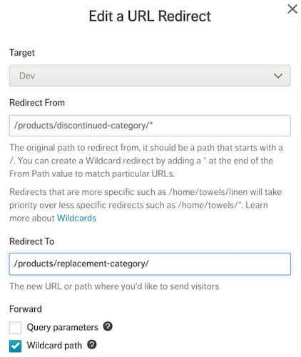
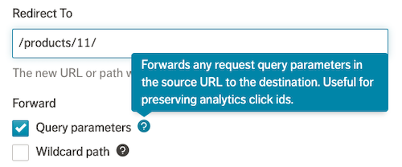
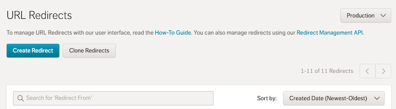
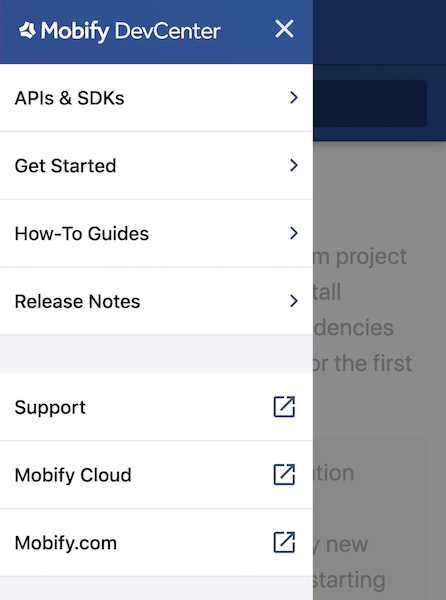

Released on May 28th 2020, corresponding to version [`v2.1.x`](https://www.npmjs.com/package/progressive-web-sdk) of our SDKs.

We’ve followed up the last major [`Version 2.0`](/release-notes/archive/2020-04) SDK release with an action-packed set of enhancements focused on:
- Reducing the number of URL redirects needed, and scaling up our users’ ability to manage large sets of redirects
- Future-proofing deployments by adding support for Node.js 12 for both local development and for production deployments
- Improving our new DevCenter documentation by updating the browsing experience, as well as expanding crucial content
- Improving how PWAs are developed client-side and server-side by improving our usage of React Helmet and server-side libraries

Features

### New features for managing redirects

#### Managing redirects with wildcards
<figure class="u-text-align-center" style="background-color: #fafafa;">

</figure>

Managing a large set of redirects becomes hard to scale for teams with large product catalogs. To address this, we’ve added the ability to use wildcards in redirect rules to shrink the overall number of redirect rules needed by teams. 

You can now use a wildcard to match multiple URLs, forward wildcard paths as part of the redirect, and test redirects. This allows you to handle use cases such as renaming subcategories, renaming products, and discontinuing seasonal categories or products.

More details on how to manage URL redirects are available in [DevCenter](/how-to-guides/categories/design/using-url-redirects). This feature is compatible with both v1.0 and v2.0 of our SDKs.

#### Redirect query parameter forwarding
<figure class="u-text-align-center" style="background-color: #fafafa;">

</figure>

Teams managing redirects may wish to preserve query parameters, such as those needed for tracking analytics for campaigns. In the Mobify Cloud UI, we’ve added the ability to forward query parameters from the incoming URL to form part of the resulting redirect.

#### Redirect only user permissions
A new `Redirector` role is now available when adding or updating project team members. Team members assigned the Redirector role will have the ability to manage redirects across all environments, such as staging and production. They will also have read access to all other functions, such as deployments. 

This new role is intended to allow non-technical team members, such as marketers and merchandisers, the ability to manage redirects without needing to edit project code.

#### Redirect pagination, sorting and searching
<figure class="u-text-align-center" style="background-color: #fafafa;">

</figure>

When managing a large number of redirects, the time taken to find redirects that need an update can be frustrating. We’ve added the ability to paginate and sort through long lists of APIs in both the UI and in the [Mobify Cloud API](https://dev.mobify.com/v2.x/apis-and-sdks/mobify-cloud-api#list-redirects).

A search functionality in the UI and [Mobify Cloud API](/apis-and-sdks/mobify-cloud-api#list-redirects) is also available to quickly find redirects based on the `From` path.

#### Redirect performance and scalability
We’ve reduced the performance impact associated with processing large numbers of redirects across all regions. For teams managing tens of thousands of redirects, we’ve reduced the processing time to below 200ms for URLs that haven’t been cached yet by the CDN.

Based on the improved performance and user experience of managing large sets of redirects, we have now raised the maximum recommended number of redirects per target from 1,000 to 30,000.

#### Redirect bulk imports
For teams getting started with redirects, the [Create Redirect API](/apis-and-sdks/mobify-cloud-api#create-redirect) now supports the creation of many redirects within one operation. This will allow teams to import large sets of existing redirects from other systems.

### New features for project development

#### Node.js 12 support
Node.js 12 is now our recommended version for local development and production deployments. Node.js 10 is still available, but will [be end-of-life as of April 30, 2021](https://nodejs.org/en/about/releases/). We recommend customers migrate to Node 12 well in advance of Node 10 end of life, so that there is no disruption to deploying new project changes.

A migration guide is available on [DevCenter](/how-to-guides/categories/upgrades-and-migrations/upgrading-to-node-js-12).

Node.js 12 is supported for all server-side rendered projects on both the latest 1.x and 2.x versions of our SDK.

Updates

### DevCenter

#### Mobile-friendly browsing
<figure class="u-text-align-center" style="background-color: #fafafa;">

</figure>

We’ve improved the [DevCenter](https://dev.mobify.com/)’s navigation and rendering on mobile devices, for those moments on the run where you need to look up critical Mobify documentation. 

#### Special Components API Documentation
[Special Components](/get-started/architecture/universal-react-rendering#special-components) are critical to extending and overriding default behaviors from our SDK. We’ve added API documentation to the following special components to assist in extension use cases:
- [`_pwa-document`](/apis-and-sdks/progressive-web-sdk/ssr/universal/components/_pwa-document)
- [`_error`](/apis-and-sdks/progressive-web-sdk/ssr/universal/components/_error)
- [`_app-config`](/apis-and-sdks/progressive-web-sdk/ssr/universal/components/_app-config)
- [`_pwa-app`](/apis-and-sdks/progressive-web-sdk/ssr/universal/components/_pwa-app)

### Progressive Web Apps (PWAs)

#### Supporting additional React Helmet tags
We originally included the [React Helmet](https://github.com/nfl/react-helmet/tree/5.2.0) to handle updates to SEO-related metadata in the head of any rendered pages, specifically around `title`, `meta` and `link` tags. 

We’ve now extended our use of React Helmet so that projects can set other [supported tags](https://github.com/nfl/react-helmet/blob/5.2.0/src/HelmetConstants.js#L7-L22) such as `style`, `base`, `script` and `noscript`.

#### Running libraries server-side only
The default Webpack build configuration has been updated to include a list of external libraries that should only be executed server-side, to avoid unnecessary client-side downloads. This can be updated in your project’s `package.json` file under `mobify.externals`.

### Application Delivery Network

#### Default regions for projects
When [creating new targets](/apis-and-sdks/mobify-cloud-api#create-target), the region is now optional and will default to the parent project region. This will save time for teams who frequently create new targets.

Bug Fixes

### Progressive Web Apps (PWAs)

- Server-side `ssr.js` was being incorrectly included on the client-side. This has been fixed!
- The ordering of accessibility messages was fixed for carousels
- The Image component now correctly renders server-side when it’s not lazy-loaded
- `prevLocation` and `Location` arguments’ `shouldGetProps` methods now return correct locations

Known Issues

None!
