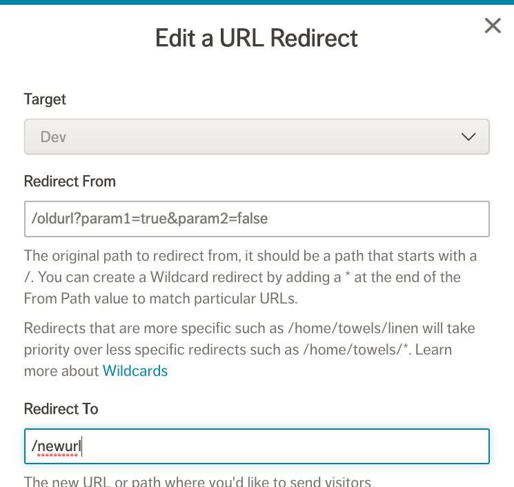

Released on August 6th 2020, corresponding to version [`v2.2.x`](https://www.npmjs.com/package/progressive-web-sdk) of our SDKs.

This release focuses on:
- Consolidating documentation into our newer [DevCenter](https://dev.mobify.com/) site
- Simplifying how to get started and deployed with new projects
- Enhancing existing URL redirects and Salesforce Commerce Cloud integrations

Features

### Project generator 
Early Access

A new [npx-based](https://www.npmjs.com/package/npx) project generator is available to quickly spin up a starting point for any V2-based projects. If your team needs to get a new proof of concept, demo or production project started quickly, the new generator will reduce setup time.

See the instructions on [npm](https://www.npmjs.com/package/@mobify/create-app) to get started. The generator is in Early Access, with additional support for a wider range of Windows developer environments planned.

### V1 SDK documentation migration to DevCenter
The existing [docs.mobify.com](https://docs.mobify.com/), home of all V1 SDK documentation, is scheduled for sunset in Q4 2020. We have migrated all V1 SDK documentation over to [dev.mobify.com/v1.x](https://dev.mobify.com/v1.x), which features an improved navigation and search experience. 

We recommend all teams update any existing bookmarks or references to docs.mobify.com prior to Q4 2020.

Updates

### Salesforce Commerce Cloud OCAPI 20.4 support
The [Salesforce Commerce Connector](../../apis-and-sdks/commerce-integrations/connectors/sfcc), provided as part of the existing [Commerce Integration framework](../../apis-and-sdks/commerce-integrations/overview), has been updated to support the latest [Salesforce Commerce Cloud OCAPI 20.4 API](https://documentation.b2c.commercecloud.salesforce.com/DOC1/index.jsp?topic=%2Fcom.demandware.dochelp%2FOCAPI%2Fcurrent%2Fusage%2FGettingStartedWithOCAPI.html).

Existing projects can upgrade to the [Commerce Integrations 2.2.x version](https://www.npmjs.com/package/@mobify/commerce-integrations) to pick up the latest OCAPI version.

### New Mobify Cloud APIs for projects
A new set of REST APIs are available to integrate, which will allow teams to programmatically list which projects and organizations they belong to, create new projects, and update or delete existing projects if they have the correct admin permissions.

The new APIs are documented as part of the [Mobify Cloud API](../../apis-and-sdks/mobify-cloud):
- [List Organizations](../../apis-and-sdks/mobify-cloud#list-organizations)
- [List Projects](../../apis-and-sdks/mobify-cloud#list-projects)
- [Create Project](../../apis-and-sdks/mobify-cloud#create-project)
- [Update Project](../../apis-and-sdks/mobify-cloud#update-project)
- [Delete Project](../../apis-and-sdks/mobify-cloud#delete-target)

We have also made available an [OpenAPI definition](https://swagger.io/specification/) for the Mobify Cloud APIs](../../apis-and-sdks/mobify-cloud), which can be used with API tools like [Postman](https://www.postman.com/) to explore or auto-generate API client libraries in any programming language of choice. 

### Redirects with exact matching of query parameters
<figure class="u-text-align-center" style="background-color: #fafafa;">

</figure>

The recently released URL Redirects capability has been expanded to support exact matching of query parameters as part of redirect rules. Redirects can now be created for finer-grained matching beyond just the initial path, which is useful for scenarios such as landing pages and localization.  

Read more as part of the updated [Redirects documentation](../../how-to-guides/categories/design/using-url-redirects).

Bug Fixes

### Progressive Web Apps (PWAs)

- [WEB-2760] Query parameters are no longer lower-cased. A bug was introduced that accidentally lower-cased query parameters for requests. This has been fixed in both V1 and V2 SDK releases, and are also available as hotfixes
- [WEB-2594] The AddToHomescreenIosBanner component now renders correctly on iOS based on new icons added the PWA sprite setup
- [WEB-2744] Browser back button now works as expected after an error page is shown, by properly resetting internal state
- [WEB-2745] App scrolling position is reset when navigating between pages via `scroll-to-top` component
- [ADN-595] Fixed redirect deployments being skipped on certain updates

Known Issues

None!
