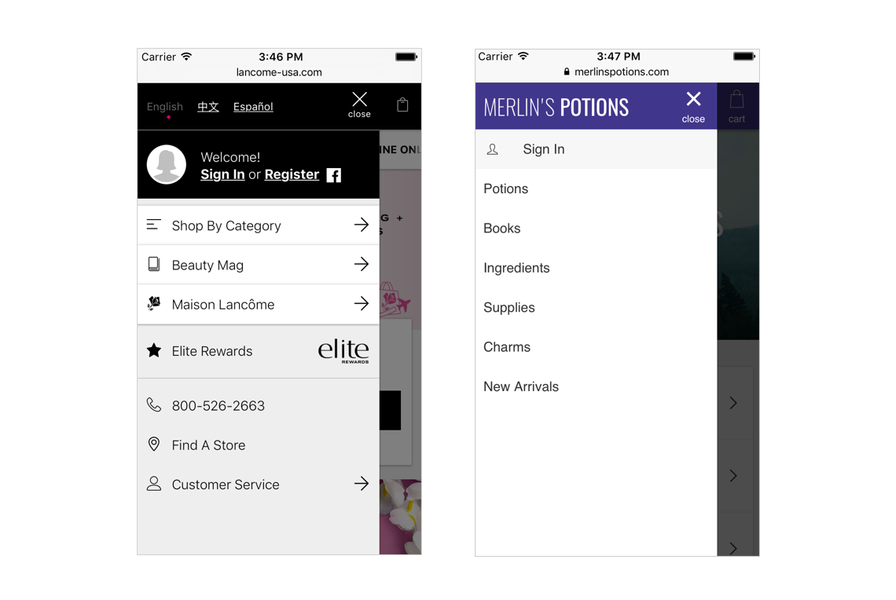
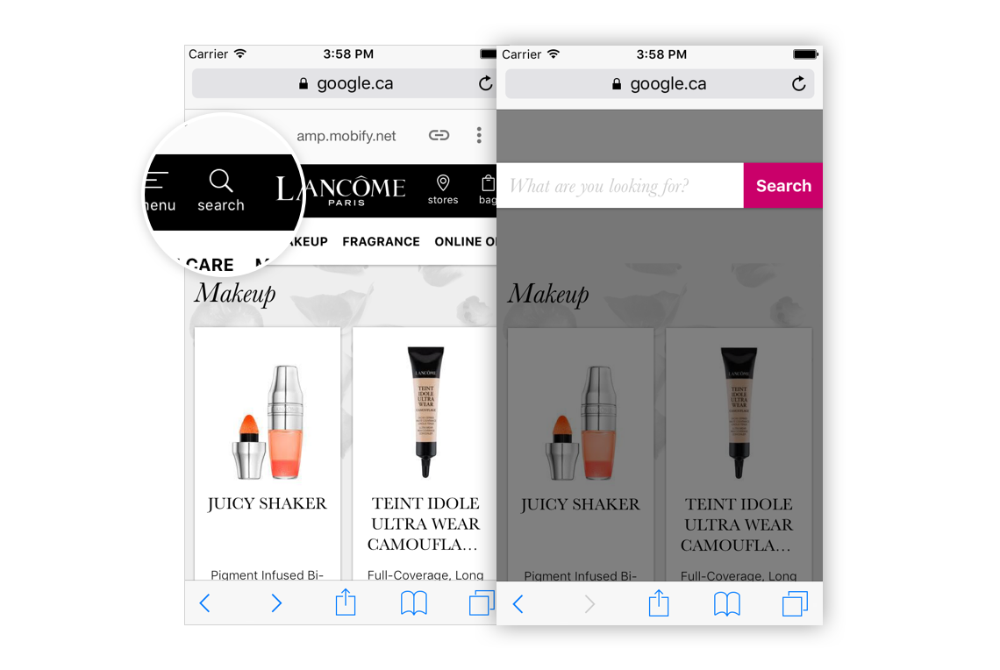
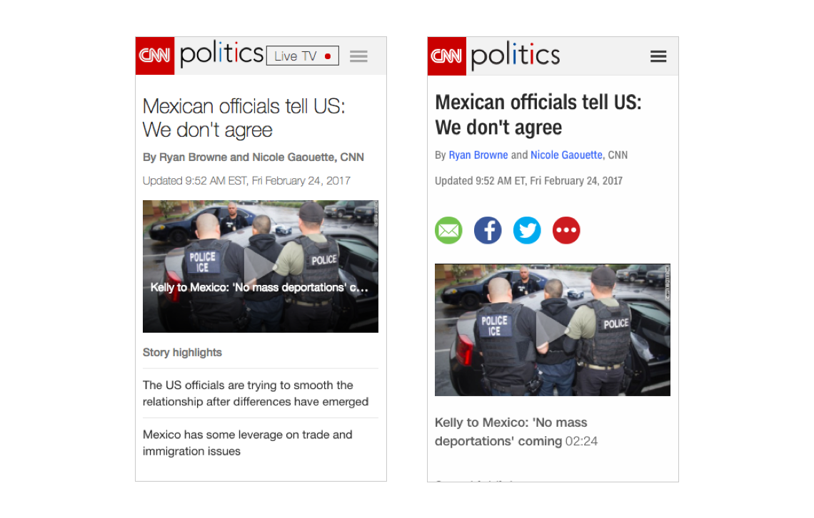
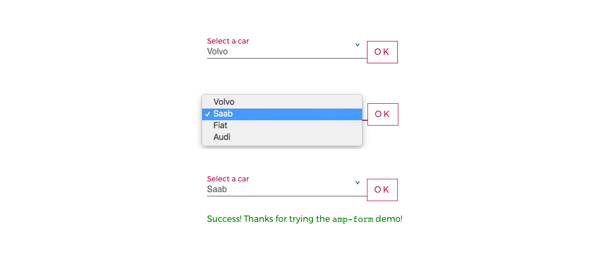
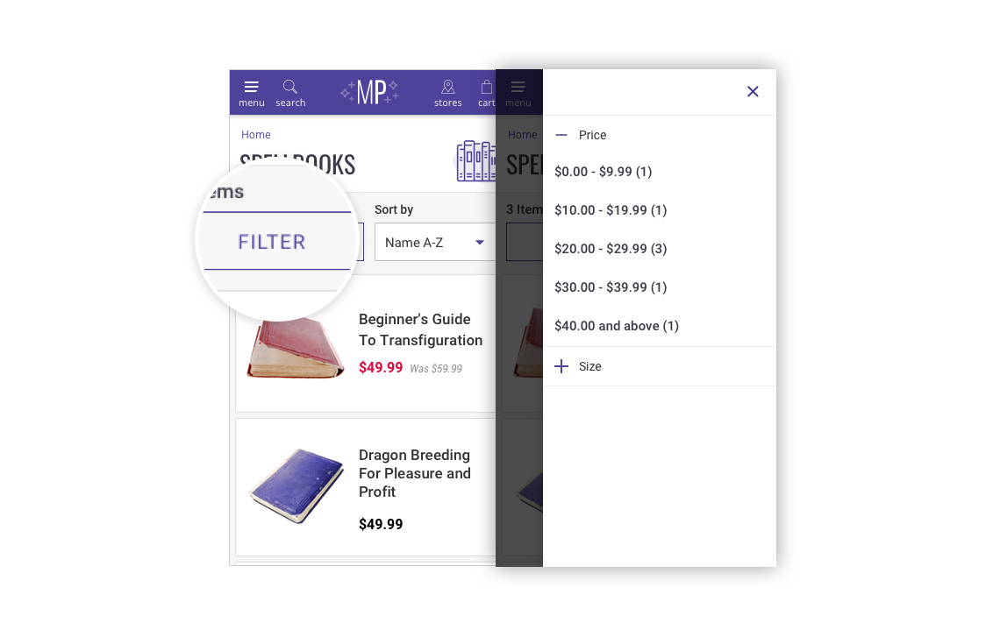
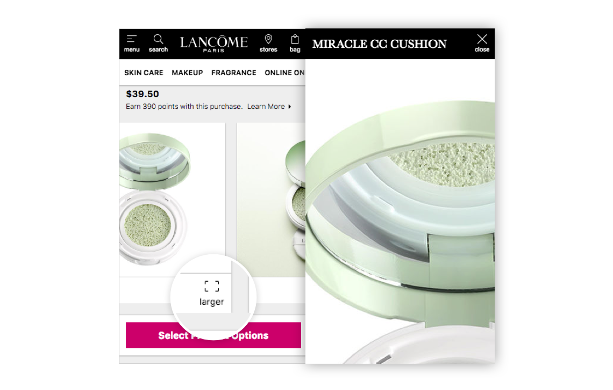
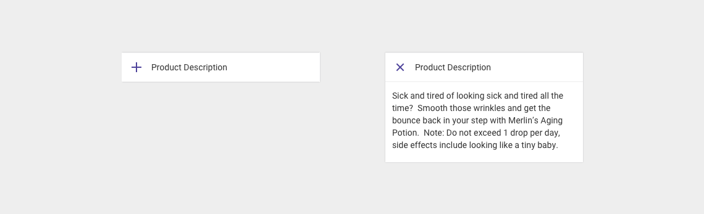
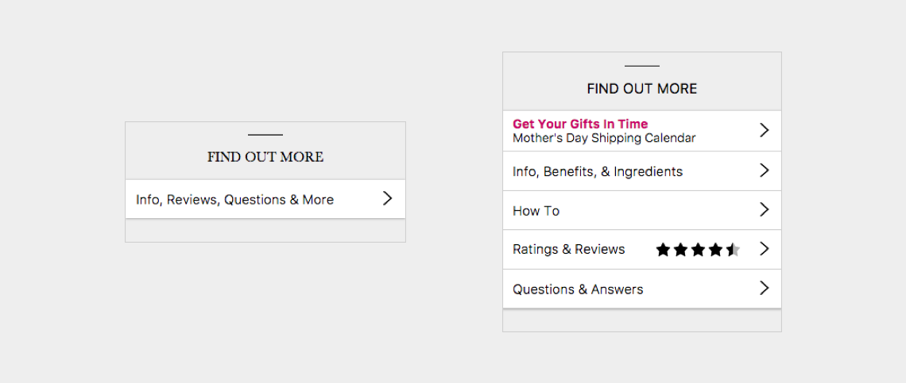
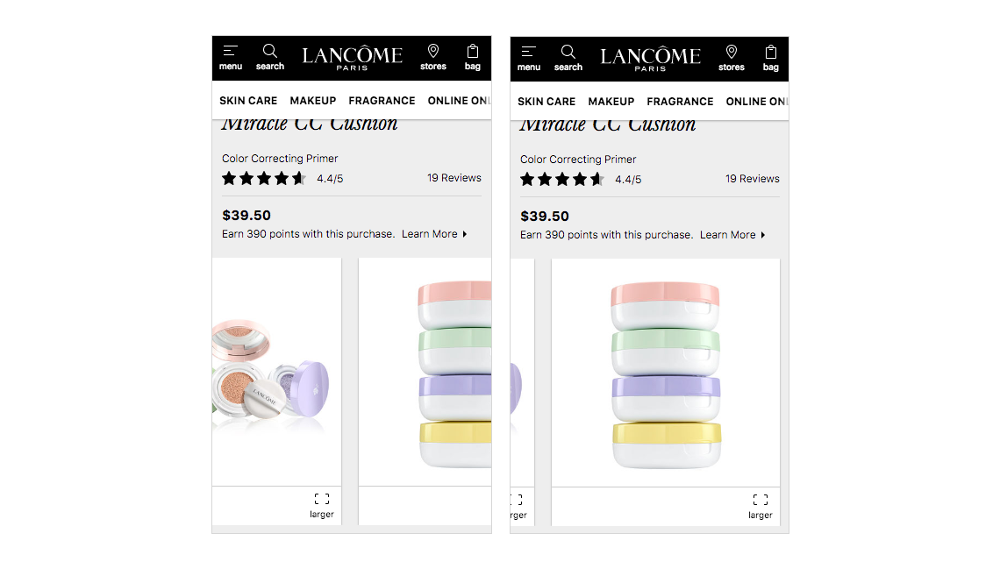

## Global Elements

### Navigation menu

Most mobile sites will use a hamburger-style modal for navigation. [amp-sidebar](https://ampbyexample.com/components/amp-sidebar/) can be used effectively to keep this task within the AMP document (e.g. Merlins Potions), however this solution is problematic if the menu contains dynamic content such as logged in messaging or nested navigation. In this case a better user experience may be for the menu button to link to the PWA before opening the menu (e.g [Lancome](https://amp.mobify.net/lancome/http://www.lancome-usa.com/makeup/face/primer/miracle-cc-cushion/LAN34.html))

<figure class="u-text-align-center">
    
    <figcaption>Navigation menu for Lancome and Merlins Potions PWAs. The latter’s simple navigation structure makes it possible to keep within amp-sidebar. Dynamic account content and multi-tiered navigation (Lancome) is not possible in AMP.</figcaption>
</figure>

### Search

A combination of [amp-lightbox](https://ampbyexample.com/components/amp-lightbox/) and [amp-form](https://ampbyexample.com/components/amp-form/) can be used to create a search experience similar to most non-AMP pages. Certain behaviours such as automatically triggering the keyboard or displaying suggested search terms are not possible in the AMP document.

<figure class="u-text-align-center">
    
    <figcaption>Use of amp-lightbox allows search keyword to be taken before loading the search results in the PWA. Lack of JS however means that the keyboard cannot be automatically activated and there can be no suggested results.</figcaption>
</figure>

### Fonts

[AMP-font](https://ampbyexample.com/components/amp-font/) can be used to render custom fonts in an AMP document, however as explained in the limitations page, these fonts should be used sparingly and system fonts should be favoured. These fonts are faster to load reduce code complexity that may cause failures in the AMP validator.

<figure class="u-text-align-center">
    
    <figcaption>CNN’s AMP pages (left) remove all instances of the brand typeface ‘CNN’ and ‘CNN Condensed’ in favour of the system font Helvetica.</figcaption>
</figure>

## PLP

### Sorting

[Amp-form](https://ampbyexample.com/components/amp-form/) contains a ‘select’ element that allows the user to choose a sorting option within the AMP document. This then loads the PWA version with the new option applied. Seamless AMP -> PWA pathways such as this are UX examples to follow.

<figure class="u-text-align-center">
    
    <figcaption>Demo of select menu in amp-form that can be used to trigger a link to a PWA page, such as the same listing page with the sorting option applied to the URL string.</figcaption>
</figure>

### Filtering

The product filtering experience is presented in the Mobify SDK via a modal. Currently AMP only supports 1 [amp-sidebar](https://ampbyexample.com/components/amp-sidebar/) per document. If this is used for the navigation drawer then the ‘filter’ action should transition to the PWA experience. If not then amp-sidebar can be used to display the filtering options instantly without leaving the AMP page.

<figure class="u-text-align-center">
    
    <figcaption>Merlins Potions mockup showing how amp-sidebar and amp-accordion could work together with a simply filtering UI to incorporate list refinement options into the AMP document, linking through to the filtered product list on PWA.</figcaption>
</figure>

## PDP

### Images

[Amp-carousel](https://ampbyexample.com/components/amp-carousel/) can be utilised to allow the user to browse multiple images on a product page. Pips or thumbnails however are not supported. Enlargement is also possible using [amp-lightbox](https://ampbyexample.com/components/amp-lightbox/).

<figure class="u-text-align-center">
    
    <figcaption>Lancome uses amp-carousel to present it’s multi-image product pages as a scrollable carousel, along with amp-lightbox to offer enlarged images within the AMP page.</figcaption>
</figure>

### Product options

Selecting product options on the PDP is made possible through amp-bind. Selecting available swatches can update the product image and price, allowing the user full functionality before adding to cart.

### Add to cart

Choosing a quantity and adding to cart is made possible through amp-bind. The add to cart action is presented to the user on the AMP page but performed on the PWA. When a user taps 'add to cart', their product options and quantity are captured and used to populate the user's shopping cart with that item. The user is redirected to the cart page instead of staying on the PDP with a confirmation dialog. This is to ensure a fluid checkout experience.

### Product descriptions

Static product information such as the description, specifications and shipping info can be organized like they are on the PWA using [amp-accordion](https://ampbyexample.com/components/amp-accordion/).

<figure class="u-text-align-center">
    
    <figcaption>The amp-accordion component can be styled to look and perform the same as their PWA counterparts, as shown in this example from Merlin’s Potions.</figcaption>
</figure>

### Reviews/Q&A

Information such as reviews and product Q&A is essential to a good shopping experience. ecommerce sites often load this content dynamically through a JavaScript library unsupported by AMP, therefor It is important that the shopper be made aware that they can access this content through a seamless pathway to the PWA.

<figure class="u-text-align-center">
    
    <figcaption>Lancome’s AMP product pages (left) provides a leading action to the PWA where the user can access dynamic content such as reviews and questions.</figcaption>
</figure>

### Related products

Provided related items are available in the HTML, they can be presented on the AMP document using [amp-carousel](https://ampbyexample.com/components/amp-carousel/). If this is not the case, a seamless AMP -> PWA pathway should allow the user to access this content.

<figure class="u-text-align-center">
    
    <figcaption>Lancome’s product image viewer shows show amp-carousel can be adopted to display content in a horizontally scrollable display of content.</figcaption>
</figure>
