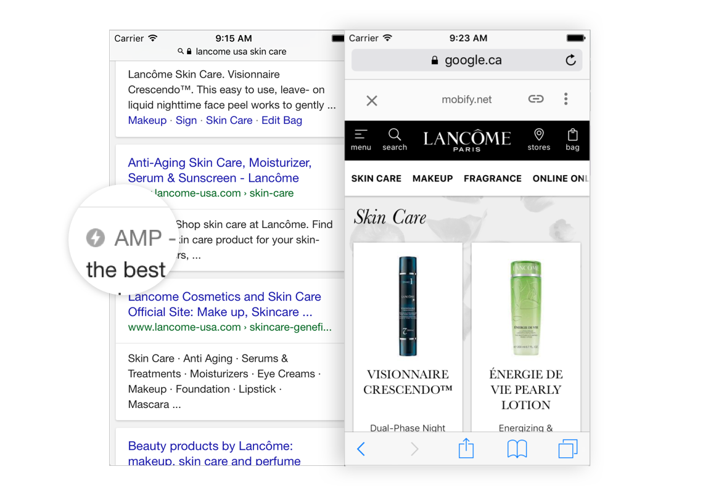

Accelerated Mobile Pages is a Google initiative focussed upon reducing the time content takes to get to a user’s mobile device. 40% of people abandon a website that takes more than 3 seconds to load. AMP delivers a mobile experience that loads almost instantaneously.
[Read more on GoogleBlogs](https://webmasters.googleblog.com/2016/09/what-is-amp.html)

<figure class="u-text-align-center">
    
    <figcaption>The Lancome's AMP PLP template featured in Google's search results.</figcaption>
</figure>

## How does it work?

AMP ‘documents’ are HTML pages made up of open source components. Lean CSS, inline style sheets, along with the limitation of JavaScript and server requests, are amongst the factors that make AMP pages so fast.
[Read more on GoogleBlogs](https://medium.com/@cramforce/why-amp-is-fast-7d2ff1f48597)

## Why do customers care?

Websites with AMP optimised pages offer superior speed for content accessed via search results, which is important because speed factors into search engine ranking. Higher search ranking and faster time to interactive are fundamental in helping customers maintain or win market share.
[Read more on CIO](http://www.cio.com/article/3091071/search/8-things-you-need-to-know-about-google-amp.html)
