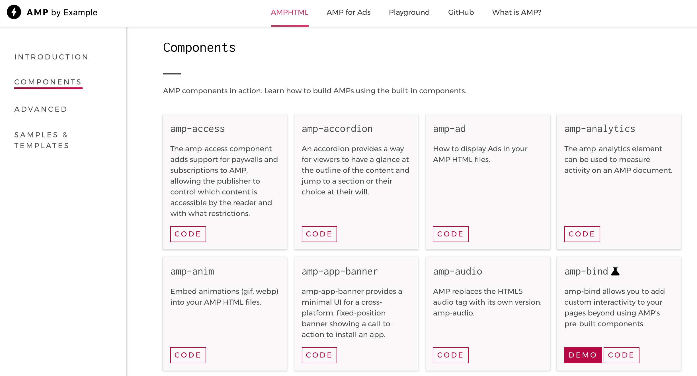
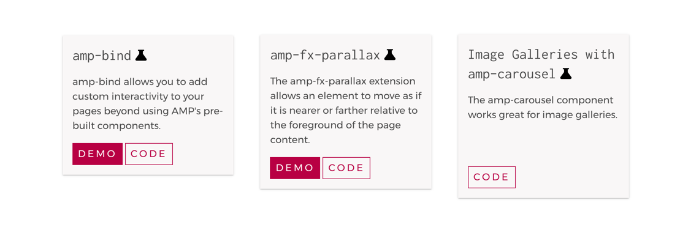

Before starting an AMP project for the first time, it is important to get familiar with the technology and the tools that are available. The website [AMP By Example](https://ampbyexample.com/), which offers code and live examples, is an excellent resource for designers.

<figure class="u-text-align-center">
    
    <figcaption>A list of available AMP components can be found on the AMP By Example website</figcaption>
</figure>

The AMP HTML library provides components that come together to make up the user interface of an AMP template. Used in everything from composing layout to triggering a loader for custom fonts, these components are what designers will primarily be working with.
[List of AMP components](https://www.ampproject.org/docs/reference/components)

## Experimental components

<figure class="u-text-align-center">
    
    <figcaption>Experimental components are marked with a 'testing' icon.</figcaption>
</figure>

There are multiple components still in the experimental phase. Mobify will release these to an ‘AMP SDK’ as they are fully tested and verified. Partners should refrain for including any experimental components in the designs until they made available in the SDK.
