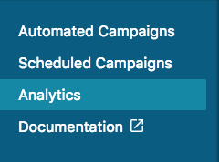
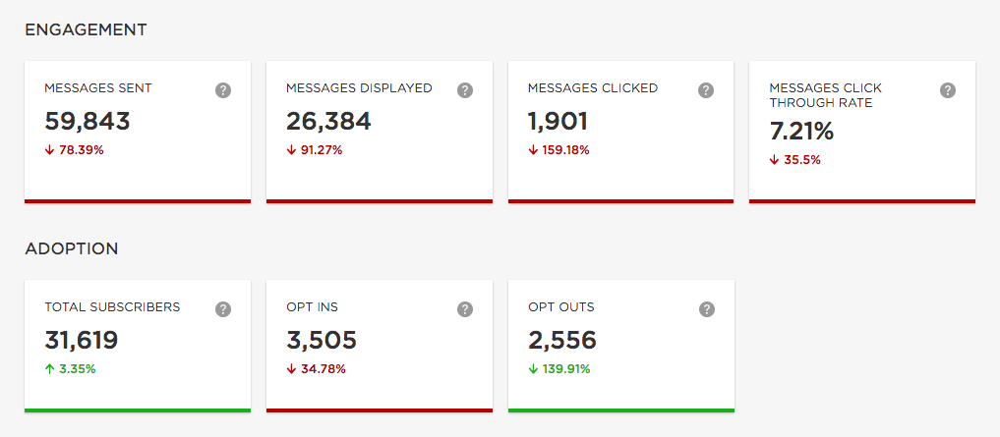

The sections below describe the metrics that are displayed in the Analytics section of Connection Center. Presented is an overview of all your web push messages combined, along with subscription opt in rates.

<figure class="u-text-align-center">
    
</figure>

## Engagement Metrics

### Messages Sent
The total number of messages sent in the selected time range to a subscriber base.
> Example: If 2 distinct messages are sent to 30,000 subscribers each, the total messages sent = 60,000

### Messages Displayed
The total number of all messages displayed on any device.
> Example: If 2 distinct messages are sent to 30,000 subscribers each, and 20,000 are displayed per message, the total messages displayed = 40,000

### Messages Clicked
The number of users that have clicked on a message.
> Note: This would correspond to the Webpush Users (Clickers) in your Web Push GA dashboard

### Message Click Through Rate
The number of messages clicked divided by the number of messages displayed.
> Example: If there are 5,000 messages clicked out of 20,000 messages displayed, the click through rate would be 5,000 divided by 20,000 = 0.25 (or 25%)

## Adoption Metrics

### Subscribers
The total number of subscribers that a message could be sent to in a given time frame.

### Opt Ins
The total number of users that subscribed during the selected time frame.

### Opt Outs
The total number of users that unsubscribed during the selected time frame.
