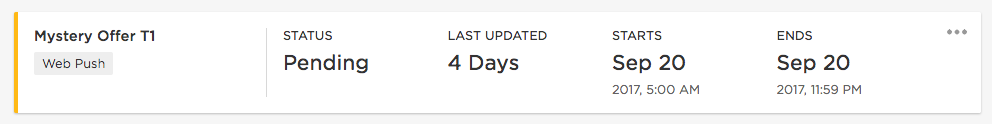
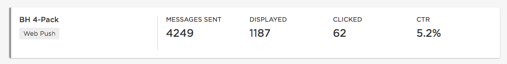
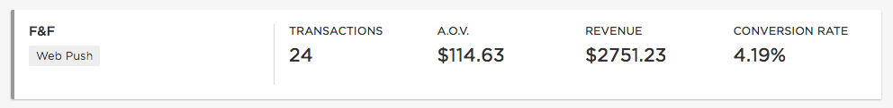

This section will help you understand how to interpret and compare metrics across campaigns. Regularly and effectively comparing data here can help identify which campaigns are resonating best with shoppers and create better campaigns.

<figure class="u-text-align-center">
    <iframe width="560" height="315" src="https://www.youtube.com/embed/euWI_w5Rbo4" frameborder="0" allowfullscreen></iframe>
</figure>

## Schedule Tab

### Status
Indicates whether a campaign is a draft, scheduled to run, currently running or complete.

### Last updated
Tells you when a change was last made to a campaign. Either through editing content or after its status has changed.

### Starts
This is the start date and time when the first message went out or is set to go out. Both the time of day and the day of week can can have a big impact on a recipient's engagement. When comparing multiple campaigns, look for patterns that indicate your user's most active time of day when they may be more likely to click on a message.

### Ends
This indicates the date and time the last connection in the campaign will expire. If subscribers' devices or browsers are offline at the time a message goes out, they can receive it if they come online before the expiry time. It is important to make this long enough that offline users will receive it, yet not too long that the content is outdated. This can be a useful metric to analyze if recipients span multiple time zones, as short expiry times may cause messages to be sent and expire during the night.

## Engagement Tab

### Messages Sent
Shows how many messages have been sent out to subscribers. This is a useful metric to analyze as it indicates the subscriber base at the time of the campaign. Lower numbers here typically indicate a high level of audience targeting. Well targeted campaigns can have higher engagement rates but be careful not to segment your audience too much by applying filters that result in no messages going out.

### Displayed
The number of messages displayed is how many messages actually made it onto users' devices. Users may have disabled notifications on their device, have been offline or had yet to turn on their device before the message expired. When comparing metrics, this is what best indicates the campaign's exposure to customers.

### Clicked
The number of clicks is a total number of times a push message is clicked on within a campaign. When comparing campaigns, look for a higher number of clicks against a lower number of received messages. This suggests users resonated with the message content and chose to engage further.

### CTR (Click Through Rate)
An important metric at discerning a campaign's effectiveness. This is obtained by dividing the number of "messages clicked" by the number of "messages displayed". When comparing campaigns, be aware that a higher number of messages displayed will typically result in lower click through rates. Look for campaigns with higher than average CTRs and low to average messages displayed.

## Revenue Tab

### Transactions
This is the number of transactions that occurred in sessions started by clicking on the push message.

### A.O.V
Average Order Value is calculated by dividing the total revenue by the number of transactions a campaign generated.

### Revenue
The total revenue generated by all web push connections in the campaign. Purchases are attributed when the user directly makes a purchase after clicking on a push message.

### Conversion rate
The conversion rate is the percentage of sessions that resulted in a purchase. Campaigns with high conversion rates are a good indication that the content that followed the message resonated well with the user.
