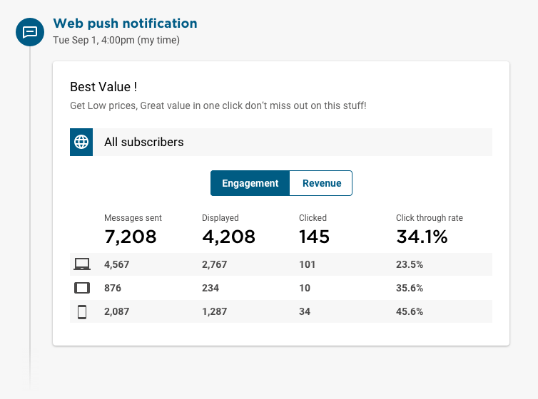
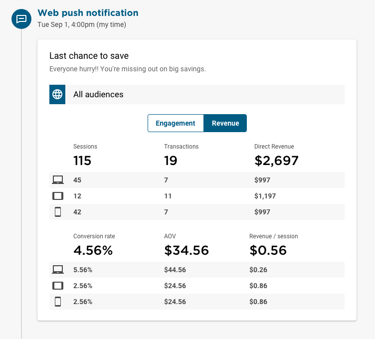
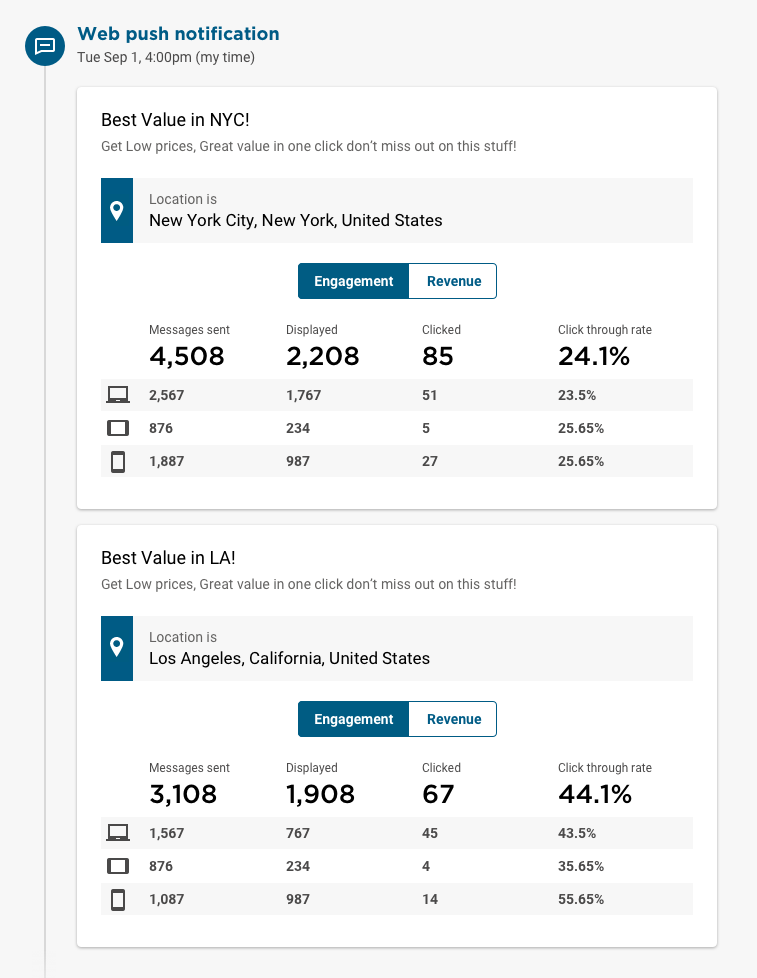
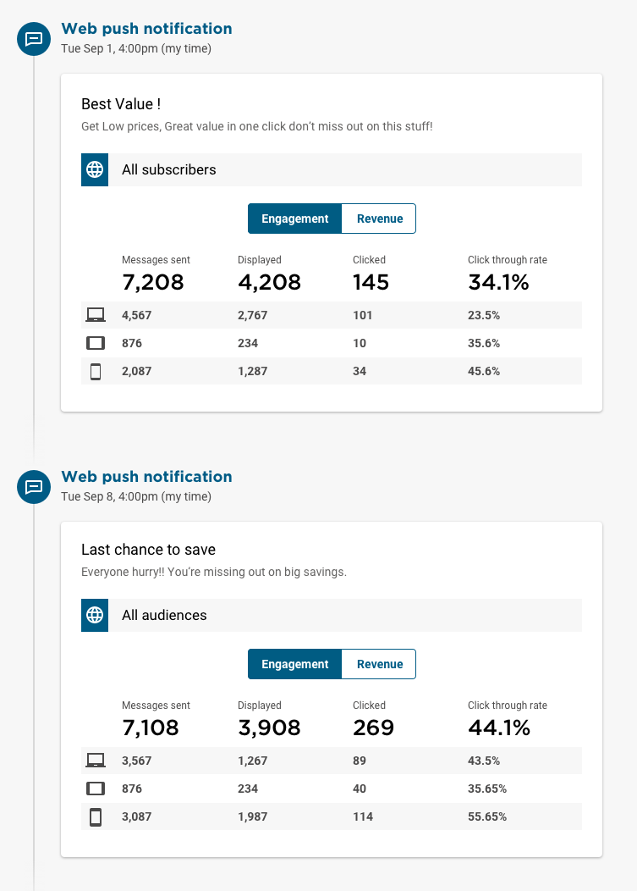

This section will help you understand how to interpret and compare metrics for an individual campaign. Here you can compare how your connections performed across mobile, tablet and desktop along with insights into how the revenue was broken down. This is especially effective at comparing messages across different segments or seeing how an initial notification compared to a follow up message.

## Engagement metrics

### Messages Sent
Shows how many messages have been sent out to subscribers. This is a useful metric to analyze as it indicates the subscriber base at the time of the campaign. Lower numbers here typically indicate a high level of audience targeting. Well targeted campaigns can have higher engagement rates but be careful not to segment your audience too much by applying filters that result in no messages going out.

### Displayed
The number of messages displayed is how many messages actually made it onto the user's device. Users may have disabled notifications on their device, are offline or had yet to turn on their device before the message expired. When comparing metrics, this is what best indicates the campaign's exposure to customers.

### Clicked
The number of clicks is a total number of interactions for all push messages in a campaign. When comparing messages, look for a higher number of clicks against a lower number of received messages. This suggests users resonated with the message content and chose to engage further.

### CTR (Click Through Rate)
The most effective metric at discovering the effectiveness of a campaign. Obtained by dividing the number of clicked messages by the number of messages displayed. When comparing messages, be aware that a higher number of messages displayed will typically result in lower click through rates. Look for campaigns with higher than average CTRs and low to average messages displayed.

## Revenue Metrics

### Sessions
How many clicks resulted in a session - a click becomes a session after the initial load of the page. This is an indication of how many people who clicked on your messages stayed to engage with the following content.

### Revenue / Session
Revenue per session is the dollar value of each session. This is calculated by a total revenue divided by total sessions. It is a good indication of the value of the message however it this number can be skewed if the message links to low value items.

### A.O.V
Average Order Value is calculated by dividing the total revenue by the number of transactions a campaign generated. AOV is a good indication of either how many items the user chose to buy or the high/low value items that were purchased during the session.

### Conversion rate
The conversion rate is the percentage of sessions that resulted in a purchase. Campaigns with high conversion rates are a good indication that the content that followed the message resonated well with the user.

### Transactions
A direct transaction is attributed when the user makes a purchase within the session that followed clicking on the push message.

### Revenue
The total revenue generated by the message. This metric shows direct revenue and is attributed when the user makes a purchase within the session that followed clicking on the push message.

## Comparing multiple segments

Targeted messages perform better. Analytics can be compared across audience segments to understand which audience resonated best with the message, helping you understand who your most engaged subscribers are.

## Comparing multiple connections

A follow up message can be useful at creating urgency of a sale ending or reminding subscribers of an ongoing promotion. Analytics can be compared across these connections to give an indication of audience behavior towards the messages, and help you understand how to structure more effective campaigns.
