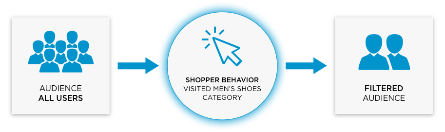

| Filter Name              | Description                                                                                           | Possible Values | Supported Channels     |
| ------------------------ | ----------------------------------------------------------------------------------------------------- | --------------- | ---------------------- |
| SHOPPER VISITED URL PATH | Target any shopper with push notifications enabled, who has visited a specific URL path on your site. | Exact URL match | Web Push Notifications |

## Shopper Visited URL Path

A visited URL path is a page on your website that your shopper has previously
landed on.  Engagement Engine captures visited pages for a shopper, from which
the Connection Center uses in order to help you filter the audience you wish to
target.  There is a 24 hour period from when the shopper visits a URL, to the
Engagement Engine making it available to the Connection Center.

> We will be decreasing this window in the near future as part of a future product release.

Let’s take a look at how this works with a campaign that includes a push
notification.

From the total push notification subscribers you have available to receive a
message, you can target the potential participants by a URL the shopper has
visited. For example, you can target a group of shoppers that recently visited a
product category on your site and send them a push notification about a new
promotion related to that category.

