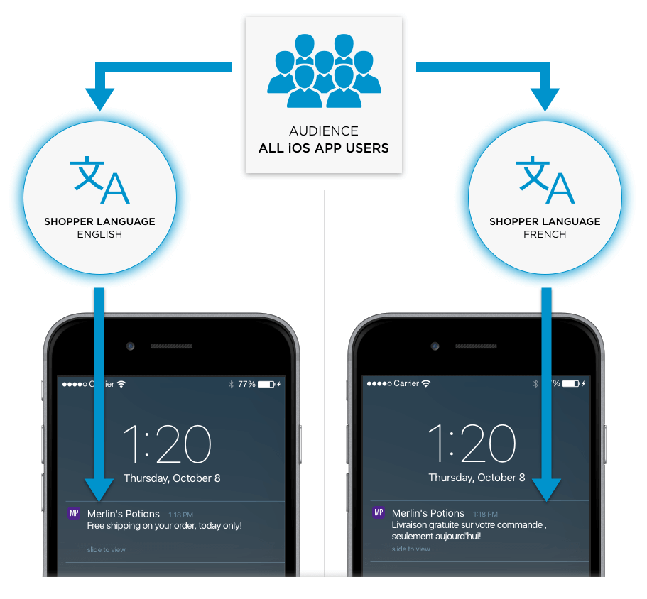

| Filter Name | Description                                         | Possible Values | Supported Channels     |
| ----------- | --------------------------------------------------- | --------------- | ---------------------- |
| LANGUAGE    | Target shoppers based on their language preferences | Language        | App Push Notifications |

## Shopper's Language

A shopper's language is the language preference used when interacting with your website or app.

Engagement Engine captures the language, or locale, from which
the Connection Center uses in order to help you filter the audience you wish to
target.  There is a 24 hour period from when the shopper interacts in a specific locale, to the
Engagement Engine making it available to the Connection Center.

> We will be decreasing this window in the near future as part of a future product release.

The benefits of using language to target your audience are:

-   To re-engage with shoppers in a more relevant way than a simple blanket notification
-   To address the difference in communication styles that works better for audiences that speak different languages

Let’s take a look at how this works with a campaign that includes an app push
notification.

Let's assume your app is set up to be interacted with in both English and French.  A shopper sets the app language preference to French.  When the shopper subscribes to Push Notifications, Engagement Engine captures the shopper's language preference.  In our example the shopper has selected French as the language of choice.

When a new app push notification campaign is created, it can then be targeted to push notification subscribers with French as their preferred language.

