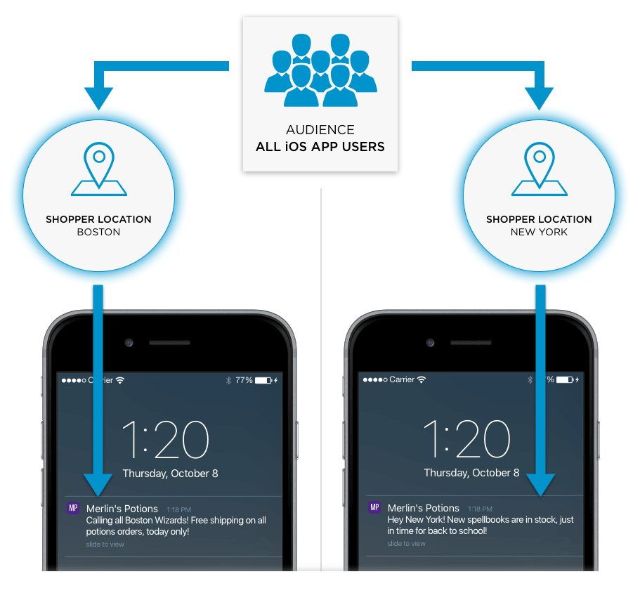

| Filter Name      | Description                             | Possible Values | Supported Channels     |
| ---------------- | --------------------------------------- | --------------- | ---------------------- |
| SHOPPER LOCATION | Target shoppers based on their location | City, DMA, Region, and Country            | App Push Notifications, Web Push Notifications,  Smart Content (DMA only) |

## Shopper Location

There are several ways to filter your audience by location, such as the
shopper's city.

Engagement Engine captures the location of shoppers based on the geographical
location derived from their ip addresses when they interact with a website or
app that is powered by Mobify. Connection Center then uses the location data to
help you filter the audience you wish to target. There is a 24 hour period from
when the shopper’s ip address is captured, to the Engagement Engine making it
available to the Connection Center.

> We will be decreasing this window in the near future as part of a future product release.

Let’s take a look at how this works with an app push notification campaign.

For an app push notification you can create unique notifications that your shoppers receive based on
their location.  For example, you can create a push notification that targets shoppers in Boston.  When a shopper interacts with your app, they will broadcast
their location.  Now when a push notification is set to be delivered, Connection Center will check to see which shoppers had their last known location as Boston. Those shoppers who are subscribed to receive push notifications and who match Boston will then be sent the push notification.

Location filters are a great way to target your push notifications subscribers in different cities.
