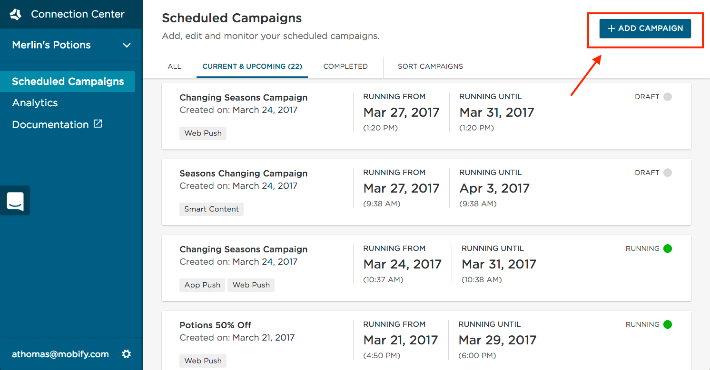
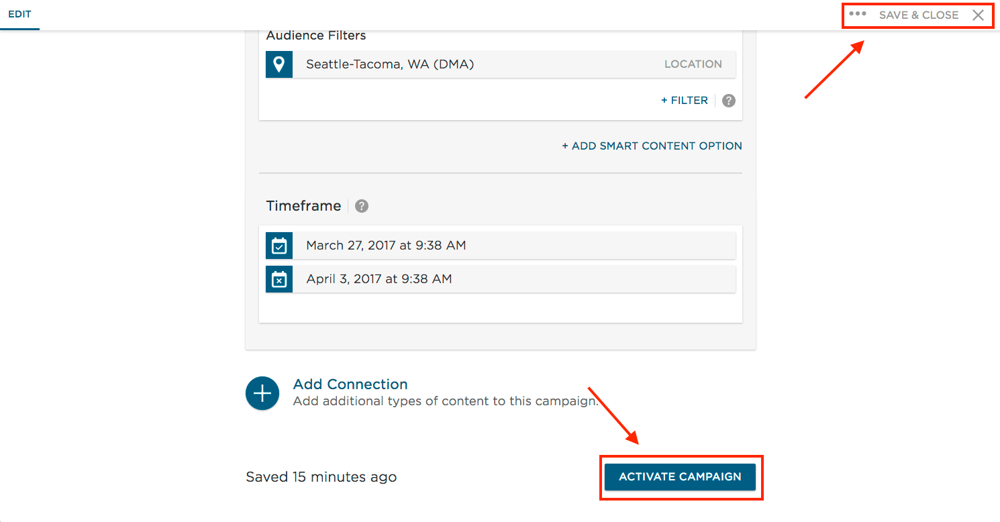
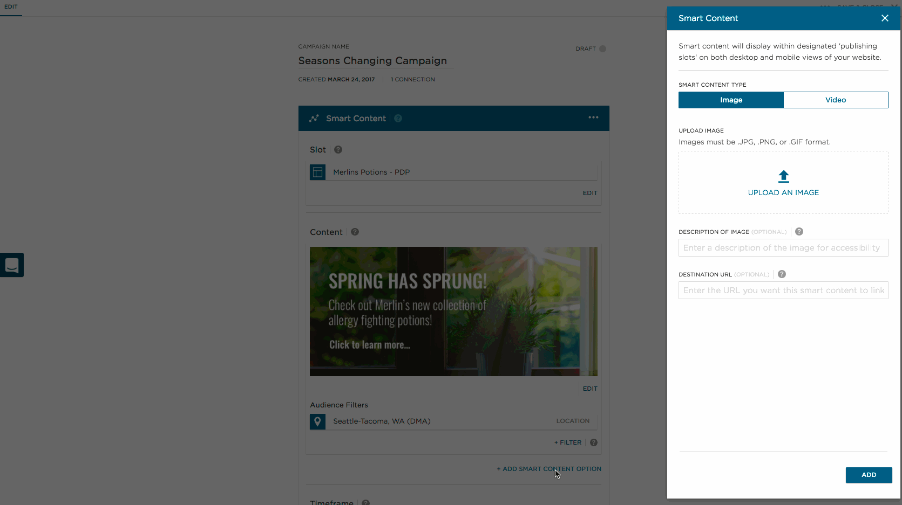
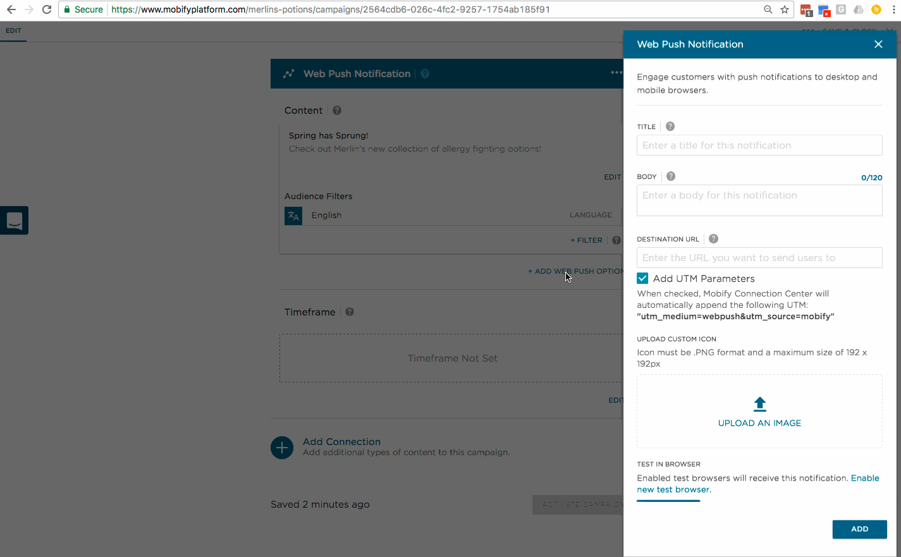
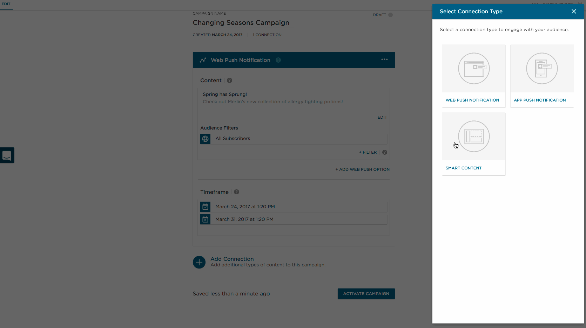
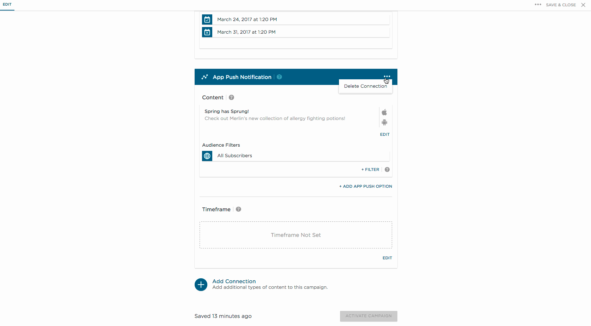

Campaigns are your way of communicating with shoppers through Connection Center. The first step to sending any message or displaying any piece of content is to create a campaign.

From the landing page of Connection Center, click the button in the top right corner to “Add Campaign”

From there, there are 4 things you need to configure:

1.  Give your campaign a name
2.  Add content. Connection Center enables 2 types of content - [Push Notifications](../../push-notifications/introduction) and [Smart Content](../../smart-content/overview).
3.  Select who your content is for using audience filters. For more details on the different filters available, visit the [audience filters](../../audience-filters/introduction) documentation.
4.  Set a start and end date for your content.
	*   The timeframe will be in your timezone by default, which means that if you are in New York and schedule it to send at 6pm, it will be sent to users in New York at 6pm their time and users in California at 3pm their time. This option is ideal for promoting sales with start and end dates in a single timezone.
	*   There’s also an option to “send in user's timezone” which will send to users in New York at 6pm their time and users in California at 6pm their time.

When you are happy with the content, audience and timeframe, you can hit Activate Campaign. Activating the campaign will make your content live on the dates you have selected. If you are still working on the campaign or want to get review from a teammate first, you can click the “Save & Close” button in the top right instead. This will save your campaign for later, and it will not run until you hit activate.

## Add Additional Content

Within a campaign, you can create multiple connections of the same type to target different shoppers. For example, you could add 2 pieces of [smart content](../../smart-content/overview) targeting shoppers in different locations.

As another example, if you are sending [push notifications](../../push-notifications/introduction) in multiple languages, you can add a push notification with a corresponding [language filter](../../audience-filters/introduction) for each

## Add an Additional Connection

Within a campaign, you can add multiple types of content by creating a new connection. This can be used to send multiple communications, such as web and app push notifications, on the same topic.

## Delete Connection

Managing connections within your campaign is simple. If you have created a connection that you no longer wish to use, you can click the ellipsis to find the delete option

