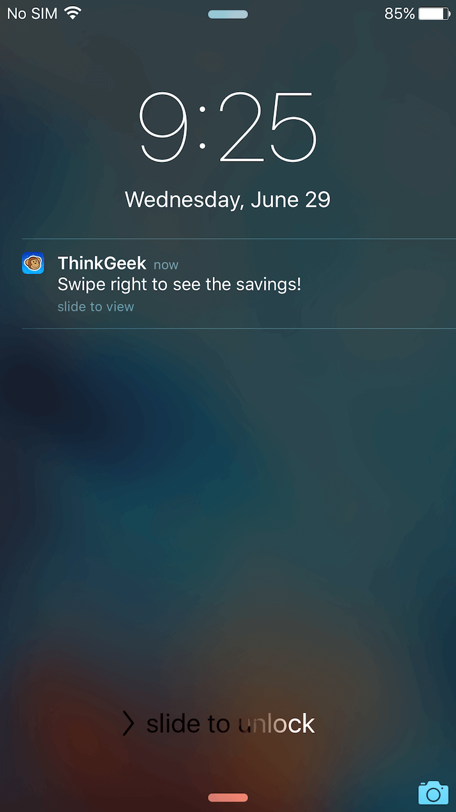
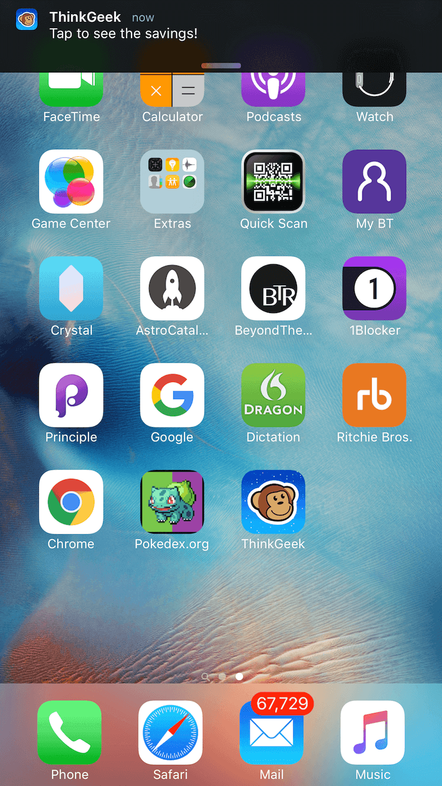
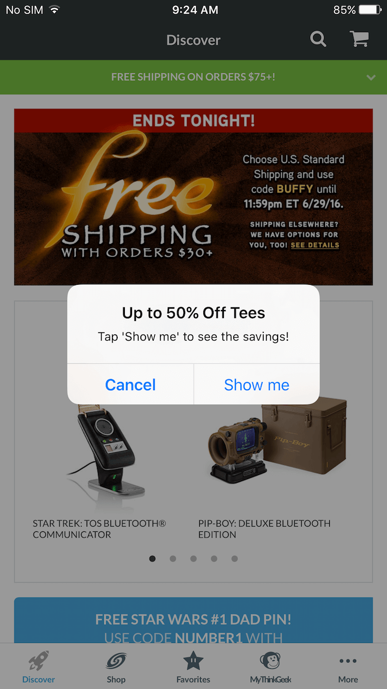
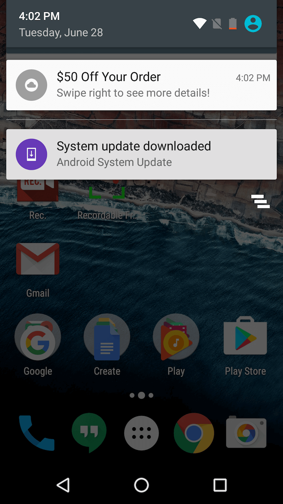
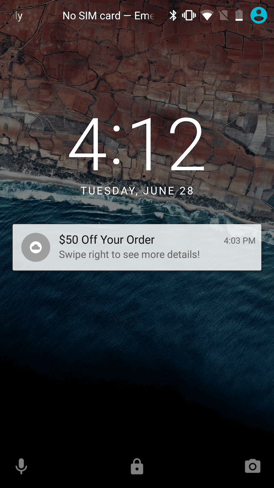

App Push Notifications are messages sent to shoppers that have downloaded your
brand’s app and have opted to receive messages. The benefits of using App Push
Notifications include:

-   Engaging your most loyal customers that have downloaded your brand app
-   A standard opt-in process used by all apps on Android and iOS.

App Push Notifications display differently on their respective platforms:

<figure class="u-text-align-center">

<figcaption>iOS Locked Screen</figcaption>
</figure>

<figure class="u-text-align-center">

<figcaption>iOS Notification Banner</figcaption>
</figure>

<figure class="u-text-align-center">

<figcaption>iOS Alert</figcaption>
</figure>

<figure class="u-text-align-center">

<figcaption>Android Banner</figcaption>
</figure>

<figure class="u-text-align-center">

<figcaption>Android Locked</figcaption>
</figure>

Visit our [best practices](../best-practices/) page to learn how to send effective push notifications.
