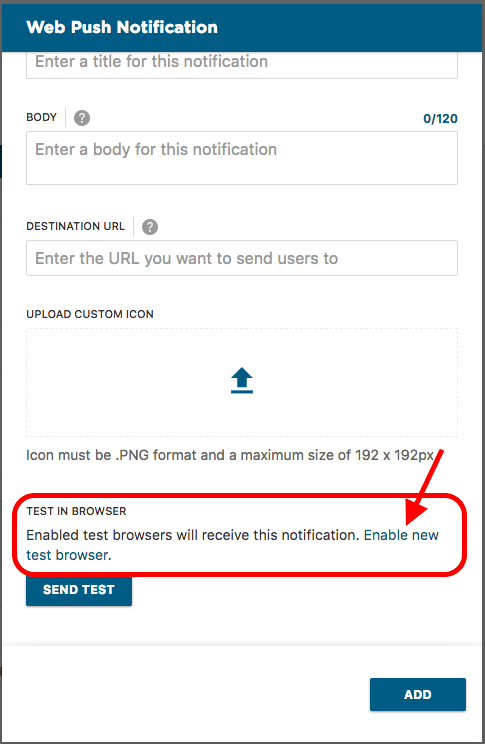
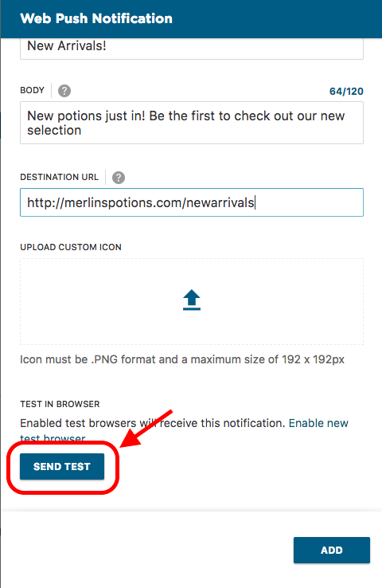

Push notifications display differently on different devices. Not all character limits are the same and icons appear in different areas of the message. It's important check what your messages look like on different devices before you send them. This article describes how to preview the content of your push notification by sending yourself a test message.

## Register for Test Messages

Test messages are sent to a subset of your subscribers who are registered to receive them. There are 2 steps to register:

### 1. Opt-in to receive push notifications

The easiest way to opt-in is the same way your customers would: visit the page on your site or app that asks shoppers if they would like to receive push notifications and sign up.

If your site is set up to display a banner for opt-in and you have trouble triggering that banner, you can also use a bookmarklet. Use one of the options below to create your bookmarklet. 

**Option 1**: Drag the below link to your bookmarks bar

<a href="javascript:(function()%7BMobify.WebPush.showSoftAsk()%7D)();">Mobify Soft Ask Trigger</a>

**Option 2**: Follow the below instructions to manually add the bookmarklet on Chrome:

1. Click Bookmarks > Bookmark Manager.
2. You should see a new tab with the bookmarks and folders listed. Right click on a folder and select “Add Page”
3. You should see two input fields. Type the name of the bookmark you would like (i.e., Mobify Soft Ask Trigger) in the name field.
4. Paste the following javascript code into the URL field. `javascript:(function()%7BMobify.WebPush.showSoftAsk()%7D)();`

Once the bookmarklet has been created, follow the steps below to use it:

1. Visit your website where push notifications have been set up
2. Click on your new bookmarklet
 
 

This should trigger the banner to come up. From there you can sign up to receive push notifications.

### 2. Opt-in to receive test messages

After you have subscribed to push notifications, the next step is to register your device or browser to also receive test messages.

1. Go to Connection Center
2. Create a new campaign
3. Add a Web Push Notification
4. In the configuration window for your web push notification, click "Enable new test browser"
5. (a) For Web Push Notifications, copy the link and paste it into the browser you would like to register. You should get a popup confirming that you are registered for preview.
(b) For App Push Notifications, this will be a deep link set up for your app. Try texting or emailing it to your device and opening from there to be taken into the correct place in the app.

## Send a preview message

Now that you've enabled your browser or device, you can send a preview every time you create a new notification. After you have filled out the details in the configuration window for your push notification, just scroll to the bottom and hit the "Send Test" button. All browsers and devices that have registered to receive preview notifications will get your message

