<!--lint disable no-duplicate-headings-->

We get it!  We understand that there will be times when you want to stop receiving push notifications for a website or app.  The guide below will walk you through the steps to opt-out from all supported browsers and platforms.

## Background
When a person subscribes to receive web push notifications, it is the web browser that enables this feature.  It is from the browser where the shopper must disable, or opt out, of web push notifications.

Similarly in an app, when a person subscribes to receive app push notifications, it is the device itself that enables this feature.  It is from the device's settings where the shopper must disable app push notifications.

Let's get started.

## Desktop Chrome
### Step 1: Access Chrome’s settings
To the right of the address bar, click on the settings icon in any window.
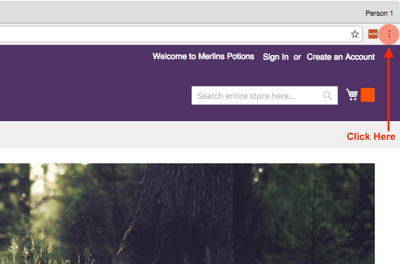
Next, click **Settings**.
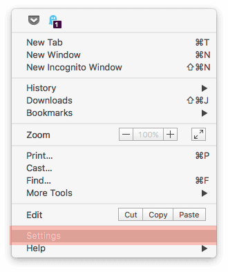
### Step 2: Access the Browser’s Content Settings
Near the bottom of the page, find the **Show advanced settings** link under Default Browser and click on it.
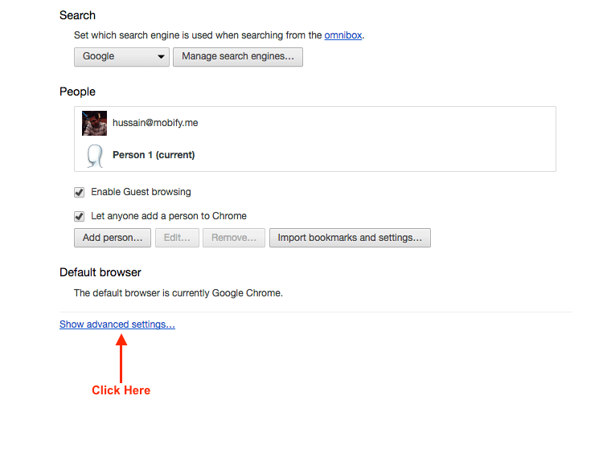
Under Privacy, click on **Content Settings**.

### Step 3: Remove the Website from Sending Web Push Notifications
In the Content Settings popup that displays, find the Push Notifications section, and click **Manage Exceptions**.
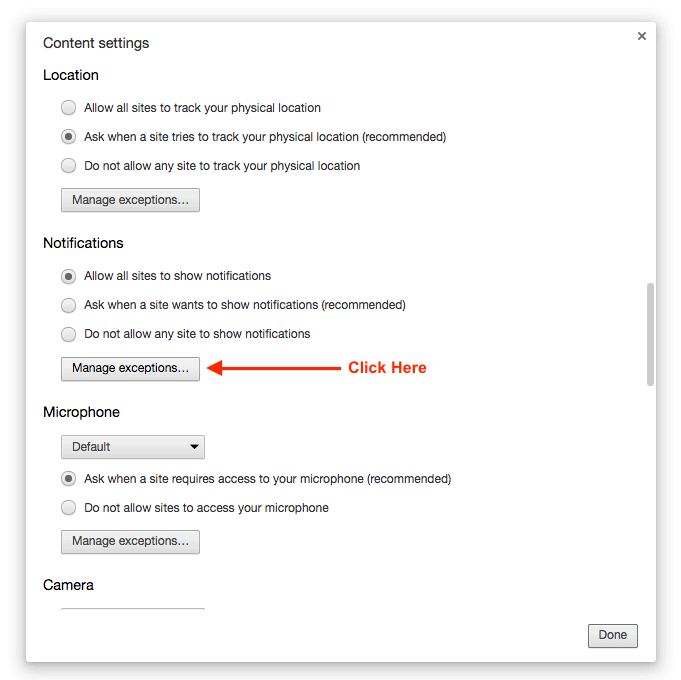
Next, find the website you want to stop from sending web push notifications, and click the **X** icon.
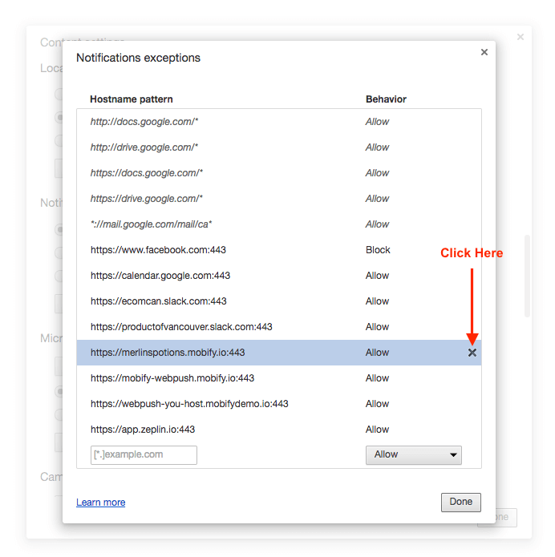
You have now successfully opted out of web push notifications.

## Desktop Safari
### Step 1: Access Safari’s settings
Click on the **Safari** menu.

Click **Preferences**.
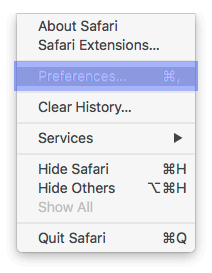
### Step 2: Access the Notifications Settings
In Preferences, click on the **Notifications** tab.
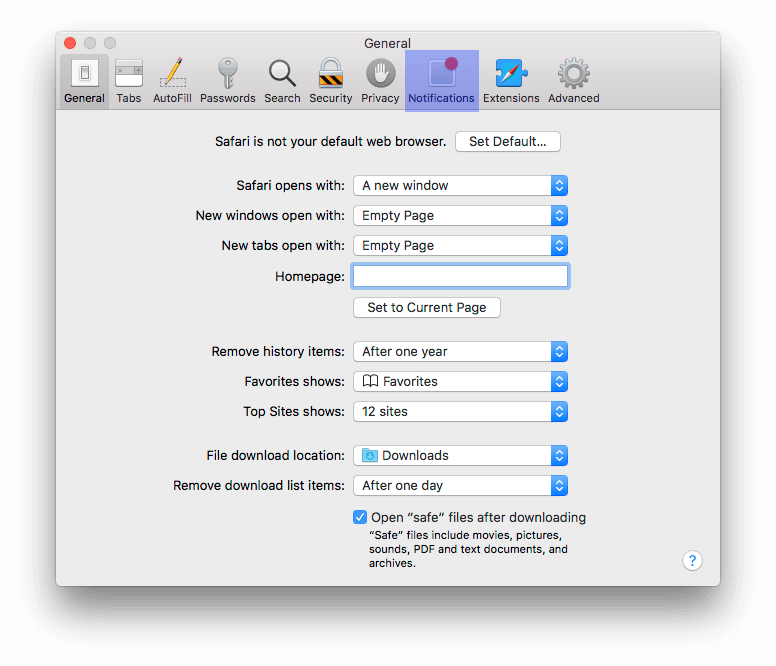
### Step 3: Deny Web Push Notifications
Click on the **Deny** radio button to prevent the website from sending you web push notifications.
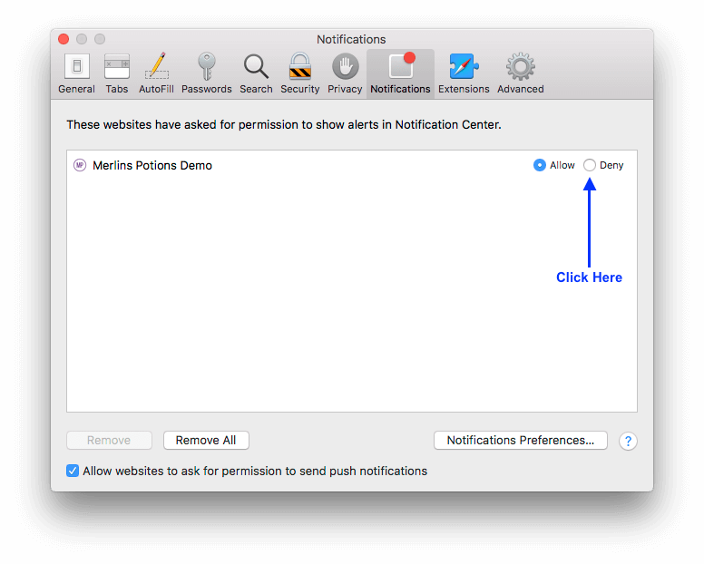
> If a website if denied, it will stop sending push notifications to you.  Denying a website also means that it will no longer be able to ask you to opt-in for push notifications again.

You have now successfully opted out of web push notifications.

## Desktop Firefox
### Step 1: Access Firefox’s settings
Click on the **Firefox** menu.
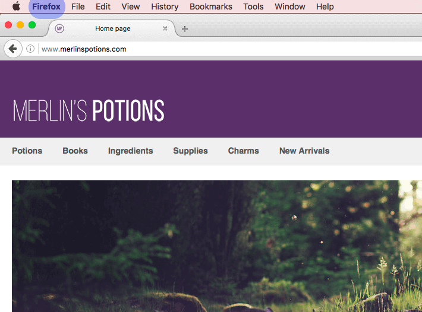
Click **Preferences**.
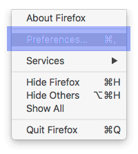
### Step 2: Access the Notifications Settings
In Preferences, click on the **Content** tab.
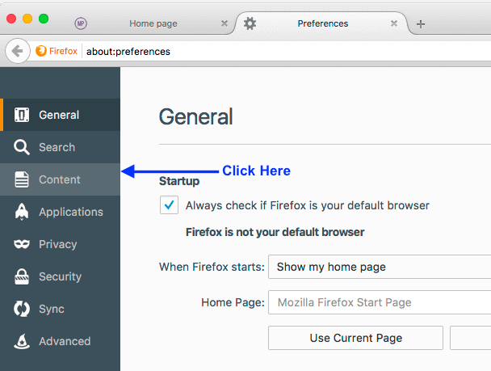
Under Notifications, click the **Choose** button.
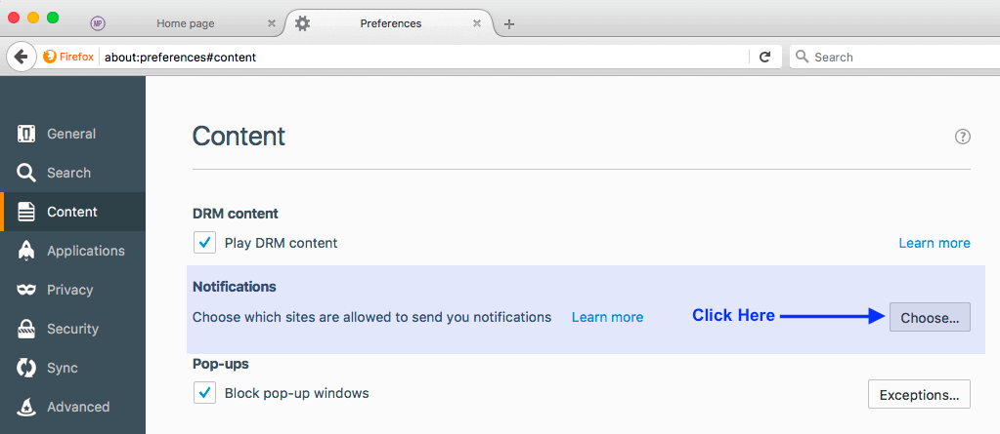
### Step 3: Prevent the Website from Sending Web Push Notifications
Click **Remove Site** to prevent the website from sending you web push notifications.
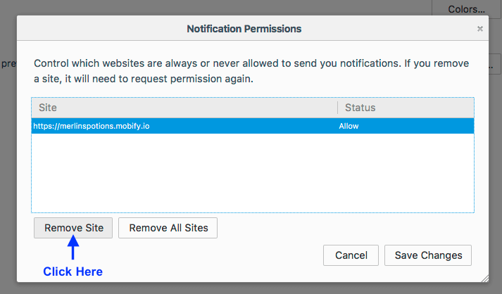
You have now successfully opted out of web push notifications.

## Android Chrome
### Step 1: Access Chrome’s settings
Open Chrome and tap on the Settings icon.

Next, tap **Settings**.
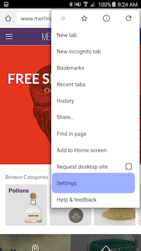
### Step 2: Access the Notifications Settings
In Settings, tap on **Site Settings**.
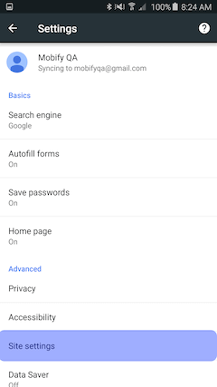
Next, tap on **Notifications**.
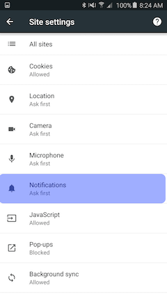
### Step 3: Block Site from Sending Web Push Notifications
Tap on the site you wish to block.  Under Permissions, tap **Notifications**.
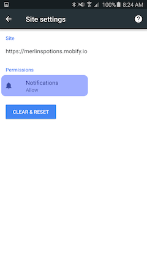
Finally, tap **Block**.

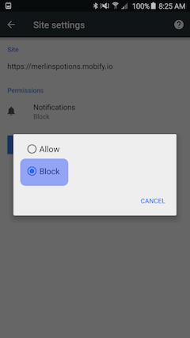
> If a website if blocked, it will stop sending push notifications to you.  Blocking a website also means that it will no longer be able to ask you to opt-in for push notifications again.

You have now successfully opted out of web push notifications.

## iOS App
### Step 1: Access iPhone Settings
Tap on **Settings**.
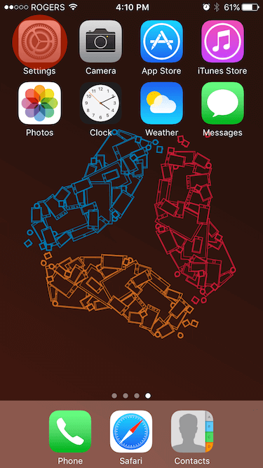
Next, tap on **Notifications**.
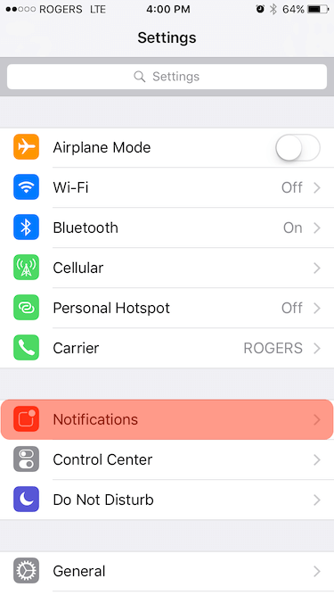
### Step 2: Turn Off Notifications For Your App
Find the app you want to unsubscribe from in the list and tap on it.

Next, switch **Allow Notifications** off.
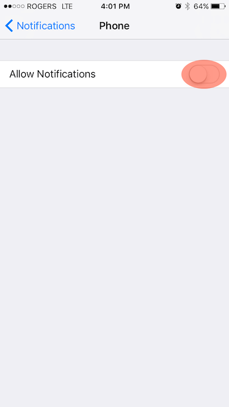
You have now successfully opted out of push notifications for your iOS app.

## Android App
### Step 1: Access Android Settings
Tap on **Settings**.
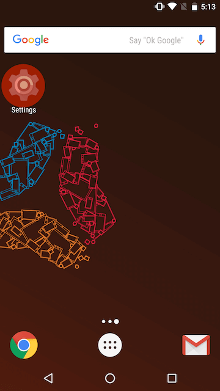
Next, tap on **Notifications**.
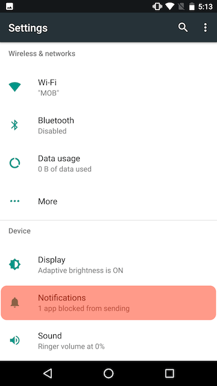

### Step 2: Turn Off Notifications For Your App
Find the app you want to unsubscribe from in the list and tap on it.

Next, switch **Block all** off.
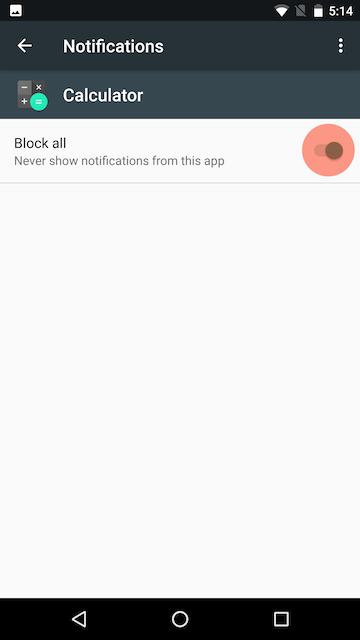
You have now successfully opted out of push notifications for your Android app.
