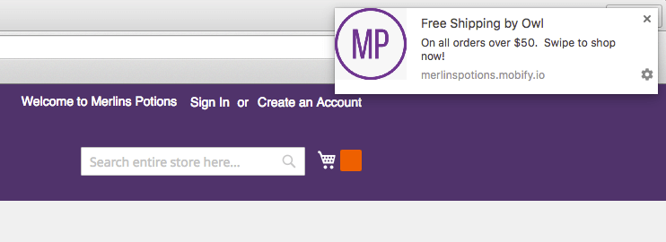
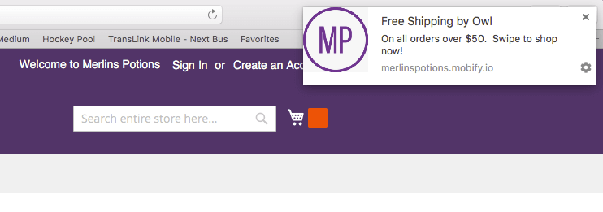
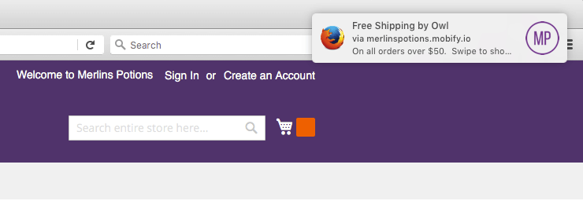
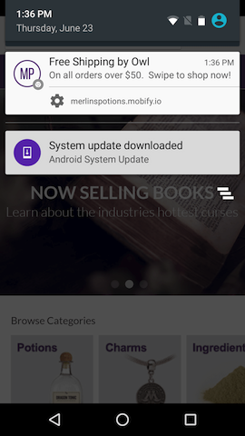
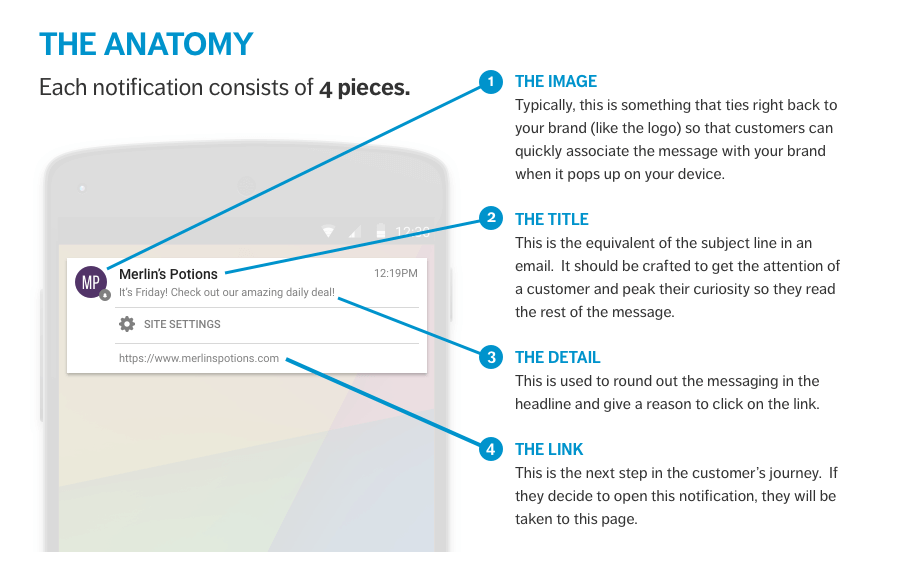
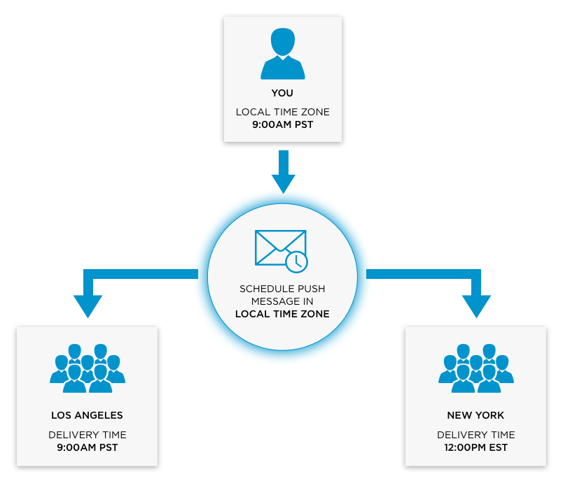

Web Push Notifications are messages sent to shoppers via their browser on both
desktops and smartphones. Web Push Notifications give you greater access to your
shoppers because:

-   Customers don't need to download your app or provide their email address to subscribe.
-   Notifications can be sent to all of your customers on the web rather than just those who have downloaded your app.

Through a simple two tap process, customers can opt in and immediately start to
receive notifications from your brand.

## Supported Browsers

| Browser | Version | Platforms                   |
| ------- | ------- | --------------------------- |
| Chrome  | 46+     | Mobile, Desktop, and Tablet |
| Safari  | 8+      | Desktop                     |
| Firefox | 46+     | Desktop                     |

Web Push Notifications display differently in different browsers:

<figure class="u-text-align-center">
    
    <figcaption>Desktop Chrome</figcaption>
</figure>

<figure class="u-text-align-center">
    
    <figcaption>Desktop Safari</figcaption>
</figure>

<figure class="u-text-align-center">
    
    <figcaption>Desktop Firefox</figcaption>
</figure>

<figure class="u-text-align-center">
    
    <figcaption>Android Chrome</figcaption>
</figure>

## Anatomy of Web Push Notifications

## Web Push Notification Guidelines

-   The image should be a max size of 192 by 192 pixels
-   The image file should be in PNG format
-   The title should be no more than 35 characters in length to fit within all supported browsers
-   The body should be no more than 120 characters in length

## Delivery of Notifications

When a message is sent, it will be shown provided:

1.  The device is connected to the internet.
2.  *On desktop*, the browser is running.
3.  The message has not expired.

Messages are scheduled to be sent using the timezone of the computer that
created the campaign.

If your computer uses Pacific Standard Time (PST) and you create a campaign to
be delivered at 9:00 AM, it will be sent to the audience at 9:00 AM PST.

If your message must be delivered at an exact time to an audience in more than
one timezone, create multiple campaigns and use [Location Filters](../../audience-filters/location-filters/)
to target each timezone.

Visit our [best practices](../best-practices/) page to learn how to send
effective push notifications.
