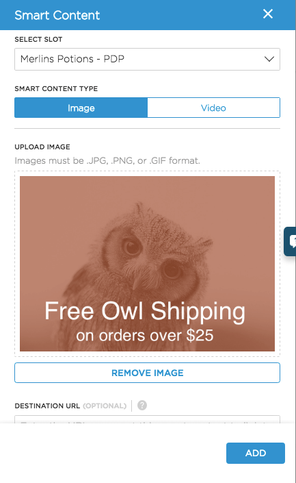
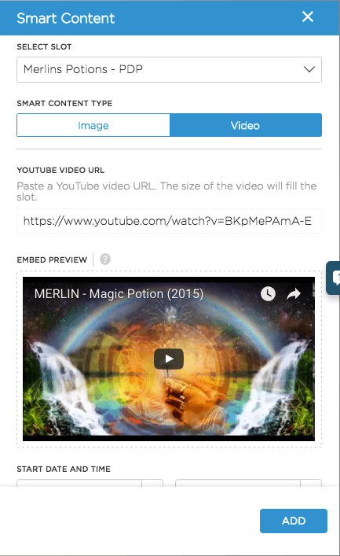

There are 2 types of content that can be displayed on your website or app through a Smart Content campaign: image and video.

## Image

The most common content type for Smart Content is an image. It can be uploaded from your machine by clicking on the Upload An Image button, which will open your file browser.  Alternatively, you can drag and drop your image in the space provided to upload it.

> Tip: Make sure your image is in either PNG, JPG, SVG, or GIF format, and less than 1MB in size.
>
> Tip: The image you upload will be fit to the width of the publishing slot on your site, which means that the height will vary. Make sure to preview your campaign so you know how it will look on the page.  Full width mobile banners should have a width of approximately 100px.

The image content type also allows you to add a destination URL. This is the URL that the user will be taken to when they click on your content. If the destination URL is outside of your domain, UTM parameters will be added to track your piece of smart content as the acquisition channel for the site the user has been sent to.

## Video

A Marketer can select a YouTube video as content to be displayed in a designated slot. It can be added by pasting the YouTube URL in the YouTube Video URL field. Connection Center handles the HTML output and embeds that into the defined Smart Content slot.  It will resize the video to fit 100% of the slot width.

[Let's get started now](../getting-started/)
