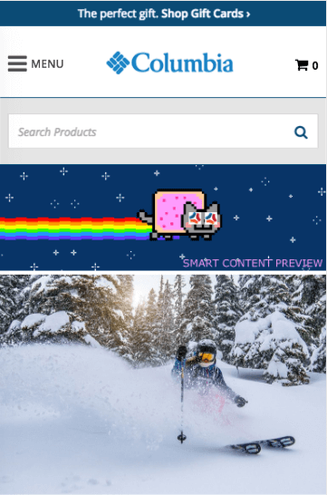
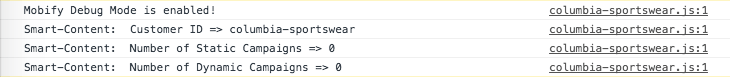

Simple steps to make sure Smart Content will run successfully on your website

## Mobify Platform Setup

1.  You have already contacted Mobify to [set up the business on the Mobify Platform (previous section)](../getting-started#mobify-platform-setup)
2.  Make sure the Mobify Tag has been added to the site or app (there is a useful [Google Chrome extension](https://chrome.google.com/webstore/detail/mobify-debug-tools/nlgcmbchmhboiijknllohbejoomplbna) for that now)
3.  Check if the Smart Content script is being loaded by adding `?MOBIFY_DEBUG=1` or `#MOBIFY_DEBUG=1` at the end of the URL of the customer's website.

If you have some slots already created, you will see a placeholder in each slot available on the current page.

Then open the console of your browser, you should see logs mentioning Smart Content.

<!--To disable the debug mode, just visit any page of the website with `?MOBIFY_DEBUG=0` or `#MOBIFY_DEBUG=0` at the end of the URL.-->

## Create a Campaign

Initial setup is now complete, and your slots are setup.

[Let's have a look at the best practices](../best-practices).
