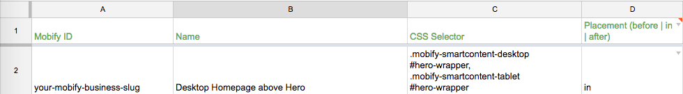
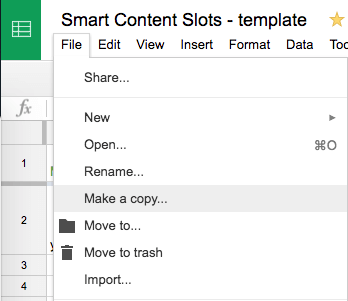

Get up and running with Smart Content in a few simple steps

## Mobify Platform Setup

Contact Mobify to set up the business on the Mobify Platform
1. Create the business in the [Connection Center dashboard](https://www.mobifyplatform.com)
2. Create the business in the [Location Dashboard](https://dashboard.donde.io) and associate the Mobify ID
3. Make sure the Mobify Tag has been added to the site or app (there is a useful [Google Chrome extension](https://chrome.google.com/webstore/detail/mobify-debug-tools/nlgcmbchmhboiijknllohbejoomplbna) for that now)

## Design Process

The next step to get started is to decide where to place Smart Content on the site. Recommendations:
-   What banners on the site are updated the most? Try replacing these with Smart Content first
-   Start with a handful of Smart Content slots to get used to the new workflow. It's easy to add more later
-   Look at decision points for customers. Where can you help transition them to the next step in their buying journey?

Once you have determined where to add Smart Content to the site, proceed to the next step to create Smart Content slots

## Create Smart Content Slots

A Smart Content Slot is a placeholder on a website or app where Smart Content can be added through the Connection Center. Currently, Mobify adds these slots to each website. To add a slot, make a request to Mobify with the below details:

-   Mobify ID: this is the business name used in Connection Center
-   Name: the name you would like to use to identify the slot. This name should be human readable and descriptive of where the slot lives on the website/app. It will be displayed in Connection Center to select where to add smart content when creating a new campaign
-   CSS Selector: the name of the valid [CSS selector](http://www.w3schools.com/cssref/css_selectors.asp) used to identify where the slot should be placed. Along with the placement field, this will be used to insert Smart Content onto the page.  
Please make sure this CSS selector is matched **only** on the pages where you want the slot to appear.  
**New** : you can now prefix your CSS selector with `.mobify-smartcontent-desktop`, `.mobify-smartcontent-mobile` or `.mobify-smartcontent-tablet` to restrict the slot to this specific kind of device. 
These classes are being added automatically on the &lt;body&gt; tag of any website where Smart Content has been installed. 
You don't need to add these classes anywhere in the customer's website.  
-   Placement: the placement of the smart content relative to that CSS selector. It can be 3 values :
    -   `in` ( smart content will **replace** the content of the element matched by the CSS selector). 
    Because it replaces the content, you will likely need to **edit the customer's website** to add placeholder divs.  This is also the **default value**.
    -   `before` (we will create a new div element just **before** the element matched by the CSS selector).  This will create a new element on the page. This option is often used when you don't want to edit the customer's website directly to add a placeholder for your content.
    -   `after` (we will create a new div element just **after** the element matched by the CSS selector).  This will create a new element on the page. This option is often used when you don't want to edit the customer's website directly to add a placeholder for your content.
-   Preview URL: a URL that links to a page that contains the slot. This URL will be used to preview Smart Content campaigns in that slot before they go live
-   Custom CSS styles : CSS styles which will be applied to this specific slot. 
Useful to add some space between the matched element and a slot _before_ or _after_ the matched element. 
These CSS styles will be added automatically by the Smart Content script, they don't need to be added to any CSS file loaded on the customer's website.

## [Slot creation template](https://docs.google.com/spreadsheets/d/1SYKtXJkm2YK9gB0Kd_tchSQ2fEOcPQDE2B4cX7p2-N8/edit?usp=sharing)

If you want to create multiple slots, it's a good idea to create a spreadsheet with the above fields as headings using [this template](https://docs.google.com/spreadsheets/d/1SYKtXJkm2YK9gB0Kd_tchSQ2fEOcPQDE2B4cX7p2-N8/edit?usp=sharing) (File > Make a Copy)

The columns in green are mandatory and need to be filled. The columns in orange are optional but highly recommended. The columns in red DO NOT need to be edited.

For more details on slots and how they work, check out the [Smart Content Slots](../overview#slots) article

## Slot creation

Once the spreadsheet is completed, please share with the [Location team](https://mobify.slack.com/messages/product-location) who will save these slots in Mobify systems.

## Debugging slots

Initial setup is now complete, let's [verify the slots we just created](../debugging).
