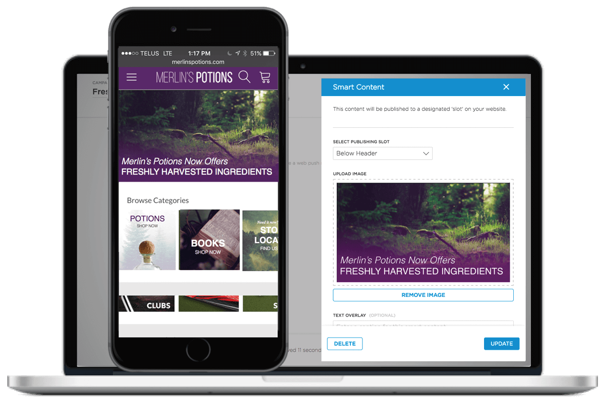
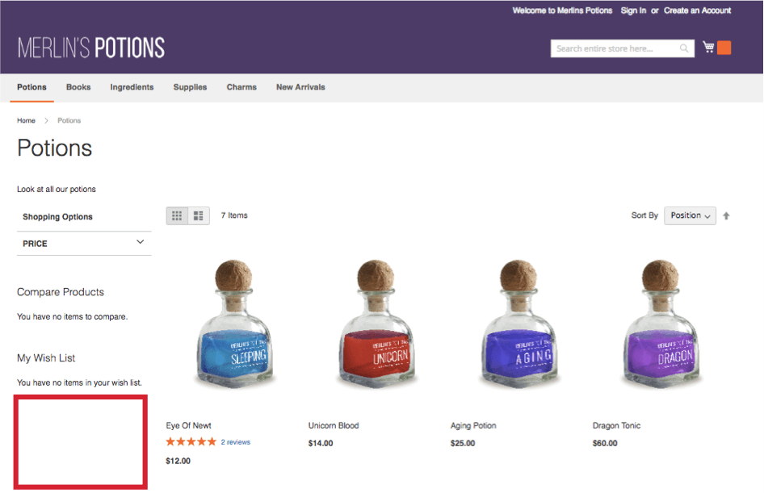
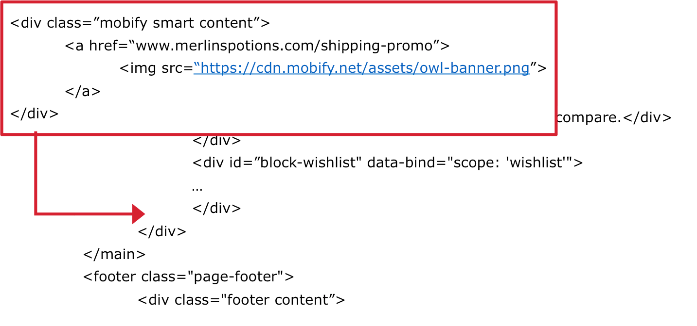
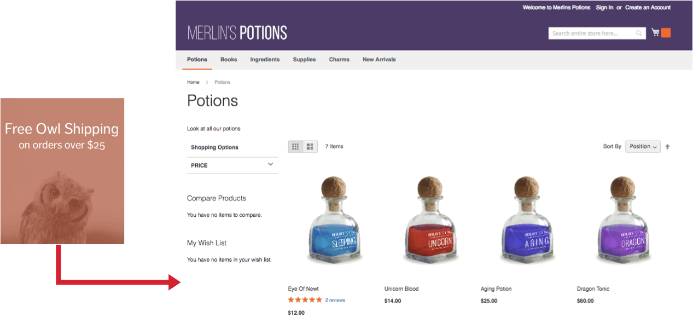

Smart Content allows you to add compelling content to engage with your customers
through your website and app. Use Smart Content to:

-   Create unique promotional content tailored to the platform your customers use to engage with your brand.
-   Target content dynamically to engage with your customers in different locations.

## Slots

The section of your desktop site, mobile site, or app where a smart content
image will be displayed to your shopper is defined as a **slot**.

When Smart Content is initially set up, Mobify will help identify the best areas
on your website or app to display content.

The specific section on your website is used as an anchor point for the
Connection Center to populate content under.

For example, if the section under the wish list of your website is identified as
a slot, the wish list section is used as an anchor point.

When a campaign is created in the Connection Center to display content into the
slot, the uploaded image asset will get inserted directly below the wish list
section.

The result is the loading of the content.

To summarize a slot is a specific area on your web pages where you will be able to inject Smart Content.

A few other things worth mentioning :

-   A slot can be an existing element on the page (the content inside the element will be replaced), or a new element created before or after an existing element. More details available [in the next section](../getting-started).
-   We can add custom styles for slots (e.g. a margin between the previous element and the slot).
-   All slots have a `max-width : 100%` set by default, meaning the Smart Content won't be wider than the parent element.
-   It is possible to restrict a slot to a specific kind of device (desktop, mobile, tablet), more details available [in the getting started guide](../getting-started).

[Let's have a look at the different content types available](../content-types/)
