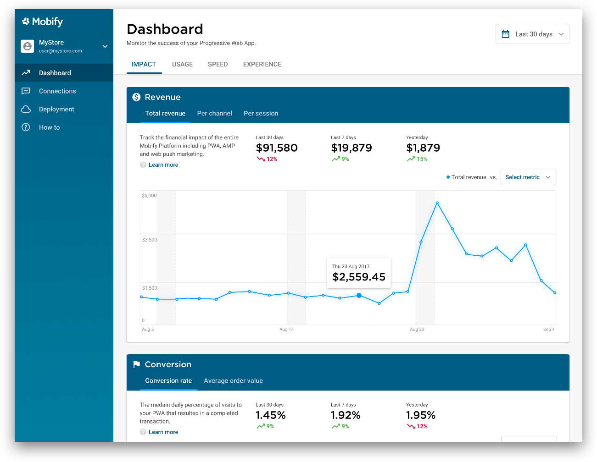
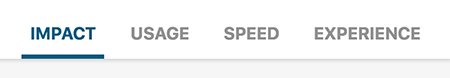
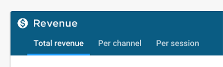
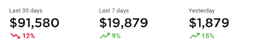
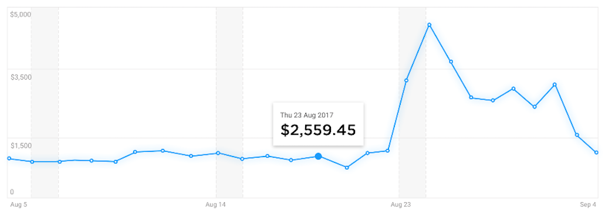
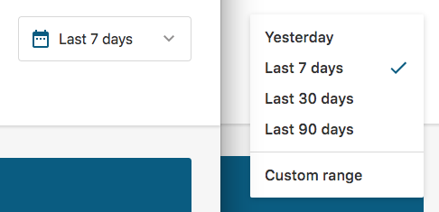
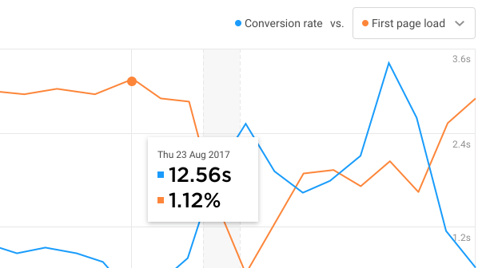
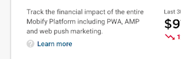

## About the prototype

The Mobify Dashboard allows you to track the performance of your Progressive Web App through daily data and trends over time.
The product is currently in beta and has limited functionality. Feedback will tell us what are the most important things we need to work on before releasing the finished product.

The data all comes from Mobify’s Engagement Engine, meaning that:

### The data may look different to your current analytics provider
Tracking varies across all analytics platforms so we developed a single source of truth for all our customers.
Take bounce rate for example. This often appears higher than other analytics providers because we use the traditional definition of bounce rate; 'sessions with a single pageview'. Other providers automatically filter out sessions recording certain page events, reducing the number of recorded "bounces".

### It’s PWA-specific
The data only goes back to when your PWA analytics were being tracked correctly in Engagement Engine, and is an in-depth overview of your mobile performance. The data in the dashboard is intended to supplement to your current analytics provider rather than replace it.

### It updates daily but not quite in real-time
The data will update once per day. So accessing the product at the start of each working day should give you new data to look at.

## Dashboard FAQs

### How do I access the dashboard?

The Dashboard is accessed at [mobifyplatform.com](http://www.mobifyplatform.com) and user access is driven through the Mobify Cloud. If you forget your password, follow the password recovery steps [here](https://cloud.mobify.com/password/reset).

If you are still having issues [reach out to the Mobify product team](mailto:athomas@mobify.com) and they'll get you set up.

### Which parts of the navigation are included in the research?

The left hand navigation contains links to other sections of the Platform including the Push Messaging center (Connections) and bundle deployment. These are not subject of the prototype, only the Dashboard section.

### How is the data organized in the dashboard?

The Dashboard's content is segmented under 4 tabs. Each of these top tabs will show a different set of metrics.

- IMPACT - Revenue and conversion metrics
- USAGE - User sessions and Push Messaging
- SPEED - Site load times including AMP
- EXPERIENCE - Checkout dropoff rates

Under each tab you can see each metric broken down further. For example revenue is broken down by total revenue, revenue per channel (AMP customers only) and revenue per session.

Under each of these metric tabs is where you’ll see the data tracking.

Under Total Revenue for example, you can see the combined revenue coming through the PWA in the selected time period (in this case last 30 days) and if that number trended up or down from to the previous period.

This data under the selected time period is then referenced in a trend graph below, showing how the data changed day to day.

### How do I change the dates?

Data sets can be changed using the global date switcher in the top right. This contains a selection of preset ranges and a custom date range picker to zero in on a particular selling period.

Switching dates will result in the new time period reflected in the totals and on the graphs across the app.

### How to compare metrics to other metrics?

Certain metrics can be plotted against each other to help find correlations between metrics.

Choosing a comparison metric will plot the new metric on the same graph. At this stage only certain metrics are comparable.

### How can I find out about how the data is recorded?

We’ve added some helpful information to help understand what to look for in the correlations. This can be found by clicking on the Learn More buttons on each card.

Behind these links are details about how the data is calculated and what to look for in the correlations.

### What kind of tasks can the Dashboard help with?

We feel like the tool can prove useful in several situations, these include:

#### Tracking daily progress
Check back each day to see metrics from the previous day and if you're trending up or down.

#### Going back in time to check performance at a particular selling period
Using the date picker, point all metrics to a set period in time (such as Black Friday) to measure performance at that time.

#### Understanding which days of the week or month mobile shoppers are most active
Weekends are marked on the data charts to help identify where numbers shift across days of the week and correlate across weeks.

#### Discovering which metrics regularly influence peaks and troughs
The comparison tool is useful at indicating the metric trends that influence other metrics. For instance, comparing a high bounce rates to traffic may indicate whether a larger volume of visitors is the cause of a higher number of people leaving the site.
