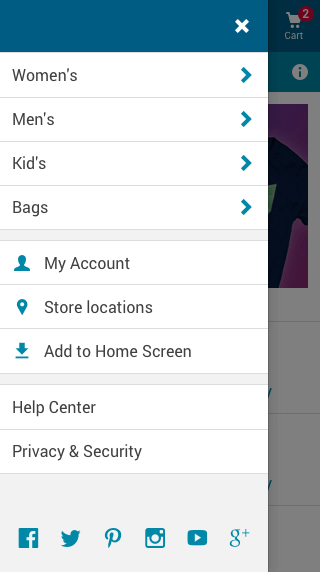
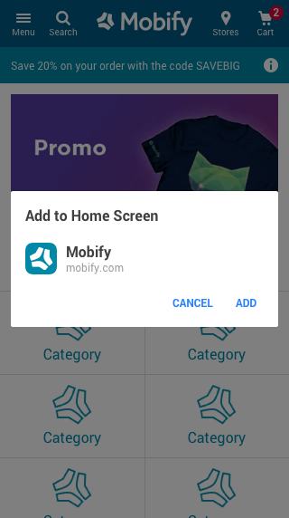
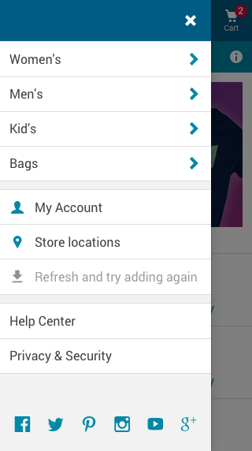
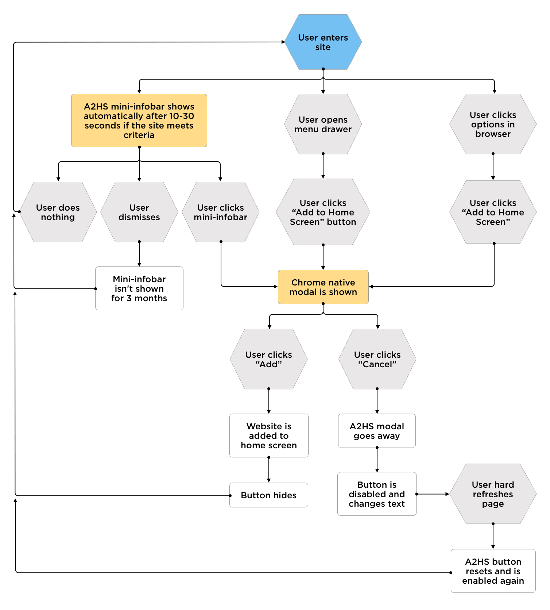

 

   <strong>Note:</strong> The Designing App-Like Patterns series is intended for interaction designers. This series will show you how to use the Mobify Platform to design performant shopping experiences, with app-like user experience best practices.
 

Related Links:
* [Configuring and Testing Add to Home Screen](https://docs.mobify.com/progressive-web/latest/guides/add-to-home-screen/)
* [AddtoHomescreen](https://docs.mobify.com/progressive-web/latest/components/#!/AddToHomescreen)
* [Full Screen Mode](https://docs.mobify.com/design/full-screen-mode)

## Introduction

Add to Home Screen is a feature that contributes to the PWA's app-like experience. It allows users (with supported devices) to add the app to their home screen, just like they would with a native app. Users can then access the PWA in their app launcher, device settings, and task switcher. To encourage this app-like behavior, designers should include an app icon in every PWA project.

Be sure to explore alternative navigation patterns for users who launch your PWA from their device home screen, because the user interface will no longer include the _Back_ and _Share_ buttons that came with the browser UI. Read more about this in [Full Screen Mode](https://docs.mobify.com/design/full-screen-mode)

## Prompts for the official modal

While Firefox, Safari, and Google Chrome all support Add to Home Screen functionality, Google Chrome has an automatic prompt feature which you can customize. (Without this feature, Firefox and Safari do not require further customization.) The next section highlights the Add to Home Screen best practices for Google Chrome. 

When a user wants to add your PWA to their home screen, they will have to confirm this action using an official modal that is built into the Chrome browser. The user can access this modal through a few different prompts:

1. A banner or "mini-infobar" that Chrome displays automatically if the PWA meets Google's criteria
2. An option in Chrome's main options menu
3. A custom prompt on the page (in Chrome 68 and later), usually a button

### Browser changes

In Chrome 67 for Android (and earlier versions), the browser displays a banner automatically if the site meets Google's criteria for the Add to Home Screen feature. In later versions, the browser displays a "mini-infobar" instead. More importantly, the later versions of Chrome allow us to use a custom prompt to show the official modal. This allows us to prompt the user within the app itself, instead of relying on the browser's built-in prompts.

To learn more about the different prompts available for the Add to Home Screen feature, read the [Google Developers site.](https://developers.google.com/web/fundamentals/app-install-banners/)

### Presenting a custom prompt

Here's a mockup that shows a custom Add to Home Screen prompt. Notice how it’s implemented as a button within the main menu drawer. This provides high visibility and a permanent place for the feature, so that the user can return if they decide to use it later.

<figure class="u-text-align-center" style="background-color: #fafafa;">

  
 <figcaption>Pictured on the left is a custom Add to Home Screen button. The screenshot on the right is the official Add to Home Screen modal.</figcaption>

</figure>

### If the user clicks cancel

The Chrome browser can only display the official modal for Add to Home Screen once per session. If the user clicks Cancel in the official modal, we can replace our custom prompt in the menu drawer with a message that asks the user to refresh the page and try again.

<figure class="u-text-align-center" style="background-color: #fafafa;">

 
 <figcaption>Disabled state for the Add to Home Screen button</figcaption>

</figure>

## Best practices

### Separate the Add to Home Screen button from category buttons

Avoid positioning the Add to Home Screen button with buttons related to the critical shopping task. Instead, consider placing it in the main menu drawer, perhaps near general company information such as My Account, or Store Locations.

### Consider placing the prompt elsewhere in the flow

Placing a button within the main menu drawer is a subtle approach to advertising the Add to Home Screen feature. You could also include a prompt on other screens, such as after checkout confirmation or after the user completes logging in.

### Test the wording of the prompt

The phrase "Add to Home Screen" still isn't widely recognized by users and may be confused with regular bookmarking. Google has been testing other phrases, such as "Install App," but they haven't shared any data yet that shows which phrase works best. We recommend that you run your own A/B tests to find the right wording.

## Flow diagram

The diagram below shows the many routes the user can take to get to the official modal for the Add to Home Screen feature—and what they can do with it once they get there.

<figure class="u-text-align-center" style="background-color: #fafafa;">

 

</figure>

To get started using Add to Homescreen, read the [AddtoHomescreen component documentation.](https://docs.mobify.com/progressive-web/latest/components/#!/AddToHomescreen)

## Desktop support

It’s important to note that Add to Home Screen functionality has not yet been considered or tested on desktop, since PWAs on desktop are still quite new to the Mobify Platform. Stay tuned to upcoming releases for best practices on incorporating Add to Home Screen into your desktop PWAs! To learn more about Add to Home Screen for desktop PWAs, visit the relevant documentation in [Google Developers docs](https://developers.google.com/web/fundamentals/app-install-banners/).

<b>IN THIS ARTICLE:</b>

