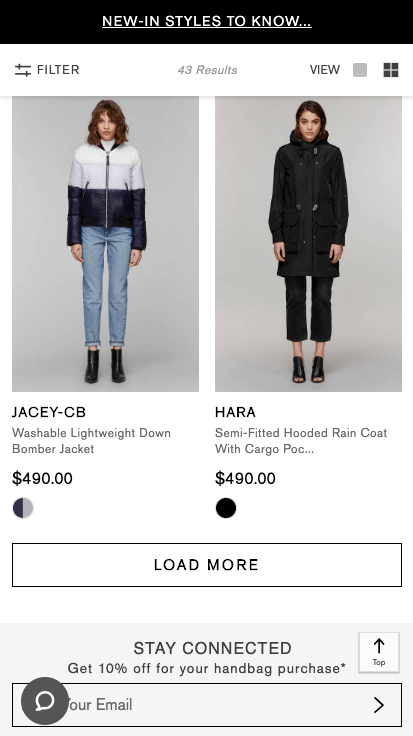

 

   <strong>Note:</strong> The Designing App-Like Patterns series is intended for interaction designers. This series will show you how to use the Mobify Platform to design performant shopping experiences, with app-like user experience best practices.
 

Related Links:
* [LazyLoader](https://docs.mobify.com/progressive-web/latest/components/#!/LazyLoader)

## Introduction

Performant product loading is a strategy that can help you improve the user's perception of how quickly your Progressive Web App (PWA) loads. This strategy uses a combination of lazy loading and "Load More" buttons to alter the user's perception of speed.

**Lazy loading** is a technique that delays rendering of off-screen content until it’s actually needed. This technique has many benefits. It reduces initial load times, speeds up the perceived performance, and decreases overall data usage. In the Mobify SDK, you can use the [LazyLoader](https://docs.mobify.com/progressive-web/latest/components/#!/LazyLoader) component to implement a lazy loading effect. 

**"Load More" buttons** are buttons located at the bottom of the loaded content which will load more content in when pressed.

## Appropriate uses for lazy loading

Lazy loading can be applied:

*   To any **large file size assets,** such as images, to speed up the initial page load.
*   On **long scrolling pages** with many instances of similar items, such as search results pages or product list pages.
*   Alongside a "Load More" button on product list pages as an alternative to pagination for loading the next set of products.

## Best practices

### Use lazy loading for large assets

Lazy loading is recommended for all large assets, such as images, that occur below the initial page load view. This will speed up the initial page load. 

### Use lazy loading for long scrolling pages

<figure class="u-text-align-center" style="background-color: #fafafa;">

 
 <figcaption> [Lancome](https://www.lancome-usa.com) uses the LazyLoader component with customized fade in animation </figcaption>

</figure>

Use lazy loading on long scrolling pages with many instances of similar items, such as search results pages or product listing pages. With long scrolling pages, be cautious about the number of products you choose to display on one page. A never-ending page of results can seem overwhelming, and it’s difficult to navigate.

### Combine lazy loading with a "Load More" button

[Research by Baymard](https://www.smashingmagazine.com/2016/03/pagination-infinite-scrolling-load-more-buttons/) has shown that users generally browsed more products on websites with lazy loading and a "Load More" button. According to Baymard, it’s best to implement the following design pattern: "display 10–30 products on initial page load and then to lazy-load another 10–30 products until reaching 50–100 products – then display a “Load More” button. Once clicked, another 10–30 products are loaded in, resuming the lazy-loading until the next 50–100 products have loaded, at which point the 'Load more' button once again appears." The lazy loading that comes in Mobify’s SDK can be used to achieve this design.

<figure class="u-text-align-center" style="background-color: #fafafa;">

 
 <figcaption>[Mackage](https://www.mackage.com) uses a "Load More Button" for loading more products in on their PLP</figcaption>

</figure>

We suggest applying this best practice from Baymard if your ecommerce site has a long list of products in one category, with many visual product images. As stated earlier, be cautious of displaying too many products on one page. It can be daunting for your user to browse through an infinite page of results.  

<b>IN THIS ARTICLE:</b>

