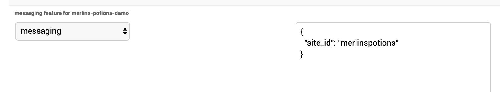
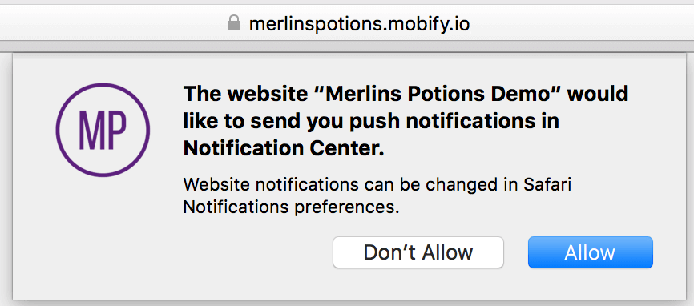
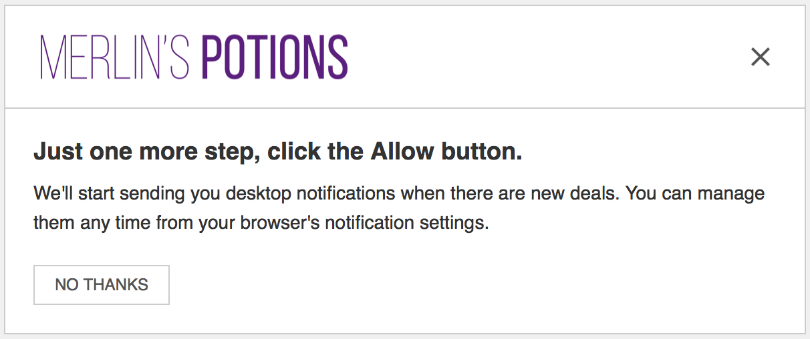
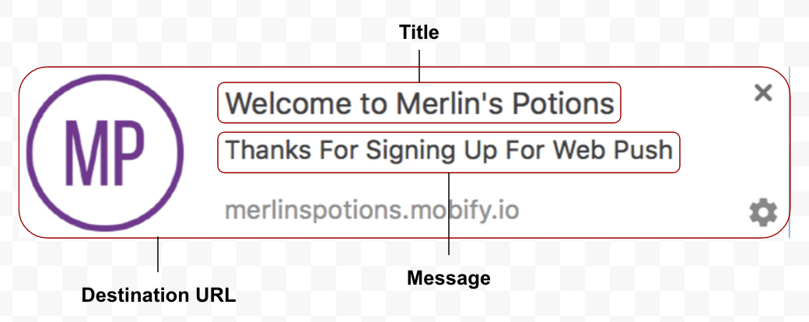
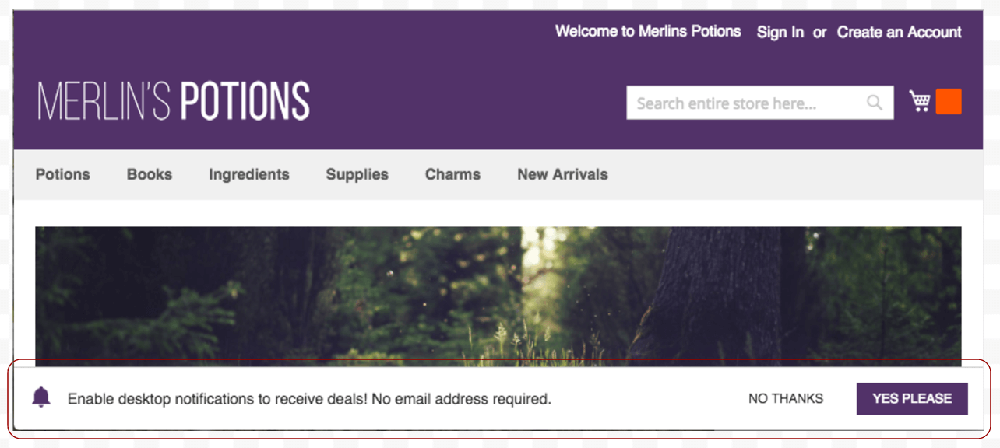

## Cloud Setup

1.  Mobify Tag is installed on client site
2.  A business is created on cloud
3.  A project is created under that business
4.  Messaging Feature Flag is configured for the project in PBJT



```json
{
    "site_id": "merlinspotion"
}
```

## Client Assets

Please refer to this documentation for an overview of what web push notifications looks like on supported browsers.
[http://docs.mobify.com/connection-center/1.0/push-notifications/web-push/](http://docs.mobify.com/connection-center/1.0/push-notifications/web-push/)

### Image Assets

| Asset                | Description                                                    |
| -------------------- | -------------------------------------------------------------- |
| Notification Icon    | A 192px x 192px image asset |
| Safari Icon          | A 256px x 256px image asset |
| Logo and Logo@2x     | The Logo to be displayed on the soft dismiss |

### Text Assets

A webpush notification have 3 important features:
*   Title
*   Message
*   Destination URL when interacted



| Asset                 | Description                                                    |
| --------------------- | -------------------------------------------------------------- |
| Default URL           | Used to populate the message url in the messaging console.     |
| Default Message Title | Used to populate the message title in the messaging console.   |
| Fallback Message Text | Used when web push notification failed somehow.                |

### Page Assets

These are the pages that can be fully customized.

#### **Soft Ask**



We have the option to place the soft ask banner at the **top or bottom** of the browser window

#### **Soft Dismiss**


### Additional Option

Client have option to show a confirmation banner **and/or** a welcome message when a new user subscribed.

#### **Confirmation**


A confirmation banner appears just like the soft ask. It is an instant feedback to the user.

#### **Welcome Message**


A confirmation message delivered to the user when the user is subscribed. This may not be an instant feedback to the user.

If a welcome message is desired, please make sure the following text assets are supplied:

*   Welcome URL
*   Welcome Message Title
*   Welcome Message Text
