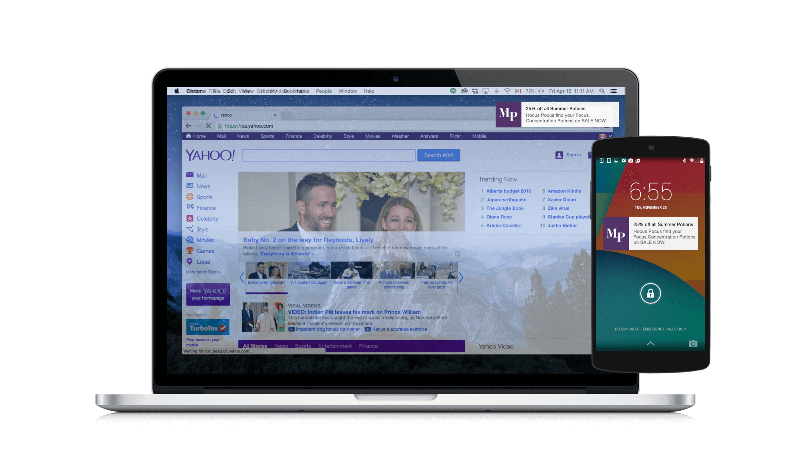

This lets you effectively re-engage visitors on both desktop and mobile with customized, compelling content.

Web push notifications will act in the same way as notifications from an installed app. The user will be presented with a short message with a call to action often linking to a page on your website. Users do not need to have your website or the browser running to receive a message. And they do not need to be using their phone to receive the message.

The difference in behaviour between web push notifications and notifications from an installed app is the opt-in flow. Opting in to push notifications for an app is often a pop-up message the first time the app is used after install. On the web, we want to consider users who are experiencing your brand for the first time. We use a 2 step signup approach that ensures users are engaged before asking them to commit to receiving notifications and that we are not interrupting their shopping journey. This results in a highly engaged, connected subscriber base.

