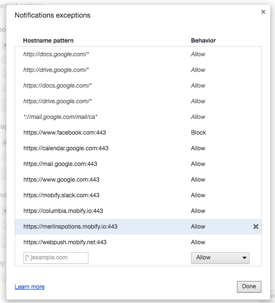

Testing web push has many layers. Due to the current product limitations, is it not possible to automate testing entirely and there are some configurations that are only testable on production. Here is a list of web push test we should perform:

-   Web push assets
-   User Flow
-   All of the above in Desktop Chrome, Desktop Safari, Android Chrome, Desktop Firefox, and Android Firefox

**Important: Do not test web push in incognito mode.**

## Web Push Assets

We should validate text and image that would appear in
-   Soft ask
    -   Opt-in text
    -   Soft Dismiss
    -   Logo
    -   Soft dismiss text
-   Confirmation Banner
    -   Confirmation message / Welcome message
-   Welcome notification
    -   Logo
    -   Title
    -   Message

Please refer to [Requirements And Assets](/messaging/1.0/create-a-webpush-project/requirements-and-assets/) for more detail on each asset.

## User Subscription Flow

A user will always be at a certain state of web push. We need to ensure all states are expected. These configurations are defined by our client. Below is an example configuration that is generated by our web push generator:

1.  On first visit, user will see soft ask every 3 page loads
1.  If user dismisses the soft ask, user should see soft ask again after 5 sessions (Each session expires in 6 hrs)
1.  If user accepts the soft ask, user is redirected to soft dismiss and hard ask
    1.  If user dismisses the soft dismiss, user is redirected back to client site and should see soft ask again after 5 sessions (Each session expires in 6 hrs)
    2.  If user clicks on *Block* on hard ask, user should never see soft ask again
    3.  If user clicks on *Allow* on hard ask, user will be redirected back to client site and the confirmation banner should appear

## Manually Testing User Subscription Flow

This is using the same web push generator default configuration.

### **Test soft ask appearing the first time**

Navigate normally thru client's site, every 3rd page load, you should see soft ask. **Note: You should not see soft ask in checkout area.**

### **Test soft ask appearing after being dismissed**

After you have dismissed the soft ask, open the web inspector and inspect the cookies. There are 2 cookies that you should be aware of here: `mobify.webpush.activeVisit` and `mobify.webpush.visitCountdown`.

-   `mobify.webpush.activeVisit` keeps tracks of number of page you have navigated in this session.
-   `mobify.webpush.visitCountdown` is a countdown that will be set if user dismisses the soft ask. While this cookie value is **not 0**, soft ask should not show.

In order to simulate a session expire, delete the  `mobify.webpush.activeVisit` and refresh the page. You should see the `mobify.webpush.visitCountdown` decrease in count.

## Clearing Your Web Push Notification Setting State

So you got to the point where you have blocked notification or subscribed to the notification. How do you get back to see soft ask again?

1.  **Clear client site cookies**
1.  **Clear browser setting for the web push domain**

    Find the web push domain that the client site is hosted on defined in the web push configuration file. (Example: `merlinspotions.yaml`)
    ```javascript
        # The secure domain that handles service-worker and push
        # subscriptions for this site. This is the 'host' domain.
        # For a customer-hosted site, it may be the same as the
        # 'target' domain. For a mobify-hosted site, this should be
        # site_id.webnotify.me or site_id.mobify.io
        # Example: "webpush-we-host.mobify.io"

        hosting_domain: "merlinspotions.mobify.io"
    ```

    **Desktop Chrome** - Navigate to chrome://settings/contentExceptions#notifications

    

    Find the setting for the web push domain and clear it by clicking on the **X** button

    **Desktop Safari** - Open Safari Menu -> Preferences...

    

    Find the setting for the web push site and clear it by removing it.

    1.  **Clear local storage**

    Make sure `mobify.webpush.client_id` key is cleared from Local Storage

    1.  **Sync setting with web push server**

    With the same browser, navigate to the following url: `https://<hosting-domain>/webpush/reset.html`

    Merlins Potion example: `https://merlinspotions.mobify.io/webpush/reset.html`

    1.  Maybe even **[Clear Staging cookie](../../deployment/staging/)**

## Querying for browser subscription state

At some point, you may need to figure out what is the subscription status of a particular client. This is how we can query for it:

`https://webpush.mobify.net/api/v1/clients/<mobify.webpush.client_id>/<Client web push site id>/`

You may find the value for `mobify.webpush.client_id` as one of the cookie value on the client site.

Merlins Potion example: `https://webpush.mobify.net/api/v1/clients/67c5e92ee470e2b7/merlinspotions/`
