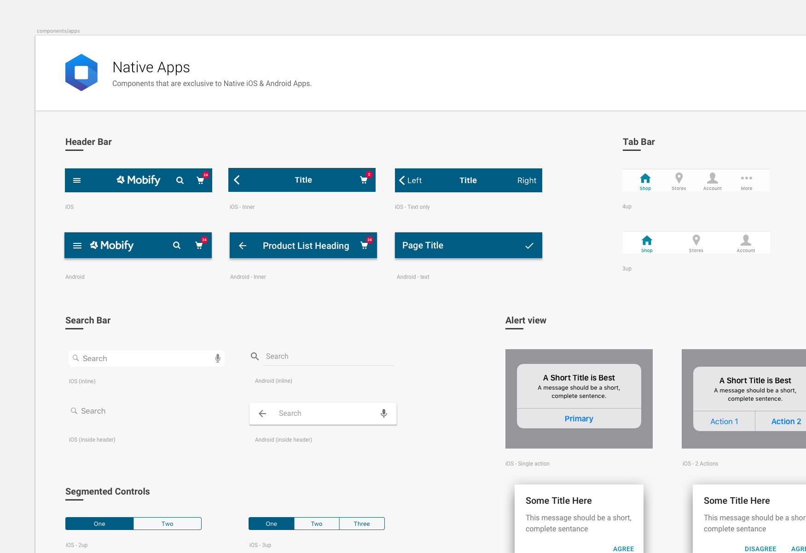
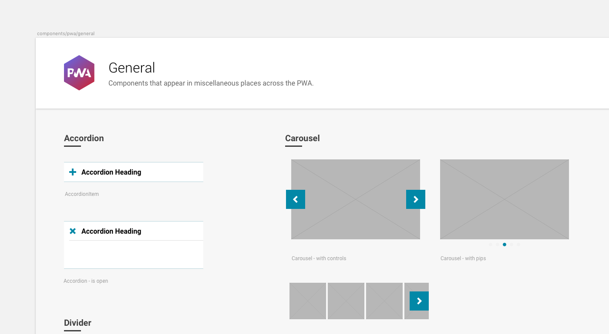
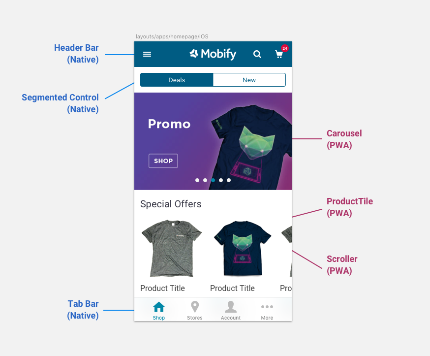
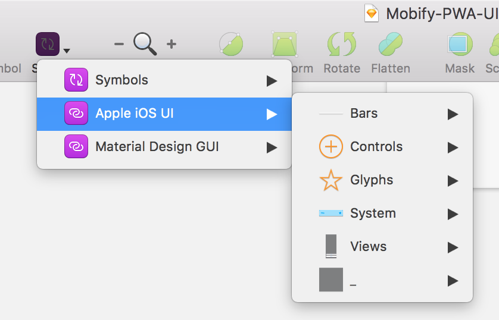

Astro has a set of built in components designed to emulate the appearance and interactions of native applications. Designers should utilize these out-of-the-box components alongside those in the [Progressive Web SDK component library](https://docs.mobify.com/progressive-web/latest/components/) when composing native and web interfaces respectively.

## The Mobify UI Kit

The Mobify UI Kit is a great resource for designers crafting the visual design of the applications. This Sketch file is a good place for any designer to start in understanding the components supported in the Astro component library and the PWA SDK.

If you are new to the UI Kit, [check out this guide on how to set up and start using it](https://docs.mobify.com/design/design-phase/ui-kit/)

### Native App Components

This page acts as a visual representation of all the components with a visual element that are supported out-of-the-box with Astro. Other components can be crafted outside of this collection, but they will require custom development and may increase scope and slow down development velocity.

Designers are encouraged to use this page as a sticker sheet when composing layouts for native applications. Typically the built-in Astro components are responsible for global interface elements such as alert dialogs, headers, navigation modals and state-switching functionality such as tab bars. These components are differentiated as iOS or Android. This has been done to reflect the user experience that platform's users are experiencing in their other apps.

### PWA components

All other components required to craft a complete shopping experience can be found amongst the PWA components. These components are universal across iOS and Android and represent Mobify's best practices in ecommerce design. They are the product of extensive research and testing and facilitate maximum development velocity when used.

Designers should combine these components with those in the Native Apps collection when composing app layouts.
Below is an example of how a typical app layout may comprise of both native Astro components and PWA components.

## iOS and Android system UI

The UI Kit links symbols from an iOS UI library and a Material Design library file for the Android Nougat OS. These contain standard iOS and Android system components such as keyboards, status bars and alert UI. These assets are useful when prototyping interactions that feature these system-driven UI elements.

## App Icons

When exporting App icons for the App Store and Google Play Stores, designers should follow the latest guidelines from Apple and Google respectively. Icons appear in several places and thus must be exported in different formats. Below are some useful links for exporting icons to appear in different parts of the app including notifications and status bars.

Extensive list of export sizes for iOS devices:
https://developer.apple.com/library/content/qa/qa1686/_index.html

Android icon export guidelines:
https://developer.android.com/guide/practices/ui_guidelines/icon_design.html

Android notifications and status by icons:
https://developer.android.com/guide/practices/ui_guidelines/icon_design_status_bar.html
