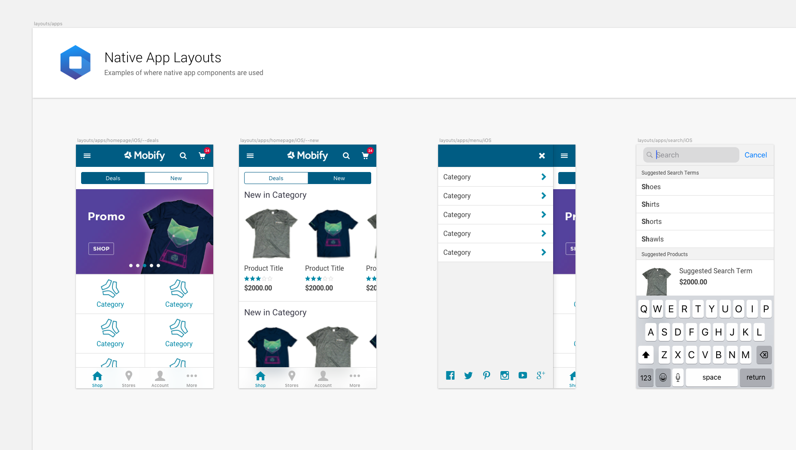
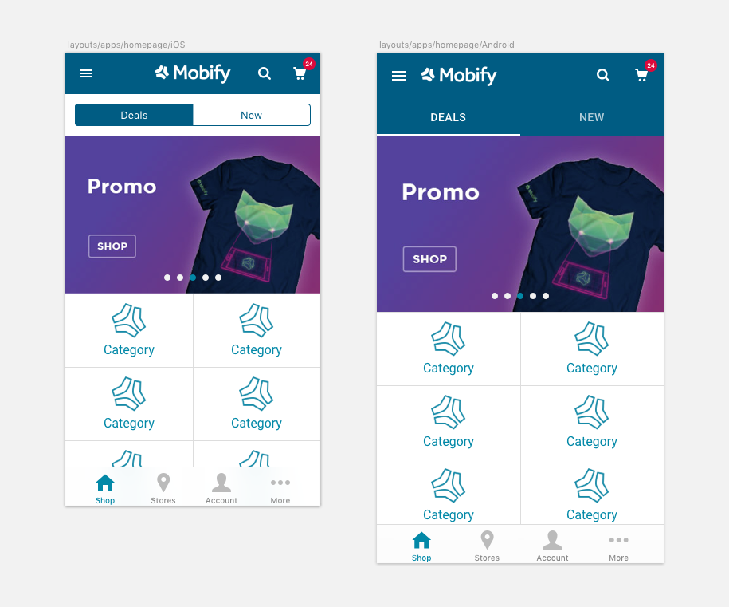

Within the Best Practice Layouts page of the UI Kit are a selection of Native App layouts for iOS and Android. These are designed to indicate how native components could be used alongside PWA components to create great shopping experiences on native applications that looks and feel like they belong there.

These layouts also provide insight into how iOS and Android design patterns may differ. It is important each device's user base feels like the experience belongs on that device.

