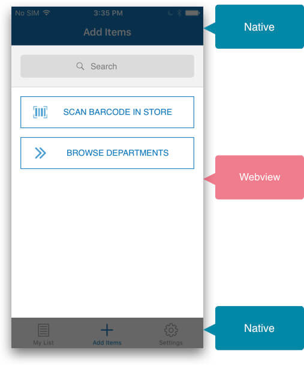
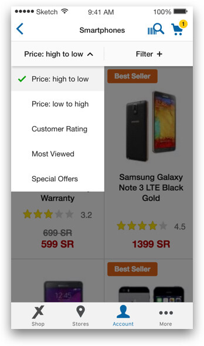
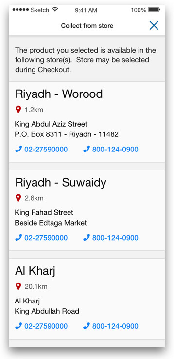
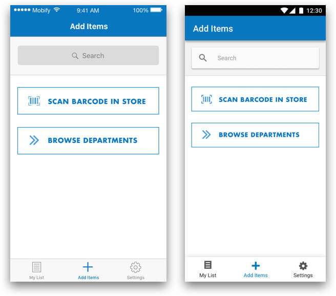

Mobify native apps are created by mixing native UI elements with mobile web views. This is because shoppers expect apps and websites to behave differently.

## Native vs Web views

Native components are commonly used in the header and tab bar, and the web view is the portion of the screen between the two:

<figure class="u-text-align-center">
    
    <figcaption>Generally, headers and tab bars are native, with the content in between being a web view.</figcaption>
</figure>

To reduce build time, you should generally limit the amount of customizations done to web views — what you see on mobile web is what will appear in the app. There are a few scenarios where modifications to web views are frequently needed:

-   Removing the breadcrumbs; breadcrumbs are replaced by the back arrow in the header bar.
-   Removing page titles; page titles are moved into the header bar.
-   Reorganizing items on the Product Details Page (PDP) or other pages; it often makes sense to reorganize the Product Details Page (PDP) so that the product image is first on the page, followed by the product name. This is to reduce redundancy of the product name being repeated directly underneath the page title.

## Overlays & Modal Dialogs

It is important to note that any web view modals or overlays will appear between the header and tab bar. If a full page modal is desired, the Header and Tab bar can be hidden while the modal is visible.

<figure class="u-text-align-center">
    
    <figcaption>Overlay within the web view.</figcaption>
</figure>

<figure class="u-text-align-center">
    
    <figcaption>Fullscreen modal with Header bar and Tab bar hidden</figcaption>
</figure>

## Designing for iOS and Android

We recommend that designers initially create designs for a single platform, and then create mockups for variations in the other platform.

Native components such as the Header and Tab Bars should have a separate design for iOS versus Android as the two ecosystems differ greatly in their approaches to UI. Once that design has been established, it is not necessary to create mockups for both platforms if their web views will be identical. These components are separated in the UI Kit.

<figure class="u-text-align-center">
    
    <figcaption>Example of how a design might differ between iOS (at left) and Android.</figcaption>
</figure>

## Design constraints

It is important for designers to communicate effectively with developers when crafting native app mocks. Developers may have feedback about the feasibility of the design with the Astro and modifications may be required before showing the client.
