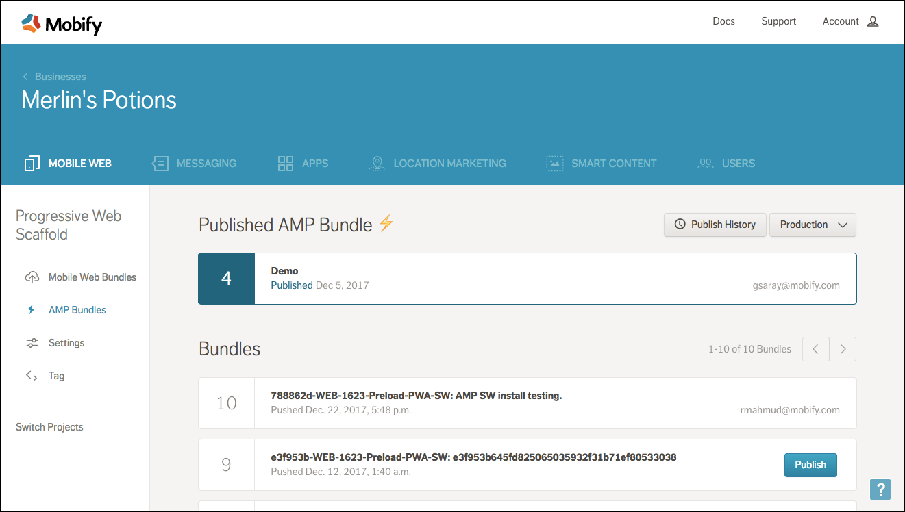
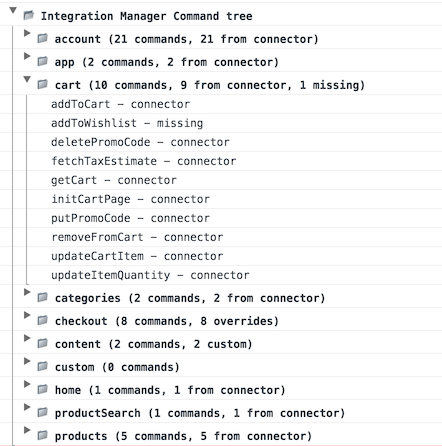

Released on January 4, 2018

The Mobify team is ecstatic to kick off the new year in fashion with a significant release that adds commonly requested features, fleshes out the developer experience across a wide part of the platform, and starts expanding on future architectural changes as part of the on-going roadmap. Specifically, we are highlighting a few common themes:
  * **Commonly requested features** - internationalization, multivariate testing integrations and analytics documentation
  * **Expanded Accelerated Mobile Pages support** - new deployment interface and deeper integrations into PWAs and analytics
  * **Improved ecommerce system integrations**

## New features

### Progressive Web Apps

#### Internationalization and localization support
Previous solutions for localization required additional code customization to support localization.

The [react-intl](https://github.com/yahoo/react-intl) library has been integrated for internationalization and localization support. With out of the box support including features for handling multiple currencies, string translations, and locale specific formatting, localizing your PWAs gets much easier, reducing implementation hours and complexity.

As part of integrating react-intl, we introduced [breaking changes to currencies](/progressive-web/latest/reference/changelog/) to get that integration working.

### Accelerated Mobile Pages

#### AMP deployment interface
Now your whole team can preview and manage changes to your AMP pages. Similar to PWA deployments, you can now upload an AMP bundle to our Mobify Cloud dashboard, and from there your team can preview the AMP pages and put your AMP bundle into production. Previously teams could only manage deployments via the [command line interface](/amp-sdk/latest/getting-started/publishing-your-site/).

You can also see a history of all your AMP bundles published to Cloud. With Mobify’s user friendly Cloud dashboard, you don’t need to be technical to manage which versions of your AMP pages are live.

<figure class="u-text-align-center">
    

        
    

    <figcaption>AMP Deployment UI</figcaption>
</figure>

### Platform Integrations
#### Monetate and multivariate testing integrations
Almost every enterprise ecommerce deployment will integrate a 3rd party A/B or multivariate testing solution. Integrating these solutions can be complex due to their lack of support for single page applications. As a better starting point for developers looking to complete an integration, we have released:
  * General guidelines, limitations and recommendations for [any multivariate integration](/progressive-web/latest/multivariate-testing/mvt-overview/)
  * New PWA components to assist with integrations for creating [audience splits](/progressive-web/latest/components/#!/Split), and [exposing PWA APIs](/progressive-web/latest/components/#!/ExposeApiBase) to multivariate experiences
  * Cookie management for integrating cookie modifications from multivariate experiences
  * A connector for [Monetate](http://monetate.com/) based on the [Analytics Manager](/progressive-web/latest/multivariate-testing/integrating-monetate/) framework, which will send all required data to Monetate to leverage as many of the Monetate capabilities as possible. Data sent includes page views, product views and transactional information.

In the future, we plan to expand support for other multivariate testing engines such as [Oracle Maxymizer](https://www.oracle.com/marketingcloud/products/testing-and-optimization/index.html), [Optimizely](https://www.optimizely.com/) and [Adobe Target](http://www.adobe.com/marketing-cloud/target.html).

## Enhancements

### Accelerated Mobile Pages

Prior to this release AMP sessions would be incorrectly double counted in Google Analytics when both AMP and PWA was connected to the same Google Analytics property. To prevent this, we've enabled analytics tracking between AMP and non-AMP sessions through [AMP Client IDs](https://developers.google.com/analytics/devguides/collection/amp-analytics/client-id) and [`amp-user-notification`](https://www.ampproject.org/docs/reference/components/amp-user-notification) (for use with AMP Client IDs). AMP Client ID enables you to associate user activity on AMP and non-AMP pages on Google Analytics. `amp-user-notification` is to be used with AMP Client ID, to support the [privacy policy requirements](https://support.google.com/analytics/answer/7486055?hl=en) to use AMP Client ID.

AMP/PWA page load performance has been improved through adding support for [`amp-install-service-worker`](https://www.ampproject.org/docs/reference/components/amp-install-serviceworker). Browsing on AMP and transitioning into the PWA requires a hard navigation, and there previously was a noticeable load time when transitioning between the two. The `amp-install-service-worker` component enables service worker installation directly on AMP pages for preloading of shared AMP/PWA content, leading to faster load times when transitioning between AMP and PWA.

### Platform Integrations
#### New Integration Manager module
Based on feedback from developers, the previous versions of Integration Manager for integrating with any ecommerce backend resulted in more duplicate code than preferred. As part of addressing developer feedback in this area, version 0.4 of Integration Manager is now available with the following features:
  * A separate [module](https://www.npmjs.com/package/mobify-integration-manager) for Integration Manager is now available, as part of decomposing the PWA SDK into smaller chunks that can be managed and upgraded separately with a more formal API structure. All supported connectors are also part of this module.
  * A central Integration Manager object that simplifies access to configurations, supported commands and providing overrides with custom code
  * Debugging enhancements that provides key information on commands for your project
  * Better separation of UI-related aspects from commands, specifically around initializing pages. Older initialization commands are now deprecated in favor of smaller, more maintainable commands

Overall, the updated Integration Manager will provide better hints for development teams on missing and customized commands, such as below:
<figure class="u-text-align-center">
    

        
    

    <figcaption>Integration Manager console</figcaption>
</figure>

See the updated documentation for [building](/progressive-web/latest/ecommerce-integrations/building-a-connector/) and [extending](/progressive-web/latest/ecommerce-integrations/extending-a-connector/) a connector, along with the [upgrade guide](/progressive-web/latest/ecommerce-integrations/upgrade/)

We plan to enhance this module to encourage additional code reuse as part of a future 1.0 release, so an upgrade to use the new module is recommended in preparation.

#### Expanded platform analytics documentation
As part of expanding developer support for the previously released [Analytics Manager](/progressive-web/latest/analytics/analytics-overview/) framework, the following documentation has been updated:
  * Standard User Interaction events have been [documented](/progressive-web/latest/analytics/built-in-events/#ui-interaction-events) along with a standard naming scheme
  * Form errors are captured to help identify where users and running into user experience or system issues during transactions
  * Transactional events such as product impressions, clicks and details have been [documented](/progressive-web/latest/analytics/ecommerce-analytics-event/) to track when products are viewed and clicked as part of a shopper journey

## Fixes
  * `SelectorRouter` and `Query Router` have been updated to support `fetchAction` and `fetchURL`. See the [changelog](/progressive-web/latest/reference/changelog/) for breaking changes
  * iFrame Bridge has been updated for correctly triggering and queueing navigation events
  * Various fixes to the PWA SDK. See the [changelog](/progressive-web/latest/reference/changelog/) for details.
