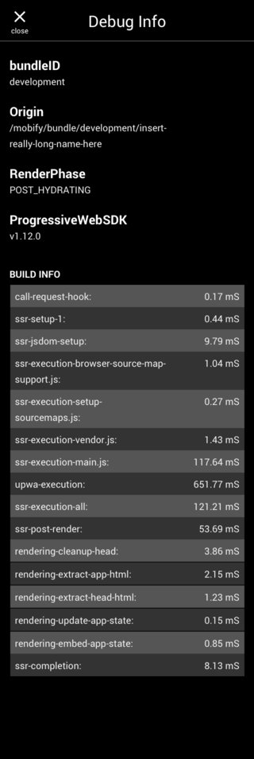

Released on August 15th, 2019 which corresponds to version `1.12.0` of our libraries.

In this release, we’ve made enhancements to our Progressive Web Apps (PWAs), Application Delivery Network (ADN), Mobify Test Framework, as well as general improvements to the developer experience.

## Features

### Progressive Web Apps (PWAs)

#### DebugInfo Component

We've added the [DebugInfo Component](../../../progressive-web/latest/components/#!/DebugInfo) to Mobify’s Component Library, which aims to assist developers by surfacing key information about their builds. The DebugInfo component brings the following information together so you can access it in one place:

- _bundleID_ of the build
- _Origin_ of the build
- _RenderPhase_, the build’s current rendering phase
- _ProgressiveWebSDK_, version of the Mobify Platform
- Build info events

<figure class="u-text-align-center">
    

        
    

    <figcaption>DebugInfo Component</figcaption>
</figure>

### Application Delivery Network (ADN)

#### Application Cache
Guarantee better page load speed and performance, regardless of backend system behavior. 

The new Application Cache is a general caching mechanism available to store data that can be reused across requests. It’s useful for implementing improvements such as minimizing Time to First Byte by caching entire or partial page responses. [Read our Guides article on Application Cache](../../../progressive-web/latest/guides/ssr-performance-application-cache/) for details on how to store and invalidate data in the Application Cache.

### Mobify Test Framework

#### Lighthouse on Desktop Devices

The [Mobify Test Framework](http://docs.mobify.com/mobify-test-framework/latest/) now has the option to run Lighthouse on desktop PWAs by specifying the device type in the package.json file.

## Updates

### Progressive Web Apps (PWAs)

#### Developer Experience Enhancements
We’ve continued to improve the Mobify Platform with the goal of enhancing our overall developer experience. This release, we reduced the overall size of the Mobify Platform by an additional 60kb which should further improve Platform performance.

In addition, all the high and critical security vulnerabilities that were caused due to our developer dependencies have been resolved.

#### Analytics Integrations
Easily integrate analytics into your project with pre-built connectors for Mobify’s Engagement Engine, Google Analytics, and Google Tag Manager.

We’ve added new schemas for the following analytics events with the new interface: 

- [`OFFLINE`](../../../progressive-web/latest/analytics/analytics-integrations-events/#offline)
- [`PAGEVIEW`](../../../progressive-web/latest/analytics/analytics-integrations-events/#pageview)
- [`PERFORMANCE`](../../../progressive-web/latest/analytics/analytics-integrations-events/#performance) 
- [`UIINTERACTION`](../../../progressive-web/latest/analytics/analytics-integrations-events/#uiinteraction)
- [`PRODUCTIMPRESSION`](../../../progressive-web/latest/analytics/analytics-integrations-events/#productimpression)
- [`PURCHASE`](../../../progressive-web/latest/analytics/analytics-integrations-events/#purchase)
- [`ADDTOCART`](../../../progressive-web/latest/analytics/analytics-integrations-events/#addtocart,-removefromcart)
- [`REMOVEFROMCART`](../../../progressive-web/latest/analytics/analytics-integrations-events/#addtocart,-removefromcart)
- [`ADDTOWISHLIST`](../../../progressive-web/latest/analytics/analytics-integrations-events/#addtowishlist,-removefromwishlist)
- [`REMOVEFROMWISHLIST`](../../../progressive-web/latest/analytics/analytics-integrations-events/#addtowishlist,-removefromwishlist)
- [`APPLEPAYOPTIONDISPLAYED`](../../../progressive-web/latest/analytics/analytics-integrations-events/#applepayoptiondisplayed)
- [`APPLEPAYBUTTONDISPLAYED`](../../../progressive-web/latest/analytics/analytics-integrations-events/#applepaybuttondisplayed)
- [`APPLEPAYBUTTONCLICKED`](../../../progressive-web/latest/analytics/analytics-integrations-events/#applepaybuttonclicked)
- [`LOCALE`](../../../progressive-web/latest/analytics/analytics-integrations-events/#locale)
- [`ERROR`](../../../progressive-web/latest/analytics/analytics-integrations-events/#error)

A data structure schema validator has also been added to guarantee that developers are sending their analytics events in the correct format for the corresponding analytics engine.

We’ve also released a new set of documentation and guides on leveraging the new Analytics Integrations interface. To start, we suggest reading our [Analytics Integrations Overview](../../../progressive-web/latest/analytics/analytics-integrations-overview/).

### Application Delivery Network (ADN)

#### Configurable TLS versions
Gain better control over end user security and browser support. When creating or updating targets, you can now specify the TLS version for providing secure deployment encryption. By default, all targets will use [TLS 1.1](https://caniuse.com/#feat=tls1-1) to meet the minimum requirements for PCI compliance. Customers can choose a different version, such as [TLS 1.2](https://caniuse.com/#feat=tls1-2), based on their security and browser support needs. TLS versions can be updated via the [Target Management API](https://docs.mobify.com/api/cloud/#api-Projects-UpdateTarget), or by contacting [Mobify Support](https://support.mobify.com).

## Bug Fixes

### Progressive Web Apps
- We made a number of visual tweaks and adjustments to ensure the look and feel of the PWA Scaffold remains consistent and up to our standards.
- We addressed an issue where images weren't loading server-side.

## Known Issues

None!

<b>IN THIS RELEASE:</b>

