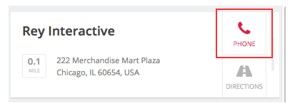
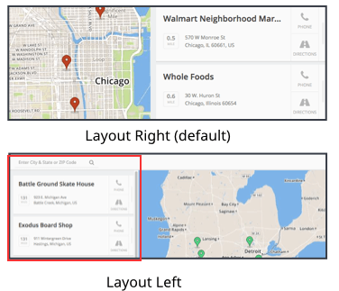

There are many more customizable settings than listed below but we wanted to highlight the most used. To create the perfect locator, we suggest you take a look at all the settings and see which suit your needs. You can find these settings under SETTINGS → CONFIGURATION.

## Brand Colors

Match the locator colors to fit your brand's guidelines.

-   Set the color of the location pin

    You can choose a color for your pin or use a custom image. To set this up, use the options in the "Pins" section of the configuration options. You can either select one of the displayed colors, or you can point to the URL of an image for your pin. If you are using a custom pin, it's recommended that the bottom of the image comes to a point to show where the location is and the image background is transparent. The image size should be 46 width x 134 height.

-   Set the current location markerYou can set the user current location marker to any image that matches your brand. Default color is blue.

-   Set the highlight color

    You can customize the color links on your locator turn when a user hovers over them.  (Note: Default highlight color is red.)

    

    To change the highlight color, enter the hex code into the "Color of Links" field in the "Layout" section of the configuration options. You can also choose a color by using the color selector located in the input.

## Display Fields

Add any additional information you want to display about your store locations. There are a number of additional fields that can be added to the list view and the popup view of your locations. All options can be found under the "List" section of the configuration options.

## Usability Preferences

Customize the text and layout of your store locator to best suit your users.

-   Set the map/list layout

    The default layout on desktop is to display the list of locations to the right of the map. If you would like to change it to left, then go to the "Layout" section of the configuration options and turn on the "Layout Left" option.

    

-   Set the search options

    -   The placeholder search text can be set using the "Search Input Placeholder" field in the "Map" section of the configuration options
    -   You can toggle whether or not to use autocomplete for search using the "Search Predictions" option in the "Map" section of the configuration options. By default this is off.
    -   To turn off the ability for the user to zoom by using the mouse wheel, turn on the "No Scroll Wheel Zoom" option in the "Map" section

Now that your locator is customized, you're ready to install it! Follow [this link](../install) for easy instructions on how to add the locator to your site.
