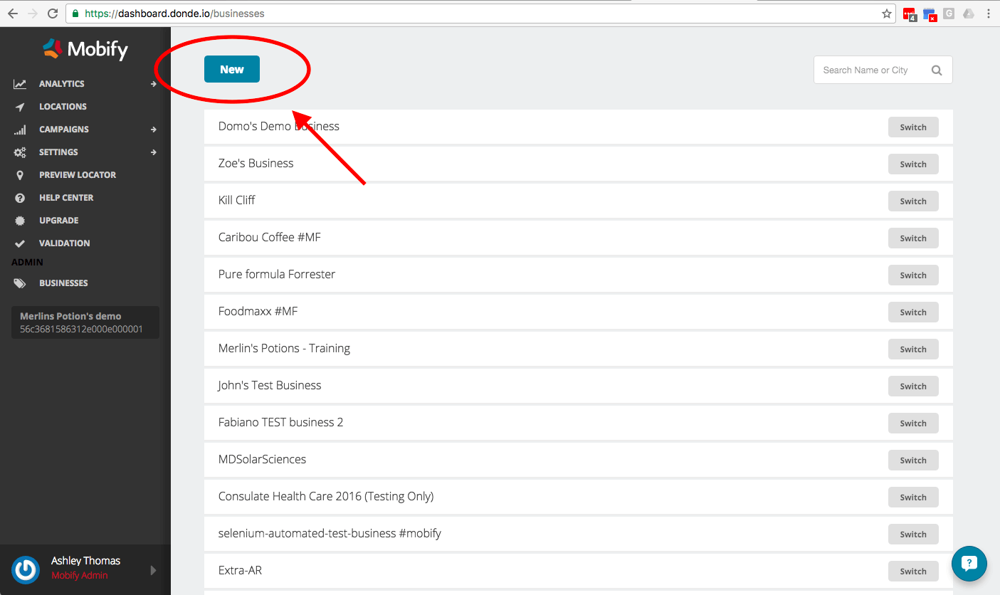
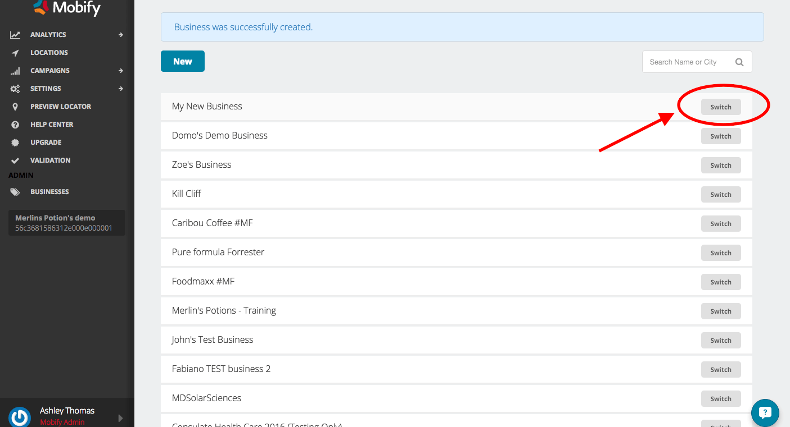
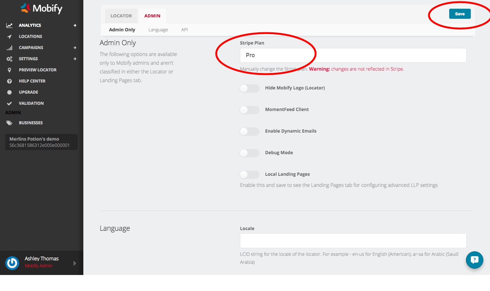
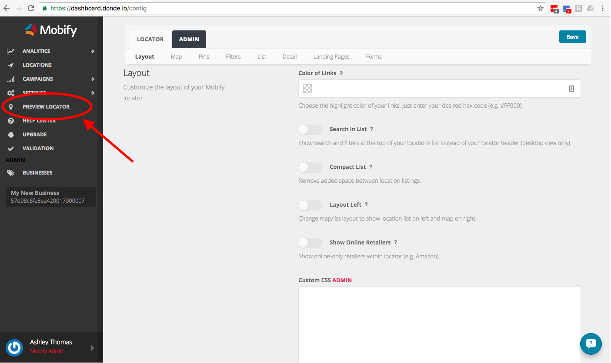

1.  Setup a business in the location dashboard

    Login to [Store Locators](https://dashboard.donde.io)
    Go to "BUSINESSES" in the sidebar of your dashboard and click on "New"
    
    Fill out the details of your new business and click "Save and Get Started"
    Find your business in the list of businesses and click "Switch"
    
    Go to SETTINGS → CONFIGURATION from the sidebar
    Under the ADMIN tab, enter "Pro" into the Stripe Plan field and click save
    

2.  Add some sample locations. To add your real store locations, you can connect to an API or upload a csv of your own store locations. For more information visit [Add Your Store Locations](../../add-store-locations)

    1.  Click on LOCATIONS in the sidebar
    2.  Click on the Bulk Import option
    3.  Import this file [Sample Store Locations](images/example_locations.csv) with the locations you would like to appear on your locator.
    4.  Refresh the dashboard. You may need to wait a few minutes for the upload to complete

3.  Preview the locator

    Once your store locations have been added, you will have a store locator with the default settings. You can preview the locator to see the base design and then customize from there.
    

## Next Steps

From here, you can [customize](../customize) the store locator to match your brands needs. Don't forget to preview at each step!

When you're done, follow these steps to [install your store locator](../install) on your site.
