<div class="c-callout c--important">
  <p>
    <strong>Important:</strong> Projects generated <em>after</em> June 2019 do not use the Analytics Manager because it has been replaced with our <a href="../analytics-integrations-overview">Analytics Integrations</a> API. For anyone working on projects that were generated before June 2019, we've left the Analytics Manager documentation here in case you still need to refer to it.
  </p>
</div>

<div class="content-accordion u-margin-top">
<h3 class="u-text-medium">Analytics Manager Overview</h3>
<div>

The Analytics Manager is an abstraction layer between your PWA and analytics
services, such as Google Analytics.

It allows you to track many events, including:

* Page view
* Purchase
* Add to cart / Remove from cart
* Open modal / Close modal
* Search
* Form and button interactions
* Enhanced ecommerce events
* Performance events
* Custom events

## How does it work?

The Analytics Manager listens for special actions dispatched by your PWA and
extracts analytics information from them. It then sends that information to each
of the analytics services that you've connected to the Analytics Manager.

The Mobify Platform includes connectors for the following analytics services:
* Google Analytics
* Google Tag Manager
* Mobify's Engagement Engine

If you don't see a connector for an analytics service that you require in the
list above, we make it easy to build your own
connector and contribute it to the platform.

You can also extend an existing connector to track analytics events under a different set of credentials for the same analytics service. For example, you may need to track events under multiple Google Analytics properties besides Mobify's Google Analytics property.

</div>
<h3 class="u-text-medium">Analytics Schema</h3>
<div>

Analytics Data Objects are convenient objects with the following functionalities:
- Standardized data format that Analytics Connectors receive
- Define requirements for a particular Analytics Connector
- Sanitize and normalize identified numeric fields
 
For example, you can create a Page data object as follows:

```jsx
const page = new Page({
    [Page.TEMPLATENAME]: 'home'
})

// Result:
// page = {
//     templateName: 'home'
// }
```

However, if you provide invalid keys, the invalid keys will not be included in the output.

```jsx
const page = new Page({
    [Page.TEMPLATENAME]: 'home',
    someKey: 'some value'
})

// Result:
// page = {
//     templateName: 'home'
// }
```

You can set requirements when creating these data objects.

```jsx
const page = new Page({
    [Page.TEMPLATENAME]: 'home',
    [Page.TITLE]: 'page title'
}, [Page.TEMPLATENAME])

// Result:
// page = {
//     templateName: 'home',
//     title: 'page title'
// }

const page = new Page({
    [Page.TITLE]: 'page title'
}, [Page.TEMPLATENAME])

// Result: An error will be thrown
```

You can remap the key names and set default values as well

```jsx
const page = new Page({
    [Page.TITLE]: 'page title'
}, [Page.TEMPLATENAME], {
    [Page.TEMPLATENAME]: {
        name: 'template_name',
        defaultValue: 'none'
    }

})

// Result:
// page = {
//     template_name: 'none',
//     title: 'page title'
// }
```

Providing `true` for `keepExtraFields` parameter will keep the keys that are not part of the data object definition

```jsx
const page = new Page({
    [Page.TITLE]: 'page title',
    'pageStatus': 'login'
}, [], {}, true)

// Result:
// page = {
//     template_name: 'none',
//     pageStatus: 'login'
// }
```

### Data Object and available keys
* **Page** (initialValues, additionalRequiredFields, keyMap, keepExtraFields = false)
    * PATH
    * LOCATION
    * TITLE
    * TEMPLATENAME

* **Product** (initialValues, additionalRequiredFields, keyMap, keepExtraFields = false)
    * ID _(Required)_
    * NAME _(Required)_
    * CATEGORY
    * BRAND
    * VARIANT
    * LIST
    * POSITION
    * PRICE
    * QUANTITY
    * COUPON
    * STOCK

* **Transaction** (transactionInitialValues, productsInitialValues, transactionAdditionalRequiredFields, productAdditionalRequiredFields, transactionKeyMap, productKeyMap, keepExtraFields = false)
    * ID _(Required)_
    * AFFILIATION
    * REVENUE
    * TAX
    * SHIPPING
    * LIST
    * STEP
    * OPTION

* **ShoppingList** (initialValues, additionalRequiredFields, keyMap, keepExtraFields = false)
    * COUNT - total number of items (a product of 2 quantity is 2 items)
    * TYPE - the type of this shopping list (cart or wishlist)
    * SUBTOTAL - total without tax, shipping, or discount

* **UIInteraction** (initialValues, additionalRequiredFields, keyMap, keepExtraFields = false)
    * SUBJECT
    * OBJECT
    * ACTION
    * NAME
    * CONTENT

## Pages Naming Convention <a name="page-naming" href="#page-naming">#</a>
A standard naming convention for pages across projects will help streamline the analytics capture & filter process. 

Use these standard names for pages within the app's router and for the page.TEMPLATENAME variable

* About Us Page: about-us
* Account Address Page: account-address
* Accoutn Dashboard Page: account-dashboard
* Account Info Page: account-info
* Account Order Page: account-order-list
* Account Preference Page: account-preferences
* View Order Page: account-view-order
* React Main App: app
* Blog Page: blog
* Contact Us Page: contact-us
* Cart: cart
* Checkout Confirmation Page: checkout-confirmation
* checkout-footer
* checkout-header
* Checkout Payment Page: checkout-payment
* Checkout Shipping Page: checkout-shipping
* Frequently Asked Questions: faq
* Page Footer: footer
* Forgot Password: forgot-password
* Page Header: header
* Home Page: home
* Login Page: login
* native-connector
* Offline Page: offline
* Order Status Page: order-status
* 404 Error Page: page-not-found
* Privacy Policy: privacy-policy
* Product Details Page: product-details
* Product List Page: product-list
* Return Policy: return-policy
* Shipping Policy: shipping-policy
* Size Guide: size-guide
* Store Locator/Find a Store: store-locator
* Wishlist: wishlist

</div>
<h3 class="u-text-medium">Extending a Connector</h3>
<div>

Here's how to extend the connectors that are included in the Mobify Platform.
You might want to do this to track analytics events under a different set of
credentials for the same analytics service. For example, you may need to track
events under multiple Google Analytics properties besides Mobify's Google
Analytics property.

## Extending the Google Analytics connector

### Setting up your PWA

1. Create a file in `web/app/utils/analytics` with the following code in it.
   You'll want to name the file so that you can identify the connector. For
   example: `ga.js`. If you have multiple instances of the connector that you
   need to extend, you should name the file so that you can identify the
   instance too. For example: `ga-international.js`.

    ```jsx
    import GoogleAnalytics from 'progressive-web-sdk/dist/analytics/connectors/google-analytics/connector'

    let ga

    export default class MyGA extends GoogleAnalytics {
        constructor() {
            super('My GA', 'myTrackerName', {
                ecommerceLibrary: 'ec'          // This should be either 'ec' or 'ecommerce'
            })
        }

        ready() {
            ga = window.ga                    // Keeping a reference of the ga object

            ga('create', 'UA-########-#', 'auto', {name: this.trackerName})

            super.ready(() => {
                // Any GA specific setup like setting dimension
                // this.setDimension(1, 'GA custom dimension 1 value')
            })
        }
    }
    ```

    **What is the difference between `ec` and `ecommerce` and which one should I
    use?**

    The `ecommerce` plug-in only allows transaction analytics.

    The `ec` plug-in is [Google Analytics' Enhanced
    Ecommerce](https://developers.google.com/analytics/devguides/collection/analyticsjs/enhanced-ecommerce)
    plug-in. This plug-in enables tracking analytics on user's shopping
    experience.

    Which one to use is completely dependent on which mode the client's Google
    Analytics is using. Your project manager can request such information from
    your customer.

2. Add your newly extended analytics
   connector to the Analytics Manager
3. Listen for the built-in events that are tracked by your
   PWA.

    For each built-in event, the arguments returned should be for the `ga`
    function. For example:

    ```jsx
        setCurrencyEvent(payload) {
            return ['set', 'currencyCode', payload.currencyCode]
        }
    ```

    The above will translate to a call to the `ga` function:
    ```jsx
        ga('yourTrackerName.set', 'currencyCode', payload.currencyCode)
    ```

#### Session splitting

Your PWA is essentially a single-page app, so you can't track pageviews as you
normally would on a desktop site with multiple pages. If you use traditional
pageview tracking in your PWA, you may encounter session splitting: a user
produces multiple sessions, when it's supposed to be counted as a single
session.

#### A/B Testing

If you are conducting an [A/B test for your
PWA](https://www.mobify.com/insights/complete-guide-a-b-testing-progressive-web-app-2018/)
you will need to collect two pieces of data in Google Analytics:
- The user's `clientID`
- The A/B test bucket the user is in

The
[`clientID`](https://developers.google.com/analytics/devguides/collection/analyticsjs/field-reference#clientId)
will allow you to do user-level analysis. It is an anonymous identifier for a
browser instance that remains the same across multiple sessions. 

You can enable this tracking in your Google Analytics connector. When
initializing your connector, pass it a `splitTestTrackingConfig` object. This
should contain the `clientIDDimension`, `bucketDimension` and `bucketValue`.

```js
const splitTestTrackingConfig = {
    clientIDDimension: 3,
    bucketDimension: 4,
    bucketValue: 'experiment'
}

analyticsManager.init(
    {
        projectSlug: AJS_SLUG,
        mobifyGAID: WEBPACK_MOBIFY_GA_ID,
        ecommerceLibrary: 'ec'
        debug: DEBUG,
        splitTestTrackingConfig
    },
    new MyGoogleAnalyticsConnector({
        ecommerceLibrary: 'ec',
        splitTestTrackingConfig
    })
)
```

The connector will automatically extract the `clientID` from Google Analytics,
so you do not need to provide it.

You should now see `cd3` and `cd4` defined on all of your Google Analytics
events. Compare `cd3` value to the cookie `_ga`. The cookie `_ga` should contain
the value of `cd4`.

### Testing Google Analytics

You should also pass this configuration to the `analyticsManager.init` function.
This will allow the Mobify Google Analytics connector to track the A/B test as
well. When you do this, do not use 1 or 2 for your `clientIDDimension` or
`bucketDimension` as those dimensions are already used by the Mobify Google
Analytics connector.


If you are using Google Analytics within a tag manager instead of a analytic
connector, you will need to add these custom dimensions manually.

While the clientID is normally stored in the `_ga` cookie, the most consistent
way to send the `clientID` to Google Analytics is by using a [custom
task](https://developers.google.com/analytics/devguides/collection/analyticsjs/tasks).
The custom task is run before any events are sent to GA, so if you define a
custom dimension for `clientID` and `bucketValue`, they will be present in all
requests.

Here is an example of using a `customTask` to set these custom dimensions:

```js
ga('set', 'customTask', (model) => {
    // You can use whichever custom dimensions are available
    model.set('dimension3', model.get('clientId'))
    model.set('dimension4', bucketValue)
})
```

When testing or debugging your Google Analytics connector, you should first make
use of the Analytics Manager's built in logging. You can turn this on by
following the steps in the Adding a New Connector
section.

The events for your connector will be labeled with the name of your connector.
For example, you should see events like `My GA sends a pageview event`. Using
these logs, you should verify 3 things:
- Are all of the expected events being sent?
- Are the correct number of events being sent?
- Is the data included in each event correct?

#### Are all of the expected events being sent?
Verify that you are seeing all of the events that you expect. For example, if
you are tracking the Add to Cart event in your connector, verify that the event
is sent when you click on the add to cart button.

If an event is missing, start by checking your connector. Are the events named
correctly?

Some events, such as pageview and purchase, are automatically instrumented in
the Google Analytics connector. As a result, unless you want to override the
default behavior of these events, you do not need to include them in your custom
Google Analytics connector. If you do override these events, make sure that you
call the base Google Analytics connector's function so that the events are sent
and logged properly.

For example, if you override the `pageviewEvent` in your custom connector, make
sure to call `super.pageviewEvent`.
```js
pageviewEvent(payload) {
    // add some custom data to your Google Analytics tracker here
    return super.pageviewEvent(payload)
}
```

#### Are the correct number of events being sent?
It is important to verify that events are being sent the correct number of
times. Duplicated events, especially pageviews, can cause incorrect reporting in
Google Analytics. For example, check that only one pageview event is sent for
your connector each time the user navigates in the PWA.

If events are being duplicated, check the code responsible for sending the
events. Is it being run too frequently? Also, check your connector and make sure
that duplicate events aren't being sent there.

#### Is the data being sent correct?
The Analytics Manager's built in logging provides a summary of each event.
Verify that the data in this summary is accurate. In particular, check that the
GA ID is correct.

Note that this logging does not include all of the data that is sent with each
analytics event. Because of this, we recommend also inspecting the network
requests made to Google Analytics to verify that all of the data is correct.

While previewing the PWA in Chrome, open the Chrome DevTools. Open the Network
tab. In the filter, enter `collect?`. This filter will show only the requests
being sent to Google Analytics. Verify that the data sent in the Query String
Parameters is correct.

**Note**: If your PWA has a service worker installed, you may see duplicate
requests in the Network tab. These duplicates will have a gear icon beside them.
These requests are handled by the service worker. They are returned from the
cache, and don't actually go out to the network. As a result, you can safely
ignore these duplicates. To check that these requests don't actually reach
Google Analytics, you can use a HTTP proxy such as Charles to inspect the
traffic. The requests with the gear icon beside them will not appear in Charles
log of the traffic.

<figure>
  
  <figcaption>Screenshot of Google analytics requests with and without the gear</figcaption>
</figure>


## Extending the Google Tag Manager connector

**Note**: In order to accurately track your PWA using Google Tag Manager, you
will need to make 2 changes to your GTM configuration. You will need to:
- Create a custom pageview event, and;
- Modify the page and location properties for the Google Analytics tag

### Setting up your PWA

1. Create a file in `web/app/utils/analytics` with the following code in it.
   You'll want to name the file so that you can identify the connector. For
   example: `gtm.js`. If you have multiple instances of the connector that you
   need to extend, you should name the file so that you can identify the
   instance too. For example: `gtm-international.js`:

    ```jsx
    import GoogleTagManager from 'progressive-web-sdk/dist/analytics/connectors/google-tag-manager/connector'

    export default class MyGTM extends GoogleTagManager {
        constructor() {
            super('My GTM', 'GTM-#######')
        }
    }
    ```
2. Add your newly extended analytics connector to the Analytics Manager
3. Listen for the built-in events that are tracked by your PWA.

    For each built-in event, the arguments returned should be the arguments to
    the `dataLayer.push` function. For example:

    ```jsx
        pageviewEvent(payload) {
            return {
                event: 'Pageview',
                ...payload
            }
        }
    ```

    The above will translate to a call to the `dataLayer.push` function:
    ```jsx
        window.dataLayer.push({
            event: 'Pageview',
            ...payload
        })
    ```

### Configuring Google Tag Manager

If you need to collect pageview metrics using the _Google Analytics_ tag in a
Google Tag Manager container, you must create a custom pageview event so that
the collected metrics are as accurate as possible. If you do not use a custom
pageview event, the event will be triggered before the PWA has finished
rendering the page, which means you will miss out on important page metrics.

1. Create a **custom event trigger** for page view

    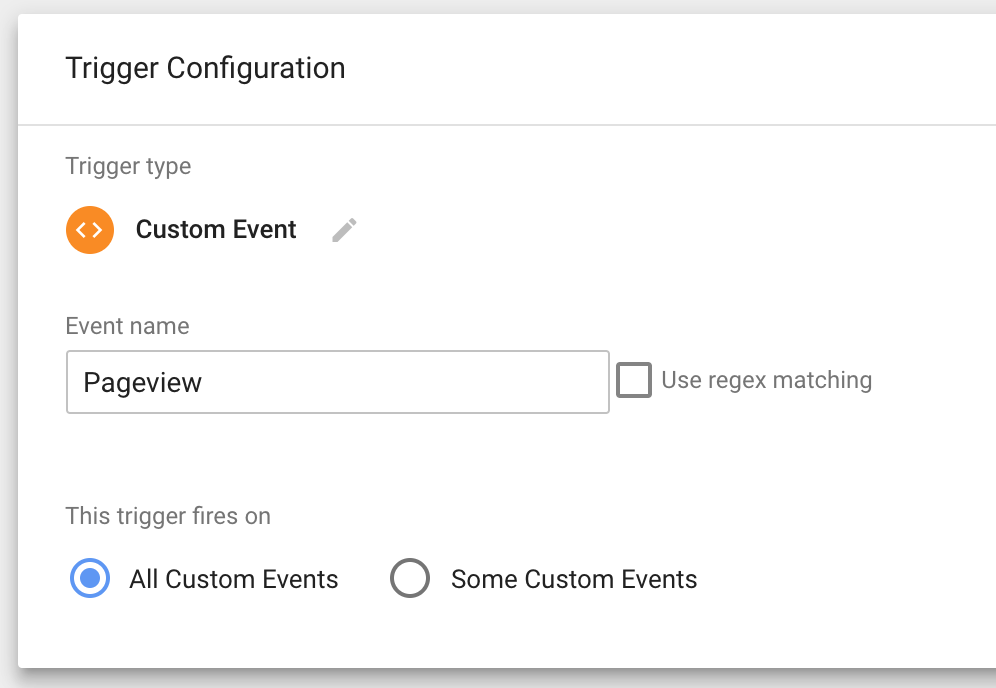

    **Note: Do not use the history change trigger type**. This trigger type
    listens for a browser's history change in order to send a page view event.
    This leaves no time for other page related metrics, such as page title, to
    be set before sending a page view event.

2. Use your custom created trigger to trigger your **page view tag**

    

#### Session splitting

Your PWA is considered to be a single-page app, so you can't track pageviews the
same way as on desktop. Otherwise, you may see a user producing multiple
unnecessary sessions, when it's supposed to be counted as one session. To avoid
this session-splitting problem, follow this **best practice for single-page
apps**: 

- Add a new field called `page` and update its value on every soft navigation
- Keep the value of `location` field the same throughout all navigations

These requirements need to be implemented for all events sent to GA, not just
pageview events. If any events have the page or location fields set incorrectly,
you may encounter session-splitting.

More details can be found on this [Single Page Application Tracking
guide](https://developers.google.com/analytics/devguides/collection/analyticsjs/single-page-applications).

As for how to implement the above requirements on the _GTM side_, it all depends
on your GTM configuration. We're not familiar with how you set it up, but for
some ideas, take a look at the following articles:

- [simoahava.com](https://www.simoahava.com/gtm-tips/fix-rogue-referral-problem-single-page-sites/)
- [thyngster.com](https://www.thyngster.com/tips-to-track-an-ajax-based-website-using-gtm-and-universal-analytics/)

However you choose to implement, please make sure that you apply your changes to
_all_ GA-related tags. So that all of your pageview and non-pageview events have
these changes.

If you need to detect whether a user is looking at the PWA or desktop site, you
could use this JavaScript snippet:

```js
if (window.Progressive && window.Progressive.isPWA()) {
   // you're on PWA
} else {
   // you're on desktop
}
```

### Debugging Google Tag Manager

#### Pageview events are missing data

This can happen if the pageview is sent too early, before the page is fully
loaded. This can happen if the pageviews are triggered by GTM, instead of by the Analytics Manager. Configure Google Tag Manager to set up pageviews that will be triggered by the Analytics Manager.

If you need to have automatically triggered pageviews, we recommend disabling
those pageviews for the PWA and setting up separate, manually triggered
pageviews. You can create a flag within the PWA that indicates if the PWA is
running or not, such as `window.Progressive.isPWA`. Disable automatically
triggered pageviews when this condition is true.

## Extending the Monetate connector

### Setting up your PWA

1. Create a file in `web/app/utils/analytics` with the following code in it.
   You'll want to name the file so that you can identify the connector. For
   example: `monetate.js`. If you have multiple instances of the connector that
   you need to extend, you should name the file so that you can identify the
   instance too. For example: `monetate-international`.

    ```jsx
    import Monetate from 'progressive-web-sdk/dist/analytics/connectors/monetate/connector'

    export default class MyMonetate extends Monetate {
        constructor() {
            super('My Monetate', 'e.monetate.net/js/2/#############/custom.js')
        }
    }
    ```

    The customer must supply you with the Monetate asynchronous tag for their
    account. To find it:

    1. Login to Monetate dashboard
    2. Click on **Integration**

        

    3. Click on **Tag**
    4. Make sure the **ASYNCHRONOUS** button is showing and copy the highlighted
       url

        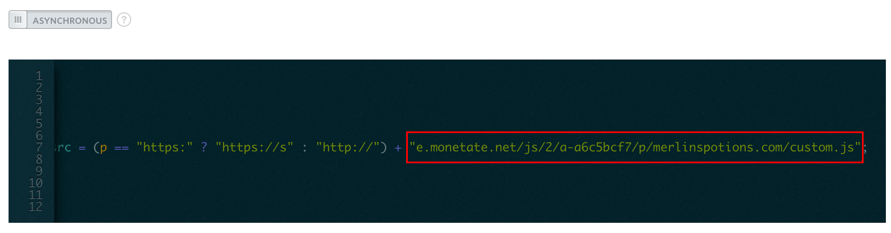

2. Add your newly extended analytics
   connector to the Analytics Manager
3. Listen for the built-in events that are tracked by your
   PWA.

    For each built-in event, we are not expecting any return arguments. However,
    each function should be interacting with the Monetate API.

    ```jsx
        pageviewEvent(payload) {
            this.send(['trackData'])
        }
    ```

    The above will translate to a call to the `monetateQ.push` function:
    ```jsx
        window.monetateQ.push(['trackData'])
    ```

To preview Monetate experiences, follow the [Monetate
guide](../../multivariate-testing/integrating-monetate)

## Extending the Adobe Dynamic Tag Management connector

This connecter provides a basic implementation of [Adobe Dynamic Tag
Management](https://marketing.adobe.com/resources/help/en_US/sc/implement/c_implement-with-dtm.html)
(Adobe DTM) for your PWA. The connector loads Adobe DTM and tracks pageview
events. The connector also tracks the following analytics events:

* Adding to cart using `scAdd` event
* Removing from cart using `scRemove` event
* Purchasing items using `purchase` event

If you need to track any other events, you'll need to do some setup before
creating adding custom events.

**_Note:_** *If you are using the same code to embed Adobe DTM as your desktop
website, some third party scripts that it loads may not be compatible with your
PWA because it is a [single-page
application](https://en.wikipedia.org/wiki/Single-page_application). We
recommend that you review your Adobe DTM configuration so that you don't
encounter any unwanted side effects.*

### Setting up your PWA

First, create a file in `web/app/utils/analytics` with the following code in it.
You'll want to name the file so that you can identify the connector. For
example: `adobe-dtm.js`. If you have multiple instances of the connector that
you need to extend, you should name the file so that you can identify the
instance too. For example: `adobe-dtm-international.js`.

```jsx
import AdobeDynamicTagManager from 'progressive-web-sdk/dist/analytics/connectors/adobe-dynamic-tag-manager/connector'

export default class MyAdobeDynamicTagManager extends AdobeDynamicTagManager {
    constructor() {
        super('My AdobeDynamicTagManager', '$SCRIPT_LOCATION', '$SUITE_ID')
    }
}
```

Now we need to replace `$SCRIPT_LOCATION` and `$SUITE_ID` in the code above with
actual string values.

Here's how to get the string value for `$SCRIPT_LOCATION`:

1. Log in to the [Adobe DTM dashboard](https://dtm.adobe.com). If you don't have
   access to the dashboard, you will need to share these instructions with
   someone who does.
1. Click on the **Embed** tab
1. Expand the **Header Code** section so that it looks like this:

   <p align="center">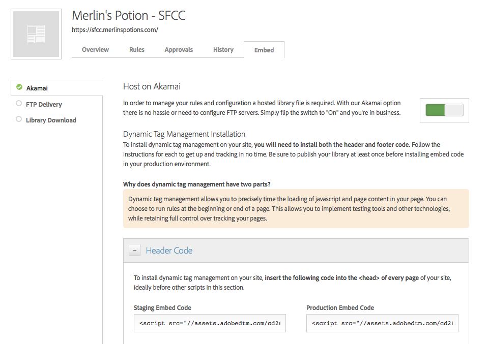</p>

1. Copy the value of the `src` attribute from the `<script>` tag. If more than
      one `<script>` tag is shown, copy from the one that appears under the
      environment you're targeting.
1. Replace `$SCRIPT_LOCATION` in the `index.js` file that you created earlier
   with the string value that you just copied

Here's how to get the string value for `$SUITE_ID`:

1. Log in to the [Adobe DTM dashboard](https://dtm.adobe.com). If you don't have
   access to the dashboard, you will need to share these instructions with
   someone who does.
1. Go to the **Admin** section
1. Go to **Dynamic Tag Management** 
1. Select the current project. The suite ID will appear under the heading for
   each environment

   <p align="center">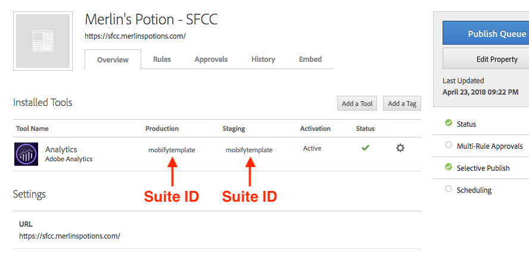</p>

1. Copy the suite ID for the environment that you're targeting
1. Replace `$SUITE_ID` in the `index.js` file that you created earlier with the
   string value that you just copied

Now that you have created a new connector that extends the base Adobe DTM connector, you can start adding custom events.

### Debugging Adobe Dynamic Tag Management

Once you have successfully added the Adobe DTM connector to your project, you
can verify its presence by following these
[instructions](https://marketing.adobe.com/resources/help/en_US/sc/implement/debugger_install.html)
and installing Adobe's DigitalPulse Debugger bookmarklet. Running the debugger
will present you with a window similar to the one shown below. Here you can
check the variables being set, the version information, and more.

<p align="center">
    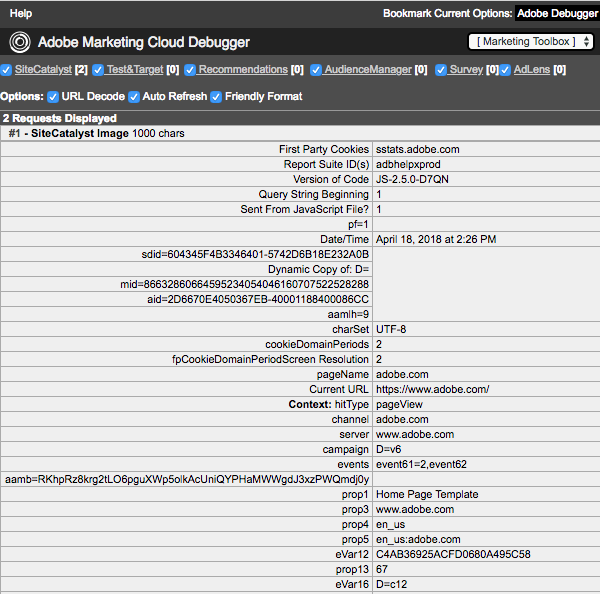
</p>

</div>
<h3 class="u-text-medium">Building a New Connector</h3>
<div>

The Mobify Platform includes built-in connectors for Google
Analytics and Google Tag Manager. But if you're using a different analytics service, you'll need to build your own connector to communicate with it.

Also, if you have a tracking specification that is client-specific, you'll need
to build your own connector.

All new connectors must be extended from the `Connector` class. This allows the
new connector to take advantage of many built-in events.

The `Connector` class provides the following capabilities:
- Loads any scripts required by the analytics vendor and invokes the connector's
  `ready` function when loading finishes
- Prevents double loading of scripts
- Provides debugging information (when enabled)
- Receives analytics events while vendor scripts are loading and stores them in
  a queue

Here's an example of a custom connector that extends from the `Connector` class:

```jsx
import Connector from 'progressive-web-sdk/dist/analytics/connectors/connector'

export default class ClientAnalytics extends Connector {
    constructor() {
        super('Client Analytics')

        // any other pre-initialization setup required for this analytics vendor

        Connector.loadScript('https://www.example.com/script_to_a_3rd_party_analytics_library.js', this)

        // If there are no scripts required for download, make sure to invoke the ready function
        // super.ready()
    }

    // Override the ready function if you need to do any further initialization after loading scripts
    // This function will be invoked when the script finishes loading
    ready() {
        // It is mandatory to invoke super.ready() as the last command
        // This will drain the queued events if any
        super.ready()
    }

    send(type, payload) {
        // Sends the analytics event to the 3rd party analytics script

        // It is optional to invoke super.send() as the last command
        // This will invoke the debug logging if debug flag is on
        super.send(type, payload)
    }
}
```

Once you have added your connector to the Analytics Manager, you should start to
see console logs from the browser inspector.

</div>
<h3 class="u-text-medium">Adding a New Connector</h3>
<div>

Once you have created or extended your connector, connect your analytics connector with the Analytics Manager.

In `web/app/store/index.js`

1. Import your analytics connector

    ```jsx
    import MyAnalyticsConnector from '../utils/analytics/my-analytics-connector'
    ```

2. Add your analytics connector to the Analytics Manager

    ```diff
    analyticsManager.init(
        {
            projectSlug: AJS_SLUG,
            mobifyGAID: WEBPACK_MOBIFY_GA_ID,
            ecommerceLibrary: 'ec'              // (Required) - The GA ecommerce plugin to use ('ec' or 'ecommerce')
            debug: DEBUG
        },
  +    new MyAnalyticsConnector()
    )
    ```

## Debugging

There are two ways to enable debugging information for analytics:

1. **Via #MOBIFY_DEBUG in production**

    Simply append `#MOBIFY_DEBUG` to the end of a project site URL and refresh the page, and you will
    see debugging information in the browser console.

2. **Via the preview server in development**

    When you preview a PWA bundle through the preview server (preview.mobify.com), the analytics debugging information will always appear in the browser console. 

You'll see two types of debugging information in the browser console:

1. **Google Analytics debugger**

    Mobify also uses Google Analytics to track analytics data. To make it easy to debug on all mobile
    platforms while in debug mode, Google Analytics Debugger will automatically turn on

2. **Analytics Manager console messages**

    When debugging mode is on, analytics manager will display critical information to help you
    validate that the correct events and dimensions are being sent to your analytics system. This
    is customizable in the analytics connectors you built

    Here is a console message example:
    ```txt
    🐯 Mobify Google Analytics sends a pageview event
        GA ID:				 UA-53825302-1
        Location:	 		 https://www.merlinspotions.com/
        Template Name:		 productDetailsPage
    ```

</div>
<h3 class="u-text-medium">Built-In Events</h3>
<div>

## Pageview events

### Receiving pageview events

Most of the analytics services that Mobify supports already implement a pageview
event. However, if you need to alter how the event is set up, add a
`pageviewEvent` function override to your analytics connector.

```jsx
    import GoogleTagManager from 'progressive-web-sdk/dist/analytics/connectors/google-tag-manager/connector'

    export default class MyGTM extends GoogleTagManager {
        constructor() {
            super('My GTM', 'GTM-#######')
        }

+        pageviewEvent(payload, state) {
+            // Shape given arguments to the expected format that
+            // the analytic platform requires
+        }
    }
```

The `payload` should have the following structure:
```jsx
payload = {
    templatename
}
```

### Dispatching pageview events from the PWA

The pageview event should be already instrumented in the PWA when you generate a
new project with Mobify's project generator. If you do not see a pageview events
firing, check inside `web/app/template.jsx` where it should be instrumented like
this:

```jsx
import {onPageReady, trackPerformance} from 'progressive-web-sdk/dist/analytics/actions'
...
const initPage = (component) => (url, routeName) => (dispatch, getState) => {
    ...
    dispatch(onPageReady(routeName))
    ...
}
```

### Verifying that pageview events are working

1. Turn on debugging mode
2. Open the web developer console and view some pages in the PWA
3. You should see the following in the console log:

    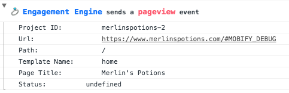

    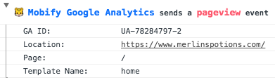

    * **Project ID:** This should match the Mobify project slug for the project
    * **Url / Location:** This should match the URL displayed in the address bar
    * **Path / Page:**  This should just be the URL path without the domain
    * **Page Title:** This should match the title of the page even across soft navigations
    * **Template Name:** This should match the template of the page
    * **Status:** This will be **undefined** until the PWA has some navigations offline and
    comes back online. When the PWA comes back online, it will send multiple pageviews with
    these possible values:
        * **offline_success** - When user viewed a saved page while offline
        * **offline_failed** - When user tried to view an uncached page while offline

## Set currency events

### Receiving set currency events

Add a `setCurrencyEvent` function override to your analytics connector.

```jsx
    import GoogleTagManager from 'progressive-web-sdk/dist/analytics/connectors/google-tag-manager/connector'

    export default class MyGTM extends GoogleTagManager {
        constructor() {
            super('My GTM', 'GTM-#######')
        }

+        setCurrencyEvent(payload, state) {
+            // Shape given arugments to the expected format that
+            // the analytic platform requires
+        }
    }
```

The `payload` should have the following structure:
```jsx
payload = {
    currencyCode
}
```

### Dispatching set currency events from the PWA

There are 2 instances when you should dispatch a set currency code event:

* Initial PWA setup in `web/app/containers/app/container.jsx`

    ```jsx
    import {setCurrencyCode} from 'progressive-web-sdk/dist/analytics/actions'

    class App extends React.Component {
        ...
        componentWillMount() {
            ...
            this.props.setInitialCurrencyCode('CAD')
        }
    ...
    const mapDispatchToProps = {
        ...
        setInitialCurrencyCode: setCurrencyCode
    }
        ...
    ```

* When the displayed currency on customer's site has changed

    ```jsx
    import {setCurrencyCode} from 'progressive-web-sdk/dist/analytics/actions'

        ...
        dispatch(setCurrencyCode(currencyCode))
        ...
    ```

If the user is able to change the currency within the UI, you should also add a UI Interaction event. To do this, provide the `data-analytics-name` and `data-analytics-content` props on the element used to set the currency.

```js
import {UI_NAME} from 'progressive-web-sdk/dist/analytics/data-objects/'

<Link
    onClick={() => { updateCurrency(currency) }}
    data-analytics-name={UI_NAME.setCurrency}
    data-analytics-content={currency}
>
    {text}
</Link>
```

### Verifying that set currency events are working

There are no console message displayed for this change. However, you should be
able to see the additional currency code setting in the Google Analytics
tracker:


## Purchase events

### Receiving purchase events

Add a `purchaseEvent` function override to your analytics connector.

```jsx
    import GoogleTagManager from 'progressive-web-sdk/dist/analytics/connectors/google-tag-manager/connector'

    export default class MyGTM extends GoogleTagManager {
        constructor() {
            super('My GTM', 'GTM-#######')
        }

+        purchaseEvent(payload, state) {
+            // Shape given arguments to the expected format that
+            // the analytic platform requires
+        }
    }
```

The `payload` should have the following structure:

```jsx
payload = {
    transaction: {
        id,

        // Following keys are optional
        revenue             // Grand total (including shipping and tax)
        affiliation
        tax
        shipping
        list
        step
        option
    },
    products: [             // Product details in cart will be pulled from redux store
        {
            id
            name

            // Following keys are optional
            price
            quantity
            stock
            category
            brand
            variant
            list
            position
            coupon
            size
            color
        },
        ...
    ]
}
```

### Dispatching purchase events from the PWA

In order to take advantage of the automatic instrumentation of **purchase
events**, you need to import the result action `receiveCheckoutConfirmationData`
from the Integration Manager and dispatch it to send the order details.

In the example below, the confirmation page will call
`initCheckoutConfirmationPage` to initialize the page. In this function, we
dispatch `receiveCheckoutConfirmationData` to store confirmation data in the
Redux store and send the purchase event.

```js
import receiveCheckoutConfirmationData from 'mobify-integration-manager/dist/integration-manager/api/checkout/results'


export const initCheckoutConfirmationPage = (url) => (dispatch) => {
    return dispatch(fetchConfirmationData())
        .then((confirmationData) => {
            // The confirmation Data contains `orderNumber`
            // Revenue, tax and products will be taken from the redux store automatically
            dispatch(receiveCheckoutConfirmationData(confirmationData))
        })
}
```

### Verifying that purchase events are working

1. Turn on debugging mode
2. Open web developer console and complete a purchase in the project
3. You should see the following in the console log:

    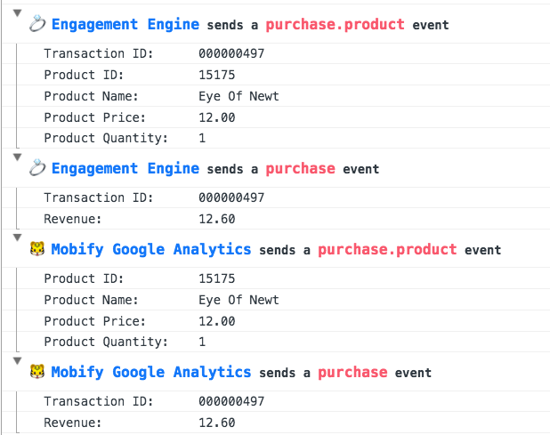

    **Make sure the following conditions are true:**
    * There is **only 1** purchase event to the Engagement Engine
    * There is **only 1** purchase event to the Mobify Google Analytics
    * The transaction id matches the backend data
    * There are the same number of purchase.product events as there are products in the order
    * The revenue matches the grand total of the order (including tax, fee, shipping)
    * Each product details matches the backend data
    * Currency Code is included if available

## Performance events

### Performance metric terminology

* **Page Start**: a high resolution timestamp collected from the [Web
    Performance
    API](https://developer.mozilla.org/en-US/docs/Web/API/Performance_API). This
    metric indicates the time when the browser starts to navigate.
* **Mobify Start**: the time when the Mobify tag starts to load loader.js.
* **First Paint and First Contentful Paint**: metrics defined from [Chrome
    PerformancePaintTiming
    Interface](https://developer.mozilla.org/en-US/docs/Web/API/PerformancePaintTiming).
    First paint time is the time that Chrome takes to finish the [critical
    rendering path](https://developers.google.com/web/fundamentals/performance/critical-rendering-path/analyzing-crp)
    that typically includes the app skeleton. Images and other assets do not
    block the first paint. First Contentful Paint is the point when the browser
    renders the first bit of content from the DOM. This content may be some text
    or an image.
* **App Start**: the time from Mobify Start to when the loader.js starts to
  initialize the PWA.
* **Page Paint**: the time taken by the router of the PWA. Each route change
    will trigger the Analytics Manager to track the time it takes.
* **Page Contentful Paint**: the time when the React component for the pages is
    mounted. At this stage, the user can see the shape of the page through
    placeholder objects (skeletons), but the data required to fill in those
    placeholders has not been fetched yet.
* **Page Content Load**: the time when the data is returned from the server and
    the necessary information such as product names and prices are rendered on
    the page, but the images are not rendered.
* **Full Page Load**: the time when all images have rendered on the page.
* **Time to Interactive (TTI)**: the time until the page being loaded is
    considered usable and will respond to user input. This is done with [TTI
    Polyfill](https://github.com/GoogleChromeLabs/tti-polyfill)
* **Is saved page**: The PWA saves the history of the pages in a variable so
    that it can navigate between saved pages instantly.

### Receiving performance events

Add a `performanceEvent` function override to your analytics connector.

```jsx
    import GoogleTagManager from 'progressive-web-sdk/dist/analytics/connectors/google-tag-manager/connector'

    export default class MyGTM extends GoogleTagManager {
        constructor() {
            super('My GTM', 'GTM-#######')
        }

+        performanceEvent(payload, state) {
+            // Shape given arguments to the expected format that
+            // the analytic platform requires
+        }
    }
```

The `payload` should have the following structure:
```jsx
// PWA First Load (Hard navigation)
payload = {
    bundle
    pageStart                   // Page Start (Available for supported browser)
    mobifyStart                 // Mobify Start
    timingStart                 // This will be pageStart if available. Otherwise, mobifyStart
    firstPaint                  // First Paint (Available for supported browser)
    firstContentfulPaint        // First Contentful Paint (Available for supported browser)
    appStart                    // App Start
    templateWillMount           // Page Paint
    templateDidMount            // Page Contentful Paint
    templateAPIEnd              // Page Content Load
    fullPageLoad                // Full Page Load
    timeToInteractive           // Time to Interactive (Available for supported browser)
    isSavedPage                 // Is Saved Page
}

// PWA Sub-sequent Load (Soft navigation)
payload = {
    bundle
    timingStart
    templateDidMount
    templateAPIEnd
    fullPageLoad
    isSavedPage
}
```

### Dispatching performance events from the PWA

Performance events should be already instrumented in PWA when you generate a new
project with Mobify's project generator. If you do not see performance events
firing, there are several files you should check where it should be instrumented
like this:

In `web/app/router.jsx`
```jsx
import {PERFORMANCE_METRICS} from 'progressive-web-sdk/dist/analytics/data-objects/'
import {trackPerformance} from 'progressive-web-sdk/dist/analytics/actions'

let OnChange = () => {
    trackPerformance(PERFORMANCE_METRICS.templateWillMount)
}

if (isRunningInAstro) {
    OnChange = (prevState, nextState, replace, callback) => {
        ...
        pwaNavigate({url: getURL(nextState)}).then(() => {
            trackPerformance(PERFORMANCE_METRICS.templateWillMount)
            ...
        })
    }
}

class Router extends React.Component {
    componentWillMount() {
        trackPerformance(PERFORMANCE_METRICS.templateWillMount)
    }
```

In `web/app/template.jsx`
```jsx
import {onPageReady, trackPerformance} from 'progressive-web-sdk/dist/analytics/actions'
...

const initPage = (component) => (url, routeName) => (dispatch, getState) => {
    ...
    return fetchResolve
        .then(() => {
            trackPerformance(PERFORMANCE_METRICS.isSavedPage, hasFetchedCurrentPath(currentState) ? 'true' : 'false')
            dispatch(setFetchedPage(url))
        })
        .then(() => {
            dispatch(onPageReady(routeName))
            trackPerformance(PERFORMANCE_METRICS.templateAPIEnd)
        })
        ...
}

const template = (WrappedComponent) => {
    class Template extends React.Component {
        ...
        componentDidMount() {
            trackPerformance(PERFORMANCE_METRICS.templateDidMount)
            ...
        }
        ...
        componentDidUpdate() {
            trackPerformance(PERFORMANCE_METRICS.templateDidMount)
            ...
        }
```

For each page container, make sure `template()` is used
```jsx
export default template(Home)
```

### Verifying that performance events are working

1. Turn on debugging mode
2. Open web developer console and navigate in the PWA
3. You should see the following in the console log:

    A hard navigated performance event will have delay of about 5 seconds.

    

    Below is an example of a soft navigated performance event:

    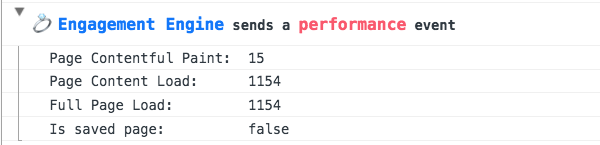

## Add to cart / Remove from cart events

### Receiving cart events

Add an `addToCartEvent` function override and a `removeFromCartEvent` function
override to your analytics connector.

```jsx
    import GoogleTagManager from 'progressive-web-sdk/dist/analytics/connectors/google-tag-manager/connector'

    export default class MyGTM extends GoogleTagManager {
        constructor() {
            super('My GTM', 'GTM-#######')
        }

+        addToCartEvent(payload, state) {
+            // Shape given arugments to the expected format that
+            // the analytic platform requires
+        }

+        removeFromCartEvent(payload, state) {
+            // Shape given arugments to the expected format that
+            // the analytic platform requires
+        }
    }
```

The `payload` should have the following structure:
```jsx
payload = {
    cart: {
        type
        count
        subtotal
    },
    product: {
        id
        name

        // Following keys are optional
        price
        quantity
        stock
        category
        brand
        variant
        list
        position
        coupon
        size
        color
    }
}
```

### Dispatching cart events from the PWA

Cart events should be already instrumented in PWA when you generate a new
project with Mobify's project generator. If you do not see cart events firing or
you are using overridden Integration Manager commands, make sure that the cart
events are instrumented. Mobify uses these analytics events for automated cart
abandonment push messages for customers.

#### Add to cart

Instrument this event whenever there is an add to cart action, including when
the user does any of the following:
* Adds an item to cart from a product description page
* Adds an item to cart from a wishlist
* Updates an item that results in an increasing quantity

In your command, make sure you dispatch the `addToCart` command.

```jsx
import IntegrationManager from 'mobify-integration-manager/dist/'
    ...
    // Add an item to cart
    dispatch(IntegrationManager.cart.addToCart(productId, qty, variant))
    ...
    // Update an item in cart
    dispatch(IntegrationManager.cart.updateCartItem(itemId, quantity, productId, variant))
    ...
    // Update the quantity of an item in cart
    dispatch(IntegrationManager.cart.updateItemQuantity(itemId, newQuantity))
```

If you are unable to dispatch the command, you will need to invoke an analytics
action to dispatch the cart analytics.

```jsx
import {EVENT_ACTION} from 'progressive-web-sdk/dist/analytics/data-objects/'
import {dispatchCartAnalytics} from 'progressive-web-sdk/dist/analytics/actions'
...
    dispatchCartAnalytics(EVENT_ACTION.addToCart, dispatch, getState, productId, quantityAdded)
```

The above command will construct the remaining required product information from
the Redux store using selectors.

#### Remove from cart

Instrument this event whenever there is an remove from cart action, including
when the user does any of the following:
* Removes an item from the cart page or mini cart
* Updates an item that results in a decrease in quantity

In your command, make sure you dispatch the `removeFromCart` command.

```jsx
import IntegrationManager from 'mobify-integration-manager/dist/'
    ...
    // Remove an item from cart
    dispatch(IntegrationManager.cart.removeFromCart(productId))
    ...
    // Update an item in cart
    dispatch(IntegrationManager.cart.updateCartItem(itemId, quantity, productId, variant))
    ...
    // Update the quantity of an item in cart
    dispatch(IntegrationManager.cart.updateItemQuantity(itemId, newQuantity))
```

If you are unable to dispatch the command, you will need to invoke an analytics
action to dispatch the cart analytics.

```jsx
import {EVENT_ACTION} from 'progressive-web-sdk/dist/analytics/data-objects/'
import {dispatchCartAnalytics} from 'progressive-web-sdk/dist/analytics/actions'
...
    dispatchCartAnalytics(EVENT_ACTION.removeFromCart, dispatch, getState, productId, quantityRemoved)
```

The above command will construct the remaining required product information from
the Redux store using selectors.

### Verifying that cart events are working

1. Turn on debugging mode
2. Open web developer console and perform the following actions on the PWA:
    * Add an item to cart
    * Remove an item from cart
    * Interact with the quantity stepper with an item in cart
    * Add an item from wishlist
3. You should see the following in the console log:

    **Add to cart**

    

    **Remove from cart**

    

    * **Cart Count** should be the total number of items in the cart
    * **Subtotal** should be the total amount displayed to the customer

## UI interaction events

UI interaction events are analytics events that resulted from an action in the
PWA. For example:

* A user clicks on a button
* A user focuses on an input
* A user opens a modal
* The app displays an error
* The app receives an internal error
* ...etc

In order to name analytics events more consistently, we've adopted a naming
scheme inspired by this article: [Closing the gap between data and product
development](https://blog.intercom.com/closing-gap-product-analytics/).

All UI interaction events have at least 4 arguments:

* **Subject** - Who is acting
* **Action** - What action is being performed
* **Object** - What is being affected
* **Name** - The name of the specific object
* **Content** (Optional) - Extra information related to this object

This results in the combination of **Subject + Action + Object** as our
Engagement Engine analytics action. For example:

* userClickButton
* userFocusInput
* appOpenModal
* appReceiveError
* appDisplayError

(For simplicity's sake, we decided to ignore pluralization and verb tenses.)

### Receiving UI interaction events

Add a `uiInteractionEvent` function override to your analytics connector.

```jsx
    import GoogleTagManager from 'progressive-web-sdk/dist/analytics/connectors/google-tag-manager/connector'

    export default class MyGTM extends GoogleTagManager {
        constructor() {
            super('My GTM', 'GTM-#######')
        }

+        uiInteractionEvent(payload, state) {
+            // Shape given arugments to the expected format that
+            // the analytic platform requires
+        }
    }
```

The `payload` should have the following structure:
```jsx
payload = {
    subject
    action
    object
    name
    content
}
```

### Dispatching UI interaction events from the PWA and validating them

We have implemented several SDK components to automatically trigger analytics
events:

* AccordionItem
* Buttons
* CardInput
* CardVerification
* Carousel
* ExpiryDate
* Pagination
* PasswordInput
* Search
* Share
* Stepper
* Swatch

Some of these SDK components require some analytics implementation from the
developers.

#### Buttons

Button analytics are built-in with the SDK Button component. Developers just
need to supply the context of the button's purpose.

```jsx
import Button from 'progressive-web-sdk/dist/components/button'
import {UI_NAME} from 'progressive-web-sdk/dist/analytics/data-objects/'
...
    <Button
        data-analytics-name={UI_NAME.checkout}
    >
        Checkout
    </Button>
```

Let's say there are 2 Checkout buttons on the same page. We can make use of the
content to distinguish the two buttons.

```jsx
import Button from 'progressive-web-sdk/dist/components/button'
import {UI_NAME} from 'progressive-web-sdk/dist/analytics/data-objects/'
...
    <Button
        data-analytics-name={UI_NAME.checkout}
        data-analytics-content={UI_NAME.top}
    >
        Checkout
    </Button>
...
     <Button
        data-analytics-name={UI_NAME.checkout}
        data-analytics-content={UI_NAME.bottom}
    >
        Checkout
    </Button>
```

You should see the following when you interact with the button in debugging mode:


#### Swatches

Swatch analytics are built-in with the SwatchItem component in the SDK.
Developers need to supply the context of the swatch's category and the value of
the individual swatch item.

```jsx
import {Swatch, SwatchItem} from 'progressive-web-sdk/dist/components/swatch'
...
    <Swatch ... >
        <SwatchItem
            analyticsName="color"
            analyticsContent={swatchValue}
        >
            ...
        </SwatchItem>
        ...
    </Swatch>
```

You should see the following when you interact with the swatch item in debugging mode:

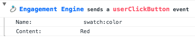

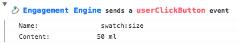

#### Inputs

Input analytics events are automatically tracked when a user focuses on the
inputs. This applies to any of the following HTML tags: input, select, and
textarea. Developers need to supply the context for each of these tags.

```jsx
import {UI_NAME} from 'progressive-web-sdk/dist/analytics/data-objects/'
...
render() {
    return (
        ...
        <input type="text" data-analytics-name={UI_NAME.firstName} />
        <input type="radio" data-analytics-name={UI_NAME.shippingMethod} />
        <input type="checkbox" data-analytics-name={UI_NAME.subscribe} />
        <select data-analytics-name={UI_NAME.country}>
            ...
        </select>
        <textarea data-analytics-name={UI_NAME.message} />
        ...
    )
}
```

You should see the following when you interact with the inputs in debugging mode:

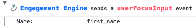


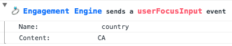

#### Form errors

There are 2 types of form errors that Mobify tracks:

* **Sync errors** - Errors that resulted from an unexpected input format
* **Submission errors** - Errors that resulted from a backend server

To instrument these events, verify that the following conditions are true:

* The **id** is defined on the form tag
* The **data-analytics-name** is defined on the form tag
* The form id is the same id as the Redux form configuration

```jsx
<form id={SIGN_IN_FORM_NAME} data-analytics-name={UI_NAME.login}>
    ...
</form>
...
const ReduxSignInForm = reduxForm({
    form: SIGN_IN_FORM_NAME
})(SignInForm)
```

You should see the following when you interact with the inputs in debugging mode:


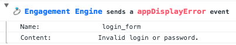

#### Change language event

If your project supports multiple languages, track when the user changes their language preferences. This should be done through a UI interaction event.

To send the UI interaction event, add the `data-analytics-name` and `data-analytics-content` props to the element the user interacts with to select a language. The `data-analytics-name` prop should be set to `"set_language"` and the `data-analytics-content` props should be set to the identifier for the selected language.

```js
import {UI_NAME} from 'progressive-web-sdk/dist/analytics/data-objects/'

<Link
    onClick={() => { changeLocale(language) }}
    data-analytics-name={UI_NAME.setLanguage}
    data-analytics-content={language}
>
    {text}
</Link>
```

#### Using UI interaction events in a custom connector

It is possible to track UI interaction events in a custom connector. In your connector, add the function `uiInteractionEvent`.

```js
import {UIInteraction} from 'progressive-web-sdk/dist/analytics/data-object'

// ...

uiInteractionEvent(payload) {
    // Convert the payload into a UIInteraction data object to ensure that it is properly structured
    const uiInteraction = new UIInteraction(payload, [], {}, false)

    // uiInteraction contains the following attributes
    // subject (required, ex. User)
    // action (required, ex. Open)
    // object (required, ex. Modal)
    // name (optional)
    // content (optional)

    // Handle the UI interaction event
}
```

### Dispatching UI interaction events from outside the PWA

You can also send UI interaction events from outside the PWA like this:

```js
window.Progressive.analytics.send({
    subject: window.Progressive.analytics.constants.UI_SUBJECT.app,
    action: window.Progressive.analytics.constants.UI_ACTION.display,
    object: window.Progressive.analytics.constants.UI_OBJECT.button,
    name: window.Progressive.analytics.constants.UI_NAME.applePay
})
```

We also made these constants available within the scope of the `window` object.

```js
window.Progressive.analytics.constants = {
    UI_SUBJECT,
    UI_ACTION,
    UI_OBJECT,
    UI_NAME
}
```

</div>
<h3 class="u-text-medium">Ecommerce Events</h3>
<div>

Below is a list of common analytics events that are part of [Google Enhanced
Ecommerce Analytics](https://developers.google.com/analytics/devguides/collection/analyticsjs/enhanced-ecommerce).

## Product impression events

A product impression event occurs when a user has seen a product within a list
of products.

### Receiving product impression events

Add this `productImpressionEvent` function override to your analytics connector.

```jsx
    import GoogleAnalytics from 'progressive-web-sdk/dist/analytics/connectors/google-analytics/connector'

    import {
        getProductById
    } from 'progressive-web-sdk/dist/store/products/selectors'

    let delayImpressionTimer

    const nonInteraction = {
        nonInteraction: true
    }

    export default class MyGA extends GoogleAnalytics {
        constructor() {
            super('My GA', 'myTrackerName', {
                ecommerceLibrary: 'ec'          // This should be either 'ec' or 'ecommerce'
            })
        }

        productImpressionEvent(payload, state) {
            const product = getProductById(payload.productId)(state).toJS()
            this.ecAddImpressionAction(product)

            clearTimeout(delayImpressionTimer)

            delayImpressionTimer = setTimeout(() => {
                this.send(
                    EVENT_ACTION.productImpression,
                    ['send', 'event', 'Ecommerce', 'Product Impressions', nonInteraction]
                )
            }, 1000)
        }
    }
```
**Note: Above example is tailored for Google Analytics**

`payload` should have the following structure:
```jsx
payload = {
    productId
}
```

#### Why is there a delay impression timer?

Although GA batches tracker calls as much as possible, we found that it is
sending off the product impression tracker too early. This caused unnecessary
network calls to the GA tracker. To reduce the number of network calls, we set a
delay on the product impression tracker so that it will wait for the user to
pause their scrolling before sending off a batch of product impressions.

### Dispatching product impression events from the PWA using React Waypoint

To determine when a product has been viewed, we need to know when a product tile
has entered the user's viewport. We use an open source library called [React
Waypoint](https://github.com/brigade/react-waypoint) to help us with boundary
detection. The package is not installed by default when your project is generated,
so will need to run the following command to include this package into your project.

```sh
npm install react-waypoint --save
```

Implement Waypoint around your entire product tile. We recommend using the
offset props in the Waypoint component.

```jsx
import {sendProductImpressionAnalytics} from 'progressive-web-sdk/dist/analytics/actions'
import Waypoint from 'react-waypoint'

...
        <Waypoint
            topOffset="20%"
            bottomOffset="20%"
            onEnter={() => {
                sendProductImpression(id)
            }}
        >
            <div>
                ... Product tile content ...
            </div>
        </Waypoint>

const mapDispatchToProps = {
    ...
    sendProductImpression: sendProductImpressionAnalytics
}
```

### Validating that product impression events are working

Validate GA tracking has the following values in the console log:

```jsx
hitType                                                 event
eventCategory                                           Ecommerce
eventAction                                             Product Impressions
nonInteraction                                          1

ec:impression list "1" product "1" id                   Product ID 1
ec:impression list "1" product "1" name                 Product Name 1

// If more than one product impression is included in the batch
ec:impression list "1" product "2" id                   Product ID 2
ec:impression list "1" product "2" name                 Product Name 2
```

## Product click events

### Receiving product click events

Add this `productClickEvent` function override to your analytics connector.

```jsx
    import GoogleAnalytics from 'progressive-web-sdk/dist/analytics/connectors/google-analytics/connector'

    import {
        getProductById
    } from 'progressive-web-sdk/dist/store/products/selectors'

    export default class MyGA extends GoogleAnalytics {
        constructor() {
            super('My GA', 'myTrackerName', {
                ecommerceLibrary: 'ec'          // This should be either 'ec' or 'ecommerce'
            })
        }

        productClickEvent(payload, state) {
            const product = getProductById(payload.productId)(state).toJS()
            
            product.position = payload.position
            this.ecAddProduct(product)

            this.ecSetAction('click', {list: payload.productListName})

            return ['send', 'event', 'Ecommerce', 'Product Click']
        }
    }
```
**Note: The example above is tailored for Google Analytics**

`payload` should have the following structure:
```jsx
payload = {
    productId,
    productListName,
    position
}
```

### Dispatching product click events from the PWA

Build an analytics action and insert the following
`web/app/utils/analytics/actions.js`

```jsx
import {createActionWithAnalytics} from 'progressive-web-sdk/dist/utils/action-creation'

export const productClickAnalytics = createActionWithAnalytics(
    'Send product click analytics',
    [],
    'productClick',
    (productId, productListName, position) => ({productId, productListName, position})
)
```

```jsx
import {productClickAnalytics} from '../utils/analytics/actions'

...
    <ProductTile
        onClick={() => {
            sendProductClickAnalytics(productId, categoryTitle, idx + 1)
        }}
    />

const mapDispatchToProps = {
    ...
    productClickAnalytics
}
```

### Verifying that product click events are working

Verify that GA tracking shows the following values in the console log:

```jsx
hitType                                                 event
eventCategory                                           Ecommerce
eventAction                                             Product Click

ec:action                                               click
ec:product "1" id                                       Product ID 1
ec:product "1" name                                     Product Name 1
```

## Product detail events

### Receiving product detail events

Add this `productDetailEvent` function override to your analytics connector.

```jsx
    import GoogleAnalytics from 'progressive-web-sdk/dist/analytics/connectors/google-analytics/connector'

    import {
        getProductById,
        getCurrentProductId
    } from 'progressive-web-sdk/dist/store/products/selectors'

    const nonInteraction = {
        nonInteraction: true
    }

    export default class MyGA extends GoogleAnalytics {
        constructor() {
            super('My GA', 'myTrackerName', {
                ecommerceLibrary: 'ec'          // This should be either 'ec' or 'ecommerce'
            })
        }

        productDetailEvent(payload, state) {
            const product = getProductById(getCurrentProductId(state))(state).toJS()
            this.ecAddProductAction('detail', product)

            return ['send', 'event', 'Ecommerce', 'Product Detail']
        }
    }
```
**Note: The above example is tailored for Google Analytics**

`payload` should be null

### Dispatching product detail events from a PWA

Product detail events should be dispatched when the user is viewing a product
details page. The best place to dispatch this event is in the
`initProductDetailsPage` component,
`web/app/containers/product-details/action.jsx` near the end of the API call.

```jsx
import {sendProductDetailAnalytics} from 'progressive-web-sdk/dist/analytics/actions'
...
export const initProductDetailsPage = (url, routeName, {basketItemId}) => (dispatch, getStore) => {
    ...
    dispatch(sendProductDetailAnalytics(routeName))
}

```

### Verifying that product detail events are working

Verify that GA tracking shows the following values in the console log:

```jsx
hitType                                                 event
eventCategory                                           Ecommerce
eventAction                                             Product Detail

ec:action                                               detail
ec:product "1" id                                       Product ID 1
ec:product "1" name                                     Product Name 1
```

</div>
<h3 class="u-text-medium">Custom Events</h3>
<div>

Let's assume you have a component that displays different messages to the user
at random, and you would like to track how many times each message has been
displayed to users. Here's an example of how you could track this:

## Create a custom analytics action

First, we need to create an analytics action that collects all the information
we need to build this analytics event. Since the message displayed is chosen at
random, we will need the message.

```jsx
import {createActionWithAnalytics} from 'progressive-web-sdk/dist/utils/action-creation'

export const sendRandomMessageAnalytics = createActionWithAnalytics(
    'Send random message analytics',
    [],
    'randomMessage',            // function name in your Analytics Connector + 'Event'
    (message) => ({message})    // The payload to randomMessageEvent function
)
```

## Dispatch the custom analytics action

Let's assume that the user will see the message when this component mounts.

```jsx
import {sendRandomMessageAnalytics} from '../utils/analytics/actions'

class ProductListContents extends React.Component {
    componentWillMount() {
        this.props.sendRandomMessageAnalytics(this.props.message)
    }
    ...
}

const mapDispatchToProps = {
    sendRandomMessageAnalytics
}
...
```

## Receive the custom analytics event in your analytics connector

Add a `randomMessageEvent` function override to your analytics connector.

```jsx
    import GoogleTagManager from 'progressive-web-sdk/dist/analytics/connectors/google-tag-manager/connector'

    export default class MyGTM extends GoogleTagManager {
        constructor() {
            super('My GTM', 'GTM-#######')
        }

+        randomMessageEvent(payload, state) {
+            // Shape given arugments to the expected format that
+            // the analytic platform requires
+        }
    }
```

The `payload` will have the following structure:
```jsx
payload = {
    message
}
```

</div>