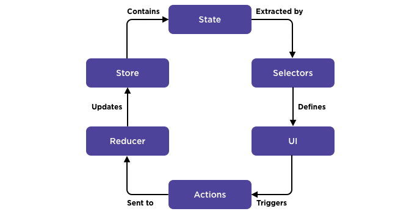
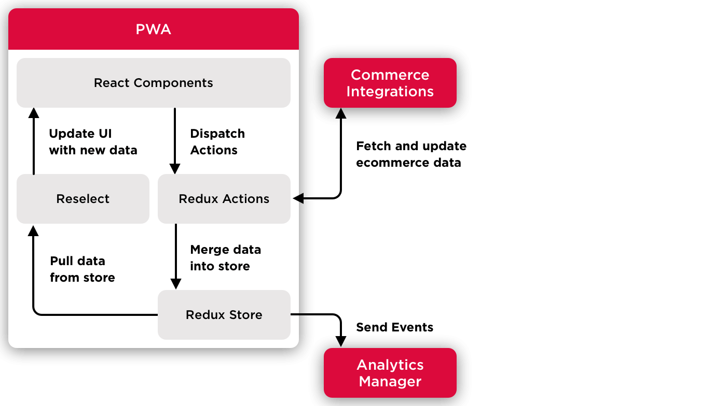
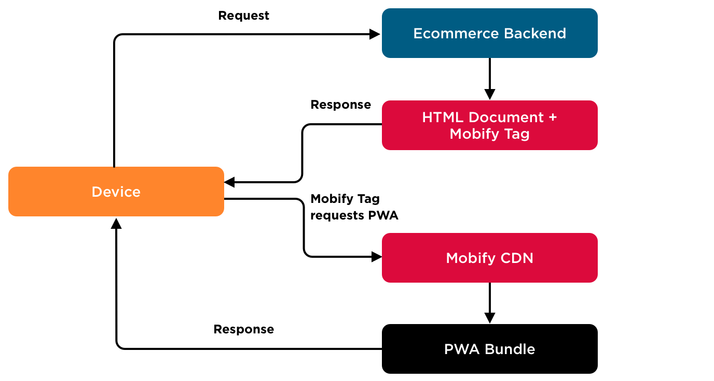
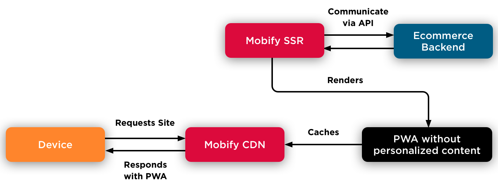
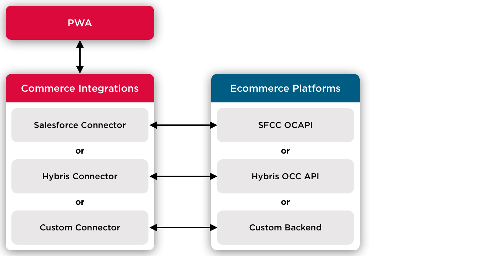
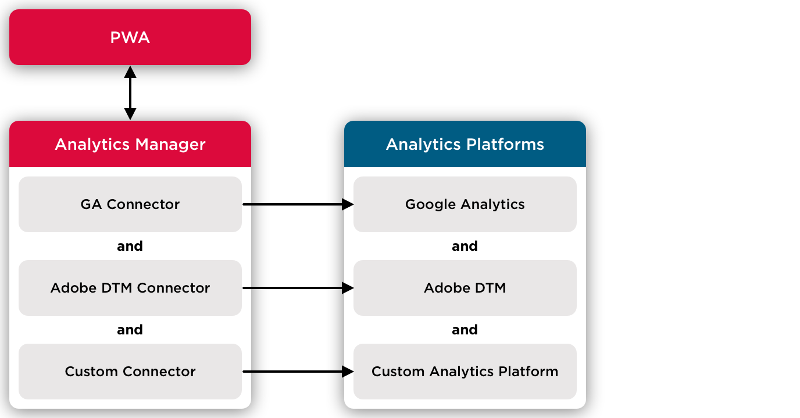

## Introduction

Progressive Web Apps (PWAs) created with the Mobify Platform are [single-page apps](https://flaviocopes.com/single-page-application/) that deliver fast, immersive user experiences across devices. This isn’t your typical web build: single page apps have more in common with native apps than they do with traditional websites.

In this overview, we’ll highlight the key technologies that make up the Mobify Platform and explain several concepts that will help you understand its architecture. You’ll learn how:

- A Mobify PWA is made up of different types of React components
- App state is managed with Redux
- Server-side rendered PWAs are different from tag-loaded PWAs
- Mobify provides a data layer for connecting to ecommerce backends and another for analytics services

## React component hierarchy

A Mobify PWA is built from a hierarchy of React components. In this section, we’ll walk you through the Router and App components at the top of the hierarchy and we’ll look at the UI components you'll include on your pages.

<figure class="u-text-align-center" style="background-color: #fafafa;">

  
  <figcaption>Mobify PWAs are built from a hierarchy of React components, with the Router component at the root.</figcaption>

</figure>

### Router component

At the root of the hierarchy we have the **Router component**, defined in `app/router.jsx`. The Router component wraps the entire application and is responsible for routing URLs to your page components.

As a developer working with the Mobify Platform, you'll need to edit the `app/router.jsx` file regularly—anytime you add a new page, for example.

By itself, the Router component does not render any visible components or UI. Instead, it defines the application’s routing structure. The purpose of the Router component is to:

- Create and wrap the application in the Redux store provider
- Map URL paths to React components using React Router

Router.jsx has all the different page routes for the application as its children, and it renders the appropriate page based on the current URL.

To learn more about routing, read our guide to [Routing URLs](../guides/routing/).

### App component

The App component renders the app’s global UI, such as your site’s header, or its sidebar navigation. It’s defined in `app/index.jsx`. When any given route is rendered, it renders with App as its top-level component.

As a developer working with the Mobify Platform, you'll rarely need to edit the App component. You may do so during initial configuration of the site, or you may use it to modify the global level of your application.

This is where app-level elements, such as the SVG sprite sheet or the [SkipLinks](../components/#!/SkipLinks) component for accessibility are rendered. In addition, the App component handles offline mode detection, rendering an OfflineBanner component with an offline status screen if a page is not available.

### User interface components

Throughout your build, you’ll be working with Mobify’s SDK user interface (UI) components, as well as building your own custom UI components. These UI components are the building blocks of your app and its pages.

Mobify’s SDK UI components can be found in your project’s `src/components` directory. By using the SDK components, you inherit a set of props and methods for pre-built UI features, designed for accessibility and lightning-fast performance. For example, you can customize a pre-designed Carousel, Banner, Image—or any of the 70+ components we offer. Check out our detailed documentation about our component library.  

You can also develop completely custom UI components for your project. These custom components can be found in the `app/components` directory.

When creating custom components, run the following command to generate all the files you need in the right place: 
```bash
$ npm run add:component
```

### Putting it all together

Now that we’ve seen each component in the hierarchy, let’s review how they build upon each other:

- The Router component wraps the entire app and defines the URL routing for the app
- The App component is rendered on all routes and manages the global UI
- SDK components and custom components render the UI of the app and its pages

## Managing app state with Redux
In the Mobify Platform architecture, React components rely on Redux to manage their state. In this section, you’ll learn:

- Essential concepts, such as the Redux Store, Redux actions, thunk actions, and selectors
- How to ensure that app data doesn’t change unexpectedly with Immutable.js

### The Redux store
The Redux store contains a complete snapshot of your Progressive Web App at a particular point in time. It contains all of the data needed by your PWA’s React components. This state data is contained in a plain JavaScript object called the app state, which is managed by Redux. 

To learn more about the Redux store, visit the [Redux docs](https://redux.js.org/basics/store).

<div class="c-callout">
<p>
<strong>Note:</strong> We tend to use the following terms interchangeably: Redux store, store, app state, and state.

</p>
</div>

### Redux actions
Redux actions are plain JavaScript objects that trigger changes in your app state in response to user interactions or internal app events. Redux actions describe any changes that need to occur through a string called the **type**. Optionally, Redux actions can provide data associated with an app state change through an object called the **payload**. Because Redux actions can only describe changes to the app state, they must be paired with a function called a [reducer](https://redux.js.org/basics/reducers) that is responsible for creating a new state object for the Redux store. Redux actions are invoked by passing them to Redux’s `dispatch()` function. 

To learn more about Redux actions and how they work together with reducers, visit the [Redux docs](https://redux.js.org/basics/actions).

<div class="c-callout">
<p>
<strong>Note:</strong> We tend to use the following terms interchangeably: Redux action, standard Redux action, and action.

</p>
</div>

<figure class="u-text-align-center" style="background-color: #fafafa;">

   
  <figcaption>The lifecycle of Redux state.</figcaption>

</figure>

### Thunk actions
A thunk action is a special type of Redux action that is defined as a function, rather than an object. This is useful when you need to run asynchronous code (to fetch data from the backend, for example). Thunk actions also have the ability to dispatch standard Redux actions so that a new app state can be created by a reducer after running any asynchronous code. They can also access data from the Redux store using Redux’s `getState()` function. Thunk actions are invoked the same way as standard Redux actions then handled by the [Redux Thunk middleware](https://github.com/reduxjs/redux-thunk), which supplies the thunk action’s function with additional parameters, including the `dispatch()` and `getState()` functions from Redux.

### Binding React and Redux together
We use the React Redux binding library to make the Redux store and Redux actions accessible to your React components through props. React Redux provides a function called `connect()` that takes two parameters that define new Redux-related props for your component:  

1. `mapStateToProps` is a function that links component props to the app state in the Redux store
2. `mapDispatchToProps` is a function that links component props to Redux actions so that actions can be dispatched from the component’s event handlers (such as `onClick`)  

To learn more about binding React and Redux together, visit the [React Redux docs](https://github.com/reduxjs/react-redux).

### Selectors
A selector is a [pure function](https://www.nicoespeon.com/en/2015/01/pure-functions-javascript/) that takes an app state object from the Redux store and returns some information extracted from that state object. Most often, selectors are used in mapStateToProps functions to provide data to your React components.  

In a Mobify PWA, we use selectors whenever we need to access data from the Redux store, rather than accessing the Redux store directly. This allows us to change the structure of the store without having to update every mapStateToProps function that accesses the store. Instead, we just update any selectors that are affected by the change.

### Memoization and the Reselect library
The [Reselect library](https://github.com/reduxjs/reselect) provides a number of useful features for creating selectors. Most importantly, selectors built with Reselect are memoized. A memoized function has a memory: it keeps track of the previous arguments that were passed into it and keeps track of the previous result. If the function is pure and the inputs do not change between sequential calls to the function, we don’t have to execute the body of the function more than once. Memoization helps avoid unnecessary re-renders.  

To learn more, visit the [Reselect library Github](https://github.com/reduxjs/reselect).

## Immutable Data Structures

Redux requires that the objects in the Redux store be *immutable*, which means that their values cannot be modified. This prevents changes to the state without the use of Reducers. Instead, objects can be *replaced* with modified copies. To satisfy this requirement, we use the immutable data structures provided by the Immutable.js library for the data we put in the Redux store. The immutable data structures replace JavaScript’s built-in data types. The replacement for JavaScript arrays is called a *list* and the replacement for JavaScript objects is called a *map*. These immutable data structures cannot be compared or modified with standard JavaScript operators like `=` and `===`. Instead, Immutable.js provides functions and methods for comparing objects and creating modified copies of them.  

To learn more about working with these data types, visit the [Immutable.js docs](https://immutable-js.github.io/immutable-js/).

## The PWA Lifecycle

Let’s examine how a Mobify PWA manages state through an example. 

Imagine that you’re building a PWA for an airline. The shopper on your site interacts with UI elements created with [Mobify’s SDK components](../components/all/). A shopper clicks on the banner of your PWA, which advertises a holiday sale for a flight to Warsaw. ([Banner](../components/#!/Banner) is one of Mobify's SDK components.) Now we want to fetch information from the backend about the sale and present it to the user in a modal. Here's what happens in the app:

1. The click handler dispatches a Redux action. 
2. The Redux action uses Commerce Integrations to communicate with the backend to find out how many seats are still available on the flight.
3. Another Redux action is dispatched with the data from the backend included in the action’s payload. To improve performance, the Service Worker can also be used to cache responses from the backend.
4. The reducer associated with the action will merge the new data into the Redux store. Now it contains data about the number of seats available.
5. If an action has an `analytics-meta` property, then the Analytics Manager is notified so that the event can be tracked.
6. A selector that returns the seat data from Redux store is mapped to one of the props in a UI component. Whenever the props for a component change, the component will re-render so the UI component will now show the number of available seats.

To summarize the flow that just occurred, let's look at it in a diagram:

<figure class="u-text-align-center" style="background-color: #fafafa;">

  
  <figcaption>Mobify PWAs use React and Redux together to manage the app state.</figcaption>

</figure>

## Two types of PWAs

Mobify PWAs can be delivered in one of two ways: tag-loaded or server-side rendered. 

Let’s take a look at each delivery method in more detail...

## 1. Tag-loaded PWAs

A tag-loaded PWA is rendered **only on the client-side**. It’s typically used for projects that are destined for mobile devices—or for both mobile and tablet devices. Its code is contained in a static bundle that’s hosted on Mobify’s content delivery network (CDN) and downloaded onto the user’s device. As the name implies, this type of PWA is loaded by a JavaScript tag, called the Mobify tag.  

### Initial request handling and app loading (tag-loaded):

1. The user navigates to the website using their mobile or tablet device, which sends a request to the site’s web server, which is usually connected to an ecommerce backend.
2. The ecommerce backend responds with an HTML page that includes the JavaScript for the Mobify tag.
3. After receiving the page, the device parses the HTML. When the parser reaches the Mobify tag, the device will request the code bundle for the PWA from Mobify’s CDN.
4. Mobify’s CDN responds to the request by sending the PWA bundle to the user’s device.

<figure class="u-text-align-center" style="background-color: #fafafa;">

  
  <figcaption>Initial request handling and app loading for a tag-loaded PWA.</figcaption>

</figure>  

### Subsequent request handling (tag-loaded)  

After the initial page load, the PWA is now running on the device, so it can make requests directly to the ecommerce backend—bypassing the Mobify CDN.  

Here’s a visual representation:

<figure class="u-text-align-center" style="background-color: #fafafa;">

  
  <figcaption>Request handling for a tag-loaded PWA after the PWA is running on the user’s device.</figcaption>

</figure>

## 2. Server-side rendered PWAs

Rendering PWAs on the server-side has a couple of important benefits over tag-loaded PWAs. First, the server enables even faster load times, with the ability to cache previously-loaded responses. Second, server-side rendered PWAs can help manage the complexity of multiscreen layouts. These PWAs can render content destined for any device, whether it’s mobile, tablet, desktop, or even something that hasn’t been invented yet.  

Server-side rendered PWAs have a code bundle just like tag-loaded PWAs do. But in this case, the bundle is run on Mobify’s servers and usually served from a cache to maximize speed.  

### Integrating with DNS

These PWAs are integrated at the DNS level, instead of through a JavaScript tag. For example, a site called *www.store.com* would point to Mobify’s servers, instead of the ecommerce backend:

<figure class="u-text-align-center" style="background-color: #fafafa;">
  
  
  <figcaption>Server-side rendered PWAs are integrated at the DNS level and point to Mobify’s servers. This is different than tag-loaded PWAs, which are integrated through the ecommerce backend and a JavaScript tag.</figcaption>

</figure>

### Initial request handling and app loading (server-side rendered)

- The user navigates to the website using their mobile, tablet, or desktop device, which sends a request directly to the Mobify CDN.
- Assuming we don’t already have anything in the cache, the Mobify CDN will then request the PWA from the server side rendering (SSR) component.
- From here, Commerce Integrations helps the SSR component communicate with the ecommerce backend.
- Using the data from the ecommerce backend and Mobify’s SDK UI components, the SSR component renders the PWA. *This will not include any personalized content, such as the user’s shopping basket data. Not including personalized data allows us to take advantage of caching to speed up each subsequent request.*
- The Mobify CDN receives the PWA without personalized content and caches it.
- The Mobify CDN responds to the user’s request by sending the PWA bundle.
- The client displays the server-side rendered content and begins loading the PWA.
- After the PWA finishes loading, it runs on the client side. 

To summarize, here is a diagram that shows the server-side rendered PWA lifecycle, for the first time a device requests the PWA:

<figure class="u-text-align-center" style="background-color: #fafafa;">

  
  <figcaption>Initial request handling and app loading for a server-side rendered PWA.</figcaption>

</figure>

### Subsequent request handling (server-side rendered)

Once the server-side rendered PWA is running on the device, handling every subsequent request becomes faster:

- Requests are proxied through the Mobify CDN to communicate with the ecommerce backend. Request handling is captured in the following diagram:

<figure class="u-text-align-center" style="background-color: #fafafa;">

  
  <figcaption>Request handling for a server-side rendered PWA after the PWA is running on the user’s device.</figcaption>

</figure>

## Commerce Integrations

Mobify’s Commerce Integrations technology provides a layer of abstraction between your PWA and the ecommerce backend of your site, such as Salesforce B2C Commerce. Through commerce connectors (think of them as plug-ins), you get a standard interface to communicate with any ecommerce backend. The commerce connector uses a class whose methods standardize common actions to fetch and update ecommerce data—plus you can extend the class to work with your project’s unique backend.

Both types of request handling are captured in the following diagram:

<figure class="u-text-align-center" style="background-color: #fafafa;">
    
  
  <figcaption>Commerce Integrations provide a layer of abstraction between your PWA and your site’s backend platform.</figcaption>

</figure>

To start learning about using Commerce Integrations in your project, check out our [Commerce Integrations docs](../integrations).

## The Analytics Manager

The Analytics Manager provides a layer of abstraction between your PWA and your site’s analytics providers, such as Google Analytics. This is similar to Commerce Integrations, but for analytics.

The Analytics Manager listens for special Redux actions that your PWA dispatches and detects analytics events from them. From there, it sends that information to each of the analytics services that you’ve connected to the Analytics Manager.

This data flow is captured in the following diagram:

<figure class="u-text-align-center" style="background-color: #fafafa;">
    
  
  <figcaption>The Analytics Manager is an abstraction layer between your PWA and your site’s analytics platform or platforms.</figcaption>

</figure>

To learn more, visit our [Analytics Manager docs](../analytics).

## Mobify Platform Libraries

The Mobify Platform includes many different libraries to help you build PWAs. A typical project will have over 100 Node packages listed as dependencies in its `package.json file`. In this section, we’ll give you a brief overview of the most important libraries included in the Mobify Platform. 

<div class="content-accordion u-margin-top">
<h3 class="u-text-medium">Mobify SDK libraries</h3>
<div>  

- [**Mobify SDK Component Library**](../components/)
  - Package name: included within `progressive-web-sdk`
  - Provides user interface components for building ecommerce PWAs
  - Developed and maintained by Mobify
- [**Mobify SDK Utility Functions**](../utility-functions/)
  - Package name: included within `progressive-web-sdk`
  - The Mobify Platform includes more than 100 JavaScript utility functions for building ecommerce PWAs
  - Developed and maintained by Mobify
- [**Commerce Integrations**](../integrations/commerce-integrations)
  - Package name: `commerce-integrations`
  - Provides an abstraction layer between your PWA and your ecommerce backend
  - Developed and maintained by Mobify
- [**Analytics Manager**](../analytics/analytics-overview/)
  - Package name: included within `progressive-web-sdk`
  - Provides an abstraction layer between your PWA and your analytics platform(s)
  - Developed and maintained by Mobify
- [**Mobify Test Framework**](../testing/mobify-test-framework/)
  - Package name: `test-framework`
  - Provides a package of tools to test the performance of your PWA throughout the build
  - Developed and maintained by Mobify
- **Sandy Tracking Pixel Client**
  - Package name: `sandy-tracking-pixel-client`
  - Provides an API for sending data to Mobify's Engagement Engine (Mobify's analytics database)
  - Developed and maintained by Mobify

</div>
<h3 class="u-text-medium">React libraries</h3>
<div>

- [**React**](https://reactjs.org/docs/getting-started.html)
  - Package name: `react`
  - Used to build the user interface for Mobify PWAs
  - Developed and maintained by Facebook
- [**ReactDOM**](https://reactjs.org/docs/react-dom.html)
  - Package name: `react-dom`
  - Provides DOM-specific methods that can be used at the top level of your PWA (DOM is an API for HTML and XML documents which defines their structure)
  - Developed and maintained by Facebook
- [**React Helmet**](https://github.com/nfl/react-helmet/blob/master/README.md)
  - Package name: `react-helmet`
  - Helps you manage changes to the document head
  - Developed and maintained by NFL Engineering
- [**React-Loadable**](https://github.com/jamiebuilds/react-loadable)
  - Package name: `react-loadable`
  - Promotes PWA performance through code-splitting of larger bundles
  - Developed and maintained by Jamie Kyle
- [**React Redux**](https://react-redux.js.org/introduction/quick-start)
  - Package name: `react-redux`
  - A binding library which allows your React components to access the Redux store and Redux actions, by linking your component props
  - Developed and maintained by Redux
- [**React Router**](https://reacttraining.com/react-router/)
  - Package name: `react-router`
  - Maps URL paths to React components
  - Developed and maintained by ReactTraining

</div>
<h3 class="u-text-medium">Redux libraries</h3>
<div>

- [**Immutable.js**](https://immutable-js.github.io/immutable-js/)
  - Package name: `immutable`
  - Ensures that the data in the Redux store cannot be mutated. This is important for Redux to work as expected. (If you are changing state in Redux, you are always returning a totally new state object, rather than mutating an existing object.)
  - Developed and maintained by Immutable.js
- [**Redux**](https://redux.js.org/introduction/getting-started)
  - Package name: `react-redux`
  - Redux simplifies the management of app state, by providing a predictable state container. In Mobify projects, Redux works together with React components and Commerce Integrations to manage your app’s state.
  - Developed and maintained by Redux
- [**Redux Form**](https://redux-form.com/8.1.0/docs/gettingstarted.md/)
  - Package name: `redux-form`
  - Provides utilities for managing forms, including error handling and validation
  - Developed and maintained by Redux Form
- [**Redux Thunk**](https://github.com/reduxjs/redux-thunk/blob/master/README.md)
  - Package name: `redux-thunk`
  - Allows Redux to dispatch actions that are defined as functions. These functions can perform asynchronous tasks, access the data in the Redux store, and dispatch other actions.
  - Developed and maintained by Redux
- [**Reselect**](https://github.com/reduxjs/reselect/blob/master/README.md)
  - Package name: `reselect`
  - Creates memoized functions for getting data out of the Redux store
  - Developed and maintained by Redux
- [**Reselect Immutable Helpers**](https://github.com/DanielleB-R/reselect-immutable-helpers/blob/master/README.md)
  - Package name: `reselect-immutable-helpers`
  - Makes it easier for you to use Reselect together with Immutable.js. Provides utilities for creating selectors that return Immutable.js objects (such as maps and lists), without having to write boilerplate code to convert them back to regular JavaScript objects.
  - Developed and maintained by Mobify (latest update: 2017)

</div>
<h3 class="u-text-medium">Development tooling</h3>
<div>    

- [**Babel**](https://babeljs.io/docs/en/)
  - Package name: `babel-*`
  - Converts your Javascript code into a backwards-compatible version so that it can be run in a wide range of browsers. Specifically, it converts JSX syntax to Javascript syntax and ES6 syntax to ES5 syntax.
  - Developed and maintained by: Babel
- [**Bluebird**](http://bluebirdjs.com/docs/getting-started.html)
  - Package name: `bluebird`
  - A promise-handling library which enables task-splitting in your PWA, a key method to optimize performance. In Mobify projects, it’s used to ensure we have promises, and to standardize how the promises work.
  - Developed and maintained by: Petka Antonov
- [**Eslint**](https://eslint.org/)
  - Package name: `eslint`
  - Provides a "linter" -- an analysis tool that helps highlight code syntax and style issues without having to execute it
  - Developed and maintained by: Eslint
- [**Jest**](https://jestjs.io/)
  - Package name: `jest`
  - A testing framework for JavaScript
  - Developed and maintained by: Facebook
- [**Webpack**](https://webpack.js.org/concepts/)
  - Package name: `webpack`
  - Consolidates Mobify's application modules into one or more bundles for the end user to download
  - Developed and maintained by: Webpack


</div>
<h3 class="u-text-medium">Styling</h3>
<div>

- [**Classnames**](https://github.com/JedWatson/classnames/blob/master/README.md)
  - Package name: `classnames`
  - Makes dynamic and conditional `className` props simpler and easier to work with
  - Developed and maintained by: JedWatson
- [**Node-Sass**](https://www.npmjs.com/package/node-sass)
  - Package name: `node-sass`
  - Allows fast and automatic compiling of CSS preprocessor files (Sassy CSS, or .scss) files to css. CSS preprocessors enable you to become more productive with CSS, through the added convenience of variables, modularity, and inheritance.
  - Developed and maintained by: Sass
- [**Susy**](https://www.oddbird.net/susy/)
  - Package name: `susy`
  - Helps you build readable and robust responsive grid systems. To learn more, read [Creating Responsive Layout Grids With Susy](../guides/responsive-grid/).
  - Developed and maintained by: Oddbird 

</div>
<h3 class="u-text-medium">Server-side rendering</h3>
<div>

- [**JSDOM**](https://github.com/jsdom/jsdom/blob/master/README.md)
  - Package name: `jsdom`
  - Used in server-side rendered PWAs to provide a browser-like environment where we can render React components on the server
  - Developed and maintained by: Jsdom
- [**Express**](https://expressjs.com/)
  - Package name: `express`
  - Provides a web server framework for node
  - Developed and maintained by: Expressjs

</div>
</div>

## Mobify Cloud

Mobify Cloud simplifies the deployment of both tag-loaded PWAs and server-side rendered PWAs. It allows you to:

- Deploy bundles in three convenient ways: either using Mobify Cloud’s web interface [(cloud.mobify.com)](https://cloud.mobify.com/), using your favorite command line interface, or via HTTP API.
- Push bundles for testing
- Roll back to previous bundles if necessary
- Set up various environments for your project where you’d like your bundles to be deployed. For example, staging, production, or user acceptance testing (UAT).

<div id="toc"><p class="u-text-size-smaller u-margin-start u-margin-bottom"><b>IN THIS ARTICLE:</b></p></div>