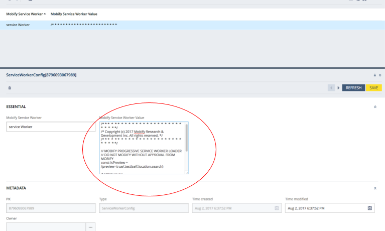

<div class="c-callout c--important">
  <p>
    <strong>Important:</strong> Projects generated <em>after</em> 2019 do not use the Integration Manager because it has been replaced with our <a href="../../integrations/commerce-integrations/">Commerce Integrations</a> technology.
  </p>

  <p>
     For anyone working on projects that were generated <em>before</em> 2019, we've left the Integration Manager documentation here in case you still need to refer to it.
  </p>
</div>

Mobify provides a set of **Mobify Extensions** for SAP Hybris Commerce Suite to simplify integration:

* The **Mobify Tag Extension** installs the Mobify Tag and Mobify Service Worker to your Hybris Storefront, this extension includes the following Hybris addons:
  - mobifystorefrontaddon
  - mobifyconfigbackoffice
  - mobifyconfig
* The **Mobify Webservice Extension** modifies the Hybris Webservice to allow guest users to change their email address as well as support storing customer's phone and company information
  - mobifywebservices


## Before you begin 

Before following these instructions you should:

* Have a running instance of SAP Hybris Commerce Suite with version **6.4** or higher
* Complete the [Quick Start](../../getting-started/quick-start/) guide.
* Read the [Integration Manager Overview](../ecommerce-overview/).
* Have admin access to Hybris Backoffice

## Integration

To complete integration with Hybris you must:

1. Install the Mobify extensions
2. Install the Mobify tag and service worker
3. Create an OAuth client
4. Set up the connector in your project

### Install the Mobify Extensions

_The Mobify Extension is availiable here: [Mobify Extension](https://s3.amazonaws.com/downloads.mobify.com/hybris-extension/MobifyExtension.zip)_

1. Download and unzip the file to your Hybris file system: `/hybris/bin/custom/<project_name>`

2. In `/hybris/bin/custom/<project_name>`, you will find four Mobify extension folders:
  - mobifystorefrontaddon
  - mobifyconfigbackoffice
  - mobifyconfig
  - mobifywebservices

3. Add the following lines to `localextensions.xml`:

  ```xml
    <!--Mobify Extensions-->
    <extension name='mobifystorefrontaddon'/>
    <extension name='mobifyconfig'/>
    <extension name='mobifyconfigbackoffice'/>
    <extension name="oauth2" />
    <extension name="addonsupport" />
    <extension name="yoccaddon" />
    <extension name="mobifywebservices" />
  ```
4. Go to command prompt and execute the following command from your Hybris platform folder (`/hybris/bin/platform`) :

  ```sh
    ant mobifyConfigTarget
  ```

  This command will copy the contents of `master.tag` file from `mobifystorefrontaddon` to `master.tag` file in `/hybris/bin/ext-template/yacceleratorstorefront/web/webroot/WEB-INF/tags/responsive/template/master.tag`

  If there has already been some custom modifications in `master.tag` of your project, then before running this command, please remove following code from the `buildcallbacks.xml` file in `mobifystorefrontaddon` extension and run “ant all” from command prompt.

  ```xml
  <copy file="${ext.mobifystorefrontaddon.path}/acceleratoraddon/web/webroot/WEB-INF/tags/responsive/template/master.tag" todir="${ext.custom-storefront-name.path}/web/webroot/WEB-INF/tags/responsive/template" overwrite="true"/>
  ```

  Removing the above xml code will prevent your master tag being overwritten, you need to manually add Mobify tag to your `master.tag`. Add the following code after <head> tag in your custom `master.tag` file.

  ```html
  <%-- mobifyConfig Tag Value from Database starts --%>

  ${mobifyTagValue}

  <%-- mobifyConfig Tag Value from Database Ends --%>
  ```

  The `master.tag` should look like this:

  

5. Run `ant clean all`  in your command prompt. There should not be any build errors.
6. After building your code, start the server by executing the following command on command prompt
  - Unix `./hybrisserver.sh`
  - Windows `hybrisserver.bat`
7. After starting the server, go to HAC and under **platform > update**, please select the following options and click on update. Executing this will help in reflecting the changes in backoffice.

  

### Install the Mobify tag and service worker

1. After successfully installing the Mobify extensions, go to Hybris Backoffice, on the left side panel, you will be able to see Mobify extension options

  

  Under Mobify, you will see two options:
    - MobifyTagConfiguration : Used to add/modify Mobify tag script which will be visible at all pages.
    - ServiceWorkerConfig : Used to add/modify Mobify Service Worker Loader javascript.

2. Add/Modify MobifyTagConfiguration and ServiceWorkerConfig, please select `+` to add new property and enter your Mobify tag

  

  To reformat the scripts, format the values in **Essential > Mobify Service Worker Value** and save the changes

  

  After saving the changes, verify the service worker is in place by going to `https://domain-name/service-worker-loader.js`

### Create an OAUTH 2.0 client 

_The client allows the connector to communicate with Hybris using OCC API._

[Create a new OAUTH client](https://help.hybris.com/6.4.0/hcd/627c92db29ce4fce8b01ffbe478a8b3b.html). _Note its client ID and client secret. It is need to configure the connector._

This connector uses two types of OAuth 2.0 tokens, one for anonymous users and
one for customers. The configuration of these tokens can be found in
`init-hybris-connector.js`

```json
  auth: {
      anonymous: {
          clientId: 'client-side',
          clientSecret: 'secret'
      },
      customer: {
          clientId: 'mobile',
          clientSecret: 'secret'
      }
  }
```

You can either configure the tokens in the HAC or the backoffice.
1. To configure these tokens in the HAC, import the following IMPEX:

  ```impex
  INSERT_UPDATE OAuthClientDetails;clientId[unique=true] ;resourceIds ;scope ;authorizedGrantTypes ;authorities ;clientSecret ;registeredRedirectUri
  ;client-side ;hybris ;basic ;implicit,client_credentials ;ROLE_CLIENT ;secret ;http://localhost:9001/authorizationserver/oauth2_implicit_callback;
  ;mobile ;hybris ;basic ;authorization_code,refresh_token,password,client_credentials ;ROLE_CLIENT ;secret ;http://localhost:9001/authorizationserver/oauth2_callback;
  ```

2. Or you can configure your tokens in backoffice, login to the backoffice, and select **Systen > OAuth > OAuth Clients**, add a new client with the following information:

  ```json
    OAuth client ID: your_client_id (no space allowed)
    OAuth client secret: your_secret
    Authorities: ROLE_CLIENT
    Client Grant Types: refresh_token, password, authorization_code, client_credentials
  ```

  

  Once the OAuth client is created, refresh the page and make sure the disabled flag of the client is set to false.


### Set up the connector

_Configuring the connector tells it how to talk to your Hybris site._

In the Web SDK, the connector is configured and registered with the Integration Manager in `web/app/init-hybris-connector.js`.
Update it with your Hybris configurations.

Open `web/app/main.jsx` and remove the other connectors. Import the one we set up:

```diff
- import initConnector from './init-merlins-connector'
- import initConnector from './init-sfcc-connector'
- import initConnector from './init-stub-connector'
+ import initConnector from './init-hybris-connector'

initConnector()
```

**You're done! Great job! 🙌**

Your PWA should now be integrated with Hybris.

## Verifying it worked

_To verify, load the PWA and confirm it gets data from Hybris_.

1. Start the development server by running `npm start` in the `web` folder.
1. Open a web browser and activate mobile emulation.
2. Copy Preview URL from your console and open it in your web browser.
3. Ensure the Site URL is set to your Hybris site's homepage over HTTPS.
3. Hit Preview!


### Troubleshooting

**`npm start` doesn't work!**
* Check your JavaScript for syntax errors.
* Check that you're running the command from inside the `/web` folder of your project.
* Check that your packages are up to date by running `npm install` from the `/web` folder of your project.

**After previewing, the PWA doesn't load!**
* [Check for HTTPS errors](../../getting-started/quick-start/#avoiding-https-errors-in-local-development).
* Verify the Mobify Tag is present on the page
* Open Dev Tools and confirm requests to Hybris are succeeding.
* Open Dev Tools and check for errors logged to the JavaScript console.

-----------

<!-- @JB Note: The rest of document should be a seperate article. -->

## Authentication/JWT 

We use JSON Web Tokens (JWT) for authentication with Hybris OCC API.
The details of how JWT authentication works in Hybris are documented in
[this](https://help.hybris.com/6.4.0/hcd/8c181d168669101480a1864a1e8fceb3.html)
document.

The Connector for Hybris automatically manages requesting a JWT token when a
sessions starts and then submits and renews the token as needed.

## Utility Functions 

There are a number of utility functions that you may find useful if you need to
[extend](../extending-a-connector) the Connector for Hybris. They simplify
interacting with Hybris OCC APIs by taking care of things like authentication
tokens (JWT) and cart management automatically.

_If you are extending the Connector for Hybris we strongly recommend
using these functions instead of implementing similar functionality from
scratch._

The functions are organized into a set of broad categories below.

### Authentication 

#### `getAuthToken(): string`

Retrieves the [auth token](#authentication-jwt) from browser storage.

_You almost never need to use this function directly because the
[Request Functions](#functions-request) manage the authorization token
automatically._

#### `storeAuthToken(authToken: string)`

Stores the [auth token](#authentication-jwt) to browser storage. This function
stores the auth token using the best available method (currently it tries
session storage first and falls back to using a cookie).

_You almost never need to use this function directly because the
[Request Functions](#functions-request) manage the authorization token
automatically._

#### `deleteAuthToken()`

Deletes the [auth token](#authentication-jwt) from browser storage.

_You almost never need to use this function directly because the
[Request Functions](#functions-request) manage the authorization token
automatically._

#### `isUserLoggedIn(authorization) -> boolean`

Returns `true` if the given `authToken` represents a logged in user, `false`
otherwise.

### Requests 

#### `makeApiRequest(path: string, options: object, body: object, logoutOnUnathorised: boolean): Promise<object>`

Executes an API request to the specified `path` and returns `Promise` that
resolves with the server's results. The resolved object is the `Response` object
returned by the `fetch` API and is documented
[here](https://developer.mozilla.org/en-US/docs/Web/API/WindowOrWorkerGlobalScope/fetch).

*Note that this method only takes a `path` instead of a full URL because the
connector manages building the full URL based on the configured **Base Site ID**.*

#### `makeUnAuthenticatedApiRequest(path: string, options: object): Promise<object>`

Exactly the same as `makeApiRequest` but explicitly _doesn't_ set any
authorization headers. This is useful if you need to make an API call outside of
the current session/user.

### Cart Management 

#### `deleteCartID()`

Deletes the currently-saved cart ID from browser storage.

#### `getCartID(): string`

Retrieves the currently-saved cart ID from browser storage

#### `storeCartID(cartID: string)`

Stores the given cart ID to browser storage

#### `fetchCart(): Promise<object>`

Fetches cart data from Hybris OCC API for the current cart. If there is no existing cart,
it will create a new cart.

#### `handleCartData(cart: object): Promise<object>`

Parse and store the cart data to the Redux store.

#### `getCart(): Promise<object>`

This is a combination of `fetchCart` and `handleCartData`, it fetchs the cart from Hybris OCC API and processes the provided cart data and dispatches it to the Redux store. The resolved value is the cart data.

----------

## Terminology 

* Backoffice - Product manangement application of Hybris
* Hybris - SAP Hybris Commerce Suite
* HAC - Hybris Administration Console, offers functionality for administration, monitoring, and configuration of SAP Hybris Commerce.
* OCC - Omni Commerce Connect, next-generation commerce API that offers a broad set of commerce and data services which enable you to use and leverage the complete SAP Hybris Commerce functionality

<div id="toc"><p class="u-text-size-smaller u-margin-start u-margin-bottom"><b>IN THIS ARTICLE:</b></p></div>