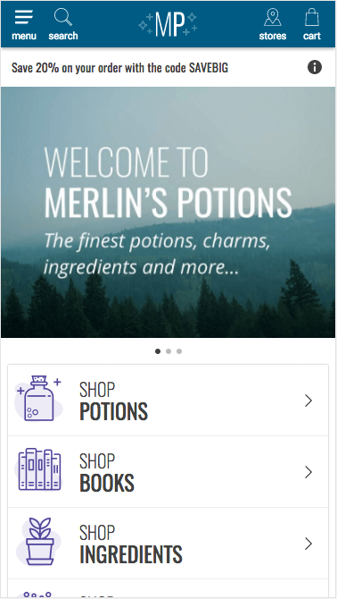
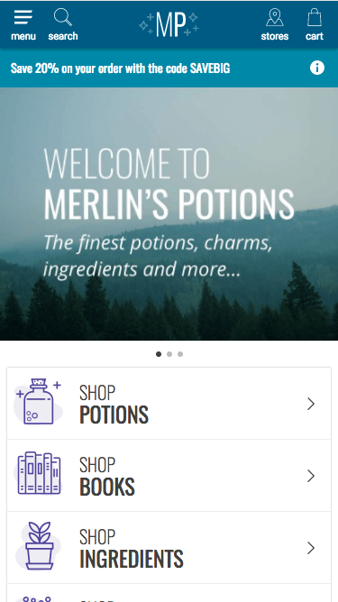

Let's start with a simple development exercise to get you started with making
progressive web apps: adding a banner to the Merlin's Potions homepage using the
[Banner](../../components/#!/Banner) component from the Progressive Mobile Web
SDK.

## Before you begin <a name="before-you-begin" href="#before-you-begin">#</a>

Complete the [Quick Start](../quick-start/) guide to install all required
software, generate your project files, and start your development server.

## 1. Setting up  <a name="setting-up" href="#setting-up">#</a>

The [Banner](../../components/#!/Banner) component is not included in your
project by default, so you will have to add a couple import statements.

Add the following to `web/app/styles/themes/_pw-components.scss`:

```css
@import 'node_modules/progressive-web-sdk/dist/components/banner/base';
```

Add the following to `web/app/containers/home/container.jsx`:

```javascript
import Banner from 'progressive-web-sdk/dist/components/banner'
```

## 2. Updating the home page <a name="updating-the-page" href="#updating-the-page">#</a>

Open `web/app/containers/home/container.jsx` and insert the following code after
`<div className="t-home__container">` in the JSX for the `Home` component:

```jsx
<Banner icon="info" title="info">
    Save 20% on your order with the code SAVEBIG
</Banner>
```

Save the file and open the preview URL in your browser (or just reload the home
page if you already have it open). 

It should look like this:



You may have noticed that the banner you added doesn't have a background color
that matches the theme of Merlin's Potions. This is because SDK components only
include a set of default styles.

## 3. Styling the component  <a name="styling-the-component" href="#styling-the-component">#</a>

To create our own styles for the banner on top of the base SDK theme styles, we
need to create a new file under `web/app/styles/themes/pw-components` called
`_banner.scss`.

Let's edit `web/app/styles/themes/pw-components/_banner.scss`:

```css
.pw-banner {
    background-color: #0288a7;
    color: #fff;
}

```

Now let's open `web/app/styles/themes/_pw-components.scss` and add an import
statement for our new styles. Under `// [BBB] Progressive Web SDK Custom
Styles`, add:

```css
@import 'pw-components/banner';
```

Reload, and you'll see your banner with the new background color.



## Next steps <a name="next-steps" href="#next-steps">#</a>

To learn more about how to use the [Banner](../../components/#!/Banner)
component, or any of the other components in the SDK, see the [Web
Components](../../components/) documentation.
