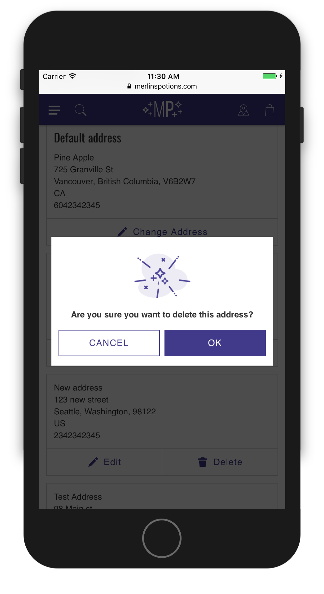
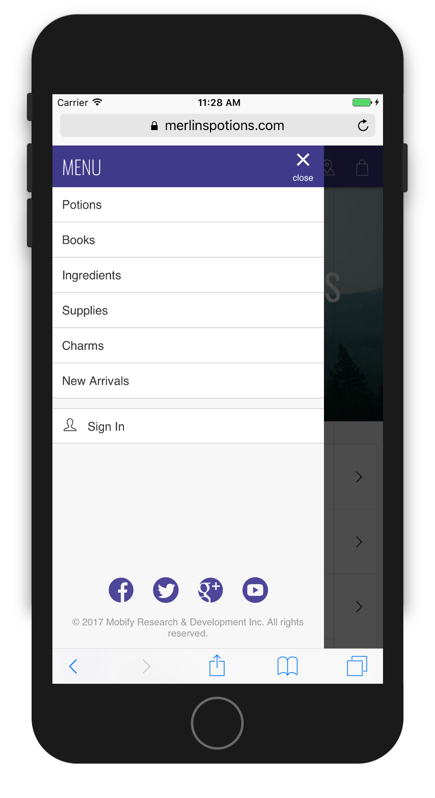

<div class="c-callout c--important">
  <p>
    <strong>Important:</strong> We've removed this article from the site navigation because Mobify projects that were generated after January 2019 do <em>not</em> include the Modal Manager technology described below. We plan to update our documentation soon to reflect this change and provide new instructions for implementing modals using the <a href="../../components/#!/Sheet">Sheet component</a>. Stay tuned! If you are maintaining a project that was generated before January 2019 that <em>does</em> include the Modal Manager, we have left this documentation in place for you.
  </p>
</div>

Modals are a user interface pattern that overlays content on top of a website. These come in various forms, but common examples include warning messages, popups, dialog boxes, and more. Regardless of the form a modal takes, a key element to their behavior is: they block users' interaction with the screen _behind_ the modal, making the modal content the center of their focus.

<aside style="display: flex; align-items: center; justify-content: center">
    <figure style="width: 40%; flex: 0 1 auto">
        
        <figcaption style="text-align: center; font-style: italic;">
            Dialog box modals provide a way to verify what might be dangerous user interactions.
        </figcaption>
    </figure>
    <figure style="width: 40%; flex: 0 1 auto">
        
        <figcaption style="text-align: center; font-style: italic;">
            Slide-in "drawers" are an example of modals that reveal content on demand.
        </figcaption>
    </figure>
</aside>

By default, your project will contain most of the modals you'll need to build your progressive web app (PWA). You'll already have a main navigation modal, a mini-cart modal, an "Added to cart" modal, and more. However, you might need to add new custom modals at some point.

Below are step-by-step instructions on how to add custom modals to your PWA and have it be openable from anywhere you want.

## Before you begin 

Follow the directions in the [Quick Start](../quick-start/) guide to install any
required software, generate your project files, and start your development
server.

## 1. Setup 

To get started, duplicate the directory `web/app/modals/_example-modal` and rename it to `web/app/modals/starter-modal/`. Then rename the files inside so they look like the following:

* \_starter-modal.scss
* index.jsx

## 2. Update the modal constants 

First, open `web/app/modals/constants.js`. Inside, create a new line at the bottom and add a new exported constant like so:

```js
// at the bottom of the list of constants...
export const STARTER_MODAL = 'starter-modal'
```

At this time, open `web/app/modals/starter-modal/index.jsx` and replace the following variable names:

* `EXAMPLE_MODAL` → `STARTER_MODAL`
* `ExampleModal` → `StarterModal`

Also replace the `m-example-modal` classname with `m-starter-modal`.

## 3. Register to the Modal Manager 

Next is to update the Modal Manager. This is the component that controls which modal (or modals) can be seen at any given time. It does so by observing the modal branch of the Redux store, and any modal who has an `open` state of `true` will render.

Open the Modal Manager (`web/app/modals/index.jsx`). The following must be done: import your newly created `StarterModal` modal and add it to the `MODAL_VIEWS` object. See below for details on each step.

### 3.1 Import the new modal component 

Beneath the list of imported components add the import for your new modal component. It should look like this:

```js
import StarterModal from './starter-modal'
```

### 3.2 Import the new modal constant 

Find the list of imported constants and add to it the constant you added earlier:

```js
import {
    ACCOUNT_ADDRESS_MODAL,
    ACCOUNT_REMOVE_ADDRESS_MODAL,
    ACCOUNT_REMOVE_WISHLIST_ITEM_MODAL,
    CART_ESTIMATE_SHIPPING_MODAL,
    CART_MERGE_ITEMS_MODAL,
    CART_REMOVE_ITEM_MODAL,
    CART_WISHLIST_MODAL,
    CHECKOUT_CONFIRMATION_MODAL,
    MINI_CART_MODAL,
    MORE_MENU,
    NAVIGATION_MODAL,
    OFFLINE_MODAL,
    PRODUCT_DETAILS_ITEM_ADDED_MODAL,
    PRODUCT_LIST_FILTER_MODAL,
    WISHLIST_ITEM_ADDED_MODAL,

    // This is your constant! Although it's best to stay in alphabetical order
    STARTER_MODAL
} from './constants'
```

### 3.2 Add modal component to view list 

In order to update the view list, we need the two things you imported above: the constant `STARTER_MODAL` and the modal component `StarterModal`. We will use the constant as a new key in the `MODAL_VIEWS` object, and its value will be an object whose content includes your modal component.

```js
const MODAL_VIEWS = {
    [ACCOUNT_ADDRESS_MODAL]: {content: <AccountAddressModal />},
    [ACCOUNT_REMOVE_ADDRESS_MODAL]: {content: <AccountRemoveAddressModal />},
    [ACCOUNT_REMOVE_WISHLIST_ITEM_MODAL]: {content: <AccountRemoveWishlistItemModal />},
    [CART_ESTIMATE_SHIPPING_MODAL]: {content: <CartEstimateShippingModal />},
    [CART_MERGE_ITEMS_MODAL]: {content: <CartMergeItemsModal />},
    [CART_REMOVE_ITEM_MODAL]: {content: <CartRemoveItemModal />},
    [CART_WISHLIST_MODAL]: {content: <CartWishlistModal />},
    [CHECKOUT_CONFIRMATION_MODAL]: {content: <CheckoutConfirmationModal />},
    [MINI_CART_MODAL]: {content: <MiniCart />},
    [MORE_MENU]: {content: <MoreMenuModal />},
    [NAVIGATION_MODAL]: {content: <Navigation />, prerender: true},
    [OFFLINE_MODAL]: {content: <OfflineModal />},
    [PRODUCT_DETAILS_ITEM_ADDED_MODAL]: {content: <ProductDetailsItemAddedModal />},
    [PRODUCT_LIST_FILTER_MODAL]: {content: <ProductListFilterModal />},
    [WISHLIST_ITEM_ADDED_MODAL]: {content: <WishlistItemAddedModal />},

    // like this! Although it's better to stay in alphabetical order here too
    [STARTER_MODAL]: {content: <StarterModal />}
}
```

Notice in the `MODAL_VIEWS` object that all the values are themselves objects. The `content` key is required and contains the Modal component, and other options may be passed in as well.

The `MODAL_VIEWS` objects do have customizable options, but we will discuss them a little later on.

## 4. Opening and closing the modal 

The next logical step is to add a way to open your newly created modal. This is simple to do, typically involving your modal's ID and a single action. In the examples below, we will add a button to your project's Home page container. The button with an event handler to open your new modal.

Open `web/app/containers/home/container.jsx` and follow the instructions below.

### 4.1 Import the modal ID 

Remember the constant variable that you imported into the modal manager? Now import it into the Home page container:

```js
import {STARTER_MODAL} from '../../modals/constants'
```

### 4.2 Import the modal actions 

Modal actions are found in `web/app/modals/actions.js`. Go ahead and import the open action into your Home container. The Home page container does not yet have the `mapDispatchToProps` variable, so you'll have to create that and pass it to the connect function at the bottom of the file.

```js
import {openModal} from '../../modals/actions'

// ...

const mapDispatchToProps = {
    openStarterModal: () => openModal(STARTER_MODAL, 'an-analytics-id')
}

const connectedHome = connect(
    mapStateToProps,
    mapDispatchToProps // don't forget to add `mapDispatchToProps` here!
)(Home)
```

Lastly, pass the new open function props into a few buttons:

```jsx
const Home = ({
    pageMeta,
    openStarterModal // Don't forget to add this new prop!
}) => {
    return (
        <div className="t-home__container">
            <button onClick={openStarterModal}>Open Modal</button>

            <PageMeta {...pageMeta} />
            <HomeCarousel />
            <HomeCategories />
        </div>
    )
}
```

Go ahead and preview your PWA, load the home page, click that modal button and just like that, we have a working modal!

## 5. Customize Your Modal 

Congratulations, your modal is up and running!

Your next step at customizing your modal will involve replacing the modal content, and creating a button that opens the modal in the template of your choice. It's as simple as that! The Modal Manager (combined with the Redux store) gives you the flexibility to show modals anywhere in the application with a single execution of the `openModal` action.

To continue your learning, please see the [Sheet component](../../components/#!/Sheet) and [Modal Manager And Actions](../../reference/modal-manager-and-actions/) documentation for advanced reference material on these topics.

<div id="toc"><p class="u-text-size-smaller u-margin-start u-margin-bottom"><b>IN THIS ARTICLE:</b></p></div>