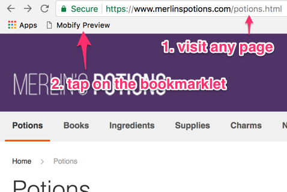

As shown on the [Quick Start](../quick-start/#previewing-your-new-project) page, we rely upon the [Mobify Preview](https://preview.mobify.com) page to **preview your project**. Depending on your needs, there are a few ways to reach this Mobify Preview page:

- Manually visit the Mobify Preview page and fill out all fields
- After starting your development web server, copy the [Preview URL](#preview-url-in-terminal) from your terminal and paste it into your browser
- Use a handy [bookmarklet](#bookmarklet) to quickly preview the page you're currently on

## Preview URL in the terminal <a name="preview-url-in-terminal" href="#preview-url-in-terminal">#</a>

When you start your development web server (by running `npm start`), the Preview URL will be listed in your terminal so that you can copy and paste it into your browser.

It's a way to quickly preview your project, and all of the fields on the Mobify Preview page are already filled out.

The downside with this terminal method is that you'll be taken to the same page each time, which is the homepage of your production site.

## Bookmarklet <a name="bookmarklet" href="#bookmarklet">#</a>

Once you're familiar with the preview process, we encourage you to explore using this bookmarklet in your workflow:

```js
javascript:(()=>{const o=window.location.href;let e="https://localhost:8443/";const n=o=>o.includes("adaptive.min.js")?"adaptive.js":o.includes("loader.js")?"loader.js":"";switch(window.Mobify.tagVersion[0]){case 6:e+="mobify.js";break;case 7:const o=window.Mobify.Tag.options;e+=n((o.enabled||o.smartphone||o.tablet).url);break;case 8:e+=n(window.Mobify.syncLoader||window.Mobify.asyncLoader)}window.location.href=`https://preview.mobify.com/?url=${encodeURIComponent(o)}&site_folder=${encodeURIComponent(e)}&disabled=0&domain=&scope=1`})();
```

A bookmarklet is useful when:
- you do not want to restart your development web server just to see the Preview URL again
- you want to preview quickly and jump directly to any particular page

### How to use the bookmarklet <a name="how-to-use-bookmarklet" href="#how-to-use-bookmarklet">#</a>



1. In your browser, visit a page that you are working on. Let's call this the target page.
2. Click on the bookmarklet to preview that page
3. You're now on the Mobify Preview page, and its fields have been automatically filled out for you
4. Click the Preview button. You'll then be redirected to the target page.
5. Verify in your browser's console that you have successfully previewed
