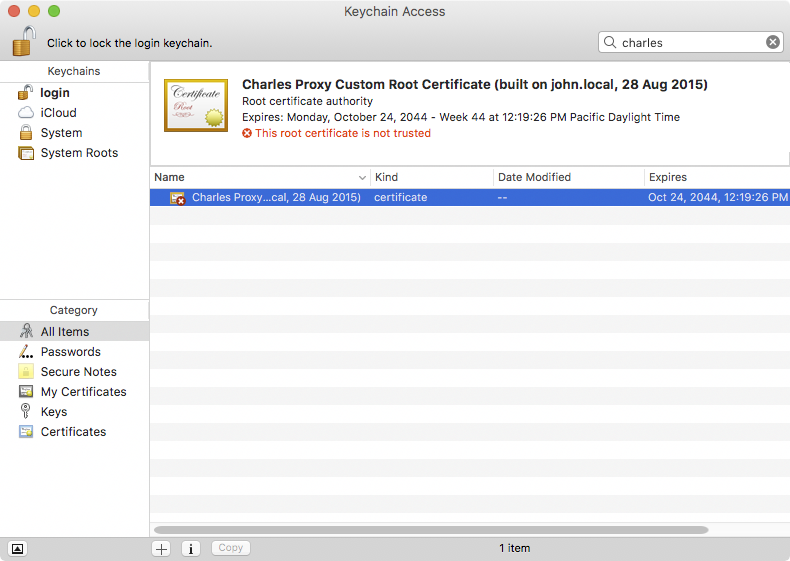
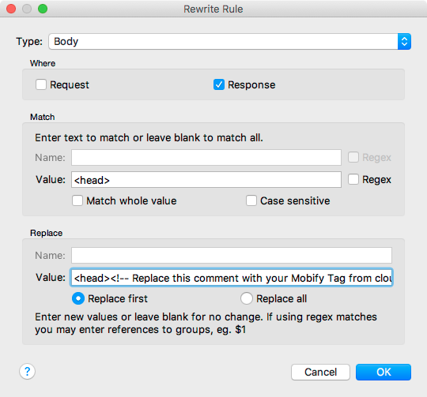
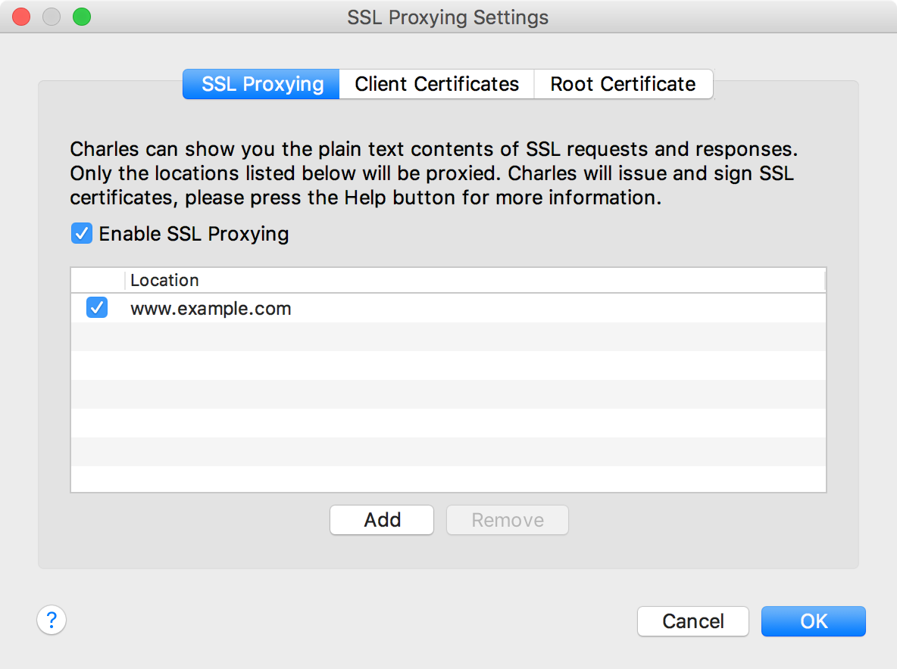
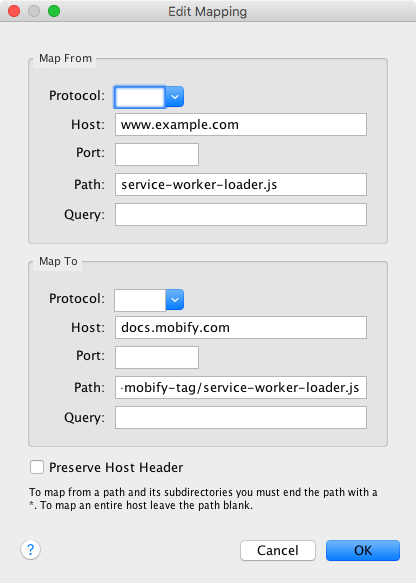

<!--
    Potential Areas for future improvement:
    * Windows!
    * Using Charles with iOS or Android
-->

The [Mobify Tag](../../getting-started/installing-the-mobify-tag) and
[Service Worker](../../getting-started/installing-the-service-worker)
are **required** to create a tag-loaded PWA with the Mobify Platform.

> In **exceptional** circumstances, it may not be possible to add the Mobify Tag
> and Service Worker before development begins.

Though the **preferred solution** is always to add the Mobify Tag and Service
Worker, complex workarounds are possible:

1) [Charles](#workaround-charles) allows the Mobify Tag and Service Worker to be
   injected

2) [Chrome Local Override](#chrome-local-override) allows **only** the Mobify Tag to be
   injected

3) [Tag Injector](#workaround-tag-injector) allows **only** the Mobify Tag to be
   injected

## Using Charles, an HTTP Proxy Application

The _preferred workaround_ for local development is to use
[Charles](https://www.charlesproxy.com/), a _paid_ Windows, Mac and Linux
application, to add the Mobify Tag and Service Worker to responses from the
website under development.

### Install Charles

* [Download](https://www.charlesproxy.com/download/latest-release/), install and
  run Charles.

### Import Rewrite Settings

* Save the [example Charles configuration](mobify-charles-config.xml) on your
  computer.

* Import it into Charles: `Tools > Import/Export Settings > Choose File >
  Import`

* Open [www.example.com](http://www.example.com) in your browser.

* View source. *The Mobify Tag is MISSING!* 😱

  

* In Charles, enable proxying for your computer: `Proxy > macOSX Proxy`

* Hard refresh, `⌘+Shift+R`, [www.example.com](http://www.example.com) and view
  source again. **The Mobify Tag is THERE!** 😎

  

> *[If you're having trouble, checkout this video](https://www.youtube.com/watch?v=JMD_X_WrNcw).*

### Configure Charles to serve HTTPS

* Open [**https**://www.example.com](https://www.example.com). *It is unsecure!* ☢️

  

* In Charles: `Help > SSL Proxying Settings > Install Charles Root Certificate`

* Add the Certificate to your Login Keychain:

  

* Open the Certificate:

  

* Trust the Certificate, you will need to enter your password:

  

* Back in your browser, refresh
  [**https**://www.example.com](https://www.example.com). **It should now be
  secure!** 🔒

  

### Configure Charles for your Website

* Copy your Mobify Tag from [cloud.mobify.com](https://cloud.mobify.com/):

  

* In Charles, configure the rewrite rule for your website: `Tools > Rewrite`

* Click the "Mobify Tag" rewrite rule to open its settings.

  

* Double click the `www.example.com` location. Change the host.

* Double click `Body` rewrite. After `<head>`, add your Mobify Tag:

  

* Click `Apply`.

* In Charles, configure the SSL Proxying Rules for your website: `Proxy > SSL Proxying Settings`

  

* Open your site, view source and confirm your Mobify Tag is present!

### Inject the Service Worker

* Open http://www.example.com/service-worker-loader.js in your browser. **The
  Service Worker is already in place!** 😀 The example Charles configuration
  automatically injects the Service Worker for the example website.

  

* To inject the Service Worker into your website, configure the map remote rules
  in Charles: `Tools > Map Remote`

  

* Double click the entry for `www.example.com/service-worker-loader.js`.

  

* Change the "Map From" host to match your site.

* Click `OK`.

* Open `/service-worker-loader.js` on your site in your browser. **You should
  see the Service Worker here too!** 🙌

## Chrome Local Override

The Local Override functionality was introduced in Chrome 65. It allows us to
modify the HTML content returned from the server. It's a simple process and
this guide will walk you through on how to install Mobify Tag locally.

- **Open Chrome 65 or above, go to your website and open Chrome Devtool**
  

- **Select Source, then select Overrides, click "Select folder for overrides"**
  *Your later changes will be stored in this folder.*

- **Create a folder on your machine and select the folder**

- **Allow the Chrome permission prompt**
  

- **Make sure the "Enable Local Overrides" check box is checked**
  

- **Select Network, choose index.html, paste the Mobify Tag immediately after the opening
`<head>`, and save it**
  

  You will see a purple dot on the file icon, that means the file is successfully overriden.

- **Refresh the page and you are good to go!**

For more information, visit [Google Developer Guide](https://developers.google.com/web/updates/2018/01/devtools#overrides).

## Tag Injector

The Tag Injector is a *development* proxy server that you can use to inject the
Mobify Tag into a website. **The Tag Injector cannot inject the Service Worker
into a site.**

### Build the Tag-Injected URL

To use it, you build a tag injector URL that embeds the target website URL. The
supported URL patterns are:

* `http://http.<hostname>.tag.mobifyproxy.com`
* `https://https.<hostname>.tag.mobifyproxy.com`

So to use the tag injector with `www.example.com` you'd build a url as follows:

`http://https.www.example.com.tag.mobifyproxy.com`

Open the above URL in Chrome and View Source <kbd>⌥⌘U</kbd>. You will see the
Mobify tag has been injected into the target website.

### Preview

The tag that is injected is does not do anything by default. In order to
activate it you need to preview using it. If you have a local development
environment serving up your code locally, you can preview against that,
otherwise you'll need to [push a bundle](#cloud-push) up to Cloud.

* Open [preview.mobify.com](https://preview.mobify.com)
* Set the *Site URL* to the [tag-injected URL](#build-url). For example:
  [http://https.www.example.com.tag.mobifyproxy.com](http://https.www.example.com.tag.mobifyproxy.com)
* Set the *Bundle Location* to be [https://localhost:8443/loader.js](https://localhost:8443/loader.js)

<b>IN THIS ARTICLE:</b>

