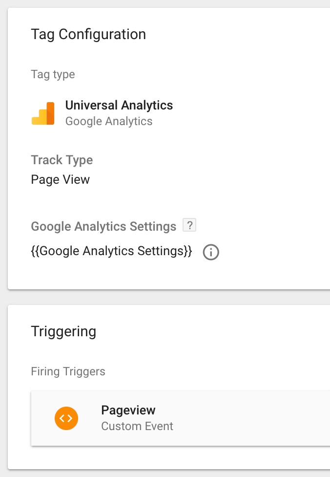

## Introduction

Wondering how analytics for Progressive Web Apps (PWAs) will differ from your traditional website analytics? This guide will explain everything that’s different about PWA analytics, so you will know what to expect. We will cover: 

1. How you can change your analytics implementation to support your PWA
2. An introduction to a new metric available for tracking called subsequent page load time

Whether you’re working on a server-side rendered or a tag-loaded PWA, this guide will help you understand how to approach analytics for your PWA.

**Changing your analytics implementation**

There are a few key areas that may require a new approach in your PWA analytics:

1. Page navigation
2. Page loading
3. Asynchronous script loading
4. Tag managers

Let's look into each area in more detail...

## Page navigation

One important aspect of a PWA is that page navigation behaves like a **single-page app**. This is fundamentally different from a traditional website. To understand this, let’s walk through a couple of diagrams.

### What’s different between PWAs and traditional websites?

Suppose you’re a website visitor browsing a **traditional website**. Here’s how you would navigate the site:

<figure class="u-text-align-center" style="background-color: #fafafa;">


</figure>

When you navigate between pages on a traditional site, there is a **browser refresh** that occurs between each page. A browser refresh achieves the following:  

1. Updates browser-specific values, such as document location
2. Clears out any scripts that got initialized
3. Initializes any scripts on the page, such as scripts that fire analytics events

Analytics scripts may trigger a pageview event automatically after being initialized, or they may use a separate script that fires once per browser refresh. 

Now, let’s imagine you’re navigating through a **single-page app**:  

<figure class="u-text-align-center" style="background-color: #fafafa;">


</figure>

Unlike the traditional website, when you navigate between pages on a single-page app, there is no browser refresh that occurs between pages. Instead, the URL and content of the page change **without triggering a browser refresh**. This is part of what helps PWAs feel so fast!

### Adapting your implementation  

As PWAs do not have a browser refresh, analytics scripts such as Google Analytics no longer know when a pageview has occurred. As a result, the PWA is now responsible for notifying all analytics scripts **when a pageview event has occurred**.

The [Mobify Analytics Manager](../../analytics) makes this process much easier. When you add an analytics script to the PWA, you will now add all your logic for loading and using the script to an analytics connector. This analytics connector is then registered with the Analytics Manager. Whenever an event occurs in the PWA, the Analytics Manager notifies all of the analytics connectors about the event occurrence.

After the page has finished loading within the PWA, the page sends a pageview event to the Analytics Manager. From there, the Analytics Manager sends this pageview event to all registered analytics connectors. In this way, the PWA is able to notify the script when a pageview occurs.  

## Page loading

### What’s different between PWAs and traditional websites

When the page has finished loading, your PWA sends a pageview event to the Analytics Manager. However, how does your PWA know that a page has finished loading? There are a few important differences between PWAs and traditional websites when it comes to determining page loading, and we’ll explain each below. 

**PageLoad and DOMContentLoaded events no longer useful**

On a traditional website, we might use events like `pageLoad` or `DOMContentLoaded` to determine whether the page has loaded. However, these events only fire once, and they fire after a browser refresh. As you know, there is **no browser refresh between pageviews** on a PWA. Because of this, `pageLoad` or `DOMContentLoaded` are no longer useful to inform us about any subsequent pageviews.  

**Page loading = when the data is available**

Instead of the traditional website’s methods, the PWA determines that a page has loaded after detecting that **all data necessary for the page is available**. When a page is being initialized, it will typically send one or more network requests to get all of the data necessary to render the page. A PWA page is considered loaded once all of these network requests have completed.

There are two important exceptions to this: images, and lazy-loaded content. By default, the PWA does not wait for all the images on the page to finish loading before sending the pageview event.

**Auto-triggers**

On single-page apps, “auto-trigger” analytics scripts will attempt to automatically determine when a page has loaded. We recommend against using these scripts. To get the most accurate pageview events, always use the pageview event built into the PWA. Below is an overview of common auto-trigger methods, and their limitations for PWAs:  

- **Trigger on document load**: this will only work on first load, and will not work for any page navigations afterward.
- **Trigger on window history change**: these scripts will be triggered as soon as the page navigation has occurred, without waiting for any of the data used within a page to load. As a result, this has two important takeaways for PWAs:
  1. The timing of your PWA’s pageview event is likely to be incorrect.
  2. If the analytics script requires any additional data about the page to be tracked, such as the product name or other properties, this data will not be available when the event is sent.

  If you trigger pageview analytics on window history change, the event is sent too early, without all the necessary information that is required in the analytics.

- **Trigger once the page is quiet**: these scripts might wait for the page to be “quiet” to determine that the page has finished loading. A quiet page means that no more changes are being made to the DOM, and that network requests are no longer being sent. However, this does not take into account lazy-loaded content, and as a result, triggering once the page is quiet may result in inaccurate pageview events.

### Adapting your implementation

On some PWA pages, you will be able to identify content that you should *exclude* from the initial load of the page. For example, this could be content that is not visible initially, such as text inside of accordions, or links at the bottom of the page. When possible, this content should be **lazy-loaded**. Lazy loading content is one of the best ways to improve the performance of your PWA. In general, your PWA **should not** wait for requests for lazy-loaded content to send the pageview event.

When it comes to auto-triggered scripts, always use the PWA’s pageview event, rather than using the auto-trigger to determine when the page has loaded.

## Asynchronous script loading

### What’s different between PWAs and traditional websites

In traditional websites, a large number of analytics scripts are loaded *synchronously*, which can negatively impact and performance of the site.

However, in the PWA environment, initial performance is critical. Analytics scripts can be large, and they can slow the initial load time of a PWA if they are loaded too early.

### Adapting your implementation

Whenever possible, analytics scripts should be loaded *asynchronously* instead of synchronously. In general, in your PWA build, it’s best to only load an analytics script synchronously if it’s absolutely necessary.  

## Tag Managers

### What’s different between PWAs and traditional websites

A Tag Manager is a convenient tool that gives users an easy way to add more scripts to their site without needing to deploy a new version of the site. The good news is that it’s possible to continue using tag managers with PWAs. However, using tag managers can impact the performance of your PWA, so it’s important to configure them correctly. 

### Adapting your implementation

When using a tag manager for a PWA, we recommend using a **new tag manager configuration**, specifically setup for your PWA. It’s best to avoid reusing the same tag manager configuration from your traditional website build, as the existing tag manager configuration may include scripts that are not necessary for your PWA. Loading these scripts unnecessarily on your PWA would decrease performance, impacting your PWA’s score on the [Time to Interactive metric](https://developers.google.com/web/tools/lighthouse/audits/time-to-interactive).

**What kinds of scripts could reduce PWA site performance?**

- Script tags that are not being used, or will never be triggered because they're in a PWA
- Script tags that are incompatible with PWAs. For example, this could be an auto-triggering script that only works accurately in the context of the traditional website
- Script tags that can break the PWA due to DOM manipulation or browser incompatibility

A typical tag manager configuration for a traditional desktop site has more than 50 tags, and each individual script can trigger more scripts to be downloaded.

### Configuring Google Tag Manager

If you want to collect pageview metrics using the Google Analytics tag in a Google Tag Manager container, you'll need to create a custom `Pageview` event so that the collected metrics are as accurate as possible. (If you do not use a custom `Pageview` event, the event will be triggered *before* the PWA has finished rendering the page, missing out on important page-related metrics.)

1. Create a custom event trigger for `Pageview` within **Trigger Configuration**:

<figure class="u-text-align-center" style="background-color: #fafafa;">


</figure>

<div class="c-callout">
  <p>
    <strong>Note:</strong> Do not use the history change trigger type. This trigger type listens for a browser’s history change in order to send a pageview event. This leaves no time for other page-related metrics, such as page title, to be set before sending a pageview event.
  </p>
</div>

2. Use your custom-created trigger to trigger your `Pageview` tag, within **Tag Configuration**:

<figure class="u-text-align-center" style="background-color: #fafafa;">



</figure>

### Best practices to avoid session splitting

Because your PWA behaves like a single-page app, you can’t track page views as you did for a desktop site. Otherwise, you may encounter a problem called session-splitting: when a user produces multiple sessions, when they're supposed to be counted as a single session. To avoid session-splitting, follow this best practice for single-page apps:

- Add a new field called `page` and update its value on every soft navigation.
- Keep the value of `location` field the same throughout all navigations.

These steps need to be implemented for all events sent to Google Analytics, not just pageview events. If any events have the `page` or `location` fields set incorrectly, you may encounter session-splitting. More details can be found on Google Analytics' [Single Page Application Tracking guide](https://developers.google.com/analytics/devguides/collection/analyticsjs/single-page-applications).

The steps to avoid session splitting in Google Tag Manager depends on your specific configuration. To get an idea, take a look at the following articles:

- [simoahava.com](https://www.simoahava.com/gtm-tips/fix-rogue-referral-problem-single-page-sites/)
- [thyngster.com](https://www.thyngster.com/tips-to-track-an-ajax-based-website-using-gtm-and-universal-analytics/)

However you choose to implement, please make sure that you apply your changes to all Google Analytics-related tags, so that all of your pageview and non-pageview events have these changes.

If you need to detect whether a user is browsing the PWA or the desktop site, you can use this JavaScript snippet:

```js
if (window.Progressive && window.Progressive.isPWA()) {
   // you're on PWA
} else {
   // you're on desktop
}

```

## Subsequent page load time  

PWAs introduce a new metric that you can track, called **subsequent page load time**.

Because a browser refresh does _not_ occur between page navigations in your PWA, subsequent page load times can be significantly faster than a traditional website. Tracking these subsequent page load times can help you evaluate how long it takes users to complete important tasks using your PWA. For example, you can track how long it takes a visitor to add an item to their cart, or how long it takes to checkout and complete a purchase. 

By tracking subsequent page load time, you can also identify areas where the PWA performance could see further improvement. For example, if you see that the subsequent page load time for a product detail page is higher than average, it may indicate that one of the network requests for that page is slower than average. With this information, you can investigate this network request and improve its performance.

## Next steps

Now that you’ve completed this guide, we hope you’re aware of the key differences between your PWA and your traditional website when it comes to analytics. You will be able to anticipate the areas of your analytics implementation that will need to change to support PWAs, plus a new metric that will bring value to your PWA analytics.

Keen to continue learning about PWA analytics? As a next step, we recommend brushing up on our [Analytics Manager documentation](../../analytics).

<div id="toc"><p class="u-text-size-smaller u-margin-start u-margin-bottom"><b>IN THIS ARTICLE:</b></p></div>
