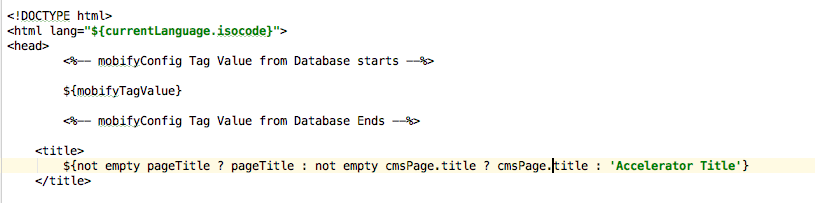
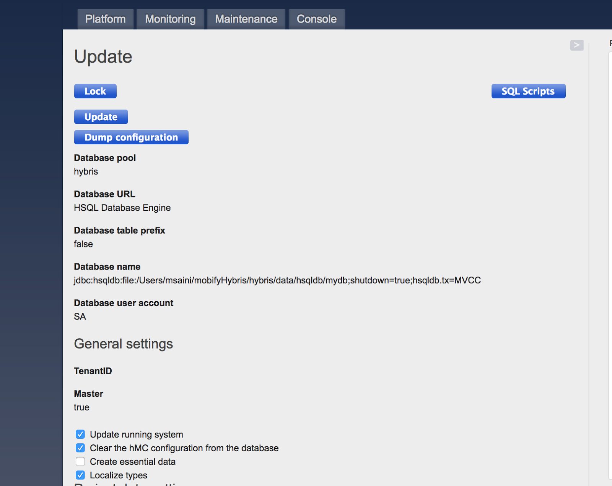
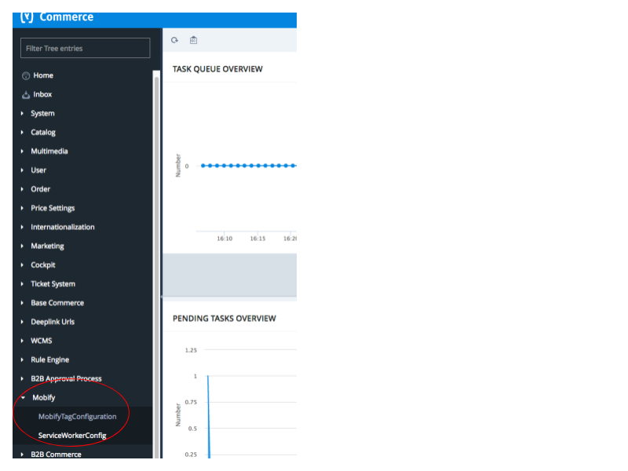
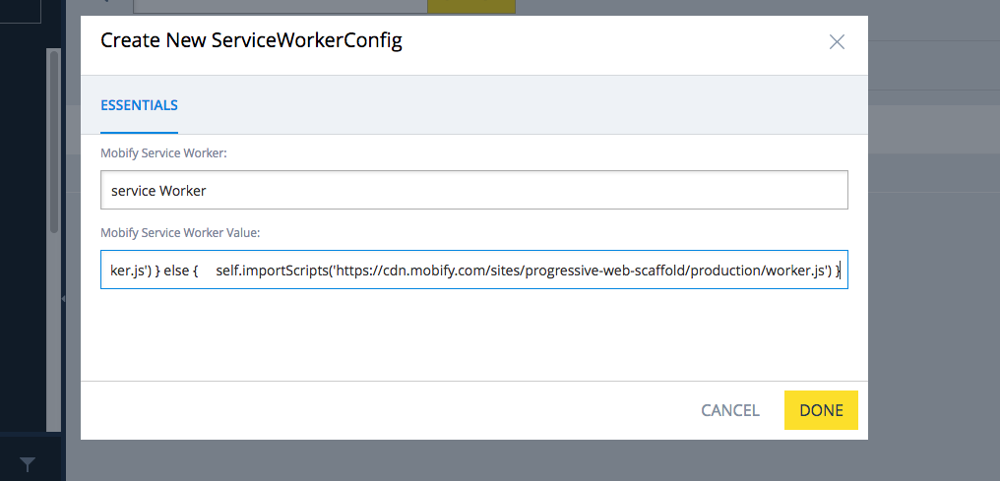

<div class="c-callout c--important">
  <p>
    <strong>Important:</strong> Projects generated <em>after</em> 2019 do not use the Integration Manager because it has been replaced with our <a href="../../integrations/commerce-integrations/">Commerce Integrations</a> technology.
  </p>

  <p>
     For anyone working on projects that were generated <em>before</em> 2019, we've left the Integration Manager documentation here in case you still need to refer to it.
  </p>
</div>

## Introduction

The Integration Manager provides an abstraction layer between your progressive
web app and the source of its ecommerce data. This data can come from a
dedicated ecommerce platform, a desktop website, or a custom API.

To give you a head start on building your app, we've included ready-made
connectors that already know how to fetch and update data using popular
ecommerce platforms. We also make it easy to create your own custom connector
for any data source.

The Integration Manager handles fetching and updating ecommerce data in a
standard way without forming any dependencies on any particular ecommerce
platform. This gives you the flexibility to connect your app to a new platform
in the future without making extensive changes to your code.

## How does it work?

The Integration Manager introduces a small "detour" into the standard data flow
for Redux actions. It all starts when a React component in your application
dispatches a Redux action that is local to the component. After handling
user-interface tasks like starting a spinner or opening a modal, the action can
dispatch an Integration Manager command. (Integration Manager commands are also
Redux actions.) The Integration Manager delegates the execution of the command
to the currently configured connector. The connector executes the command in a
way that is compatible with the ecommerce data source that it is built for. That
means that the same command will be interpreted differently by different
connectors. When the command has completed, it dispatches another type of Redux
action called a result action. The data returned by the result is merged into
the Redux store by reducers that are provided by the Integration Manager. At
this point, the standard data flow for Redux actions resumes, and the
application's components are notified about any changes to the Redux store that
may require them to re-render.

The diagram below shows how the Integration Manager fits into the architecture
of your progressive web application.

[](https://docs.mobify.com/progressive-web/assets/images/mobify-backend-analyticsmanager_complexdiagram_june2017_1085.png)

<figcaption>
  <small>(Click the image for a larger version.)</small>
</figcaption>

## Dispatching commands

When using the Integration Manager in front end code (UI, components, etc.) you
dispatch operations by importing the appropriate command and then dispatching
it. There are often UI-level behaviors that need to be managed as part of
dispatching the core action and so a common pattern when using the Integration
Manager is to create an "event handler" action to connect to the UI and then
dispatching the appropriate Integration Manager command from within that. This
pattern allows the UI to present a spinner for the duration of the Integration
Manager command, for example. The Integration Manager commands never modify the
UI directly (or through UI-related actions) and so that must be handled in the
event handler actions which are themselves Redux thunk actions.

<div class="c-callout">
  <p>
    <strong>What's a thunk action?</strong> A thunk action is a function is dispatched as an action by the <a href="https://github.com/reduxjs/redux-thunk">Redux Thunk</a> middleware. The middleware provides two parameters
to the thunk: the <code>dispatch</code> function from Redux for dispatching other actions and a
<code>getState</code> function that returns a reference to the Redux state object. Thunks
are not pure functions because they perform the side effects of dispatching actions and/or making network requests.
  </p>
</div>

Dispatching a command is only half of the equation though. Once the command is
dispatched you'll want to be notified when the command completes. Integration
Manager commands always return a
[Promise](https://developer.mozilla.org/en/docs/Web/JavaScript/Reference/Global_Objects/Promise)
which can be used to execute some behaviour when the command completes. This
also provides a mechanism for handling error states that the Integration Manager
and configured connector may encounter (network errors, server errors, etc). A
complete example below shows how the UI would connect to an event handler
action, dispatch a command to do the "real work", and then clean up when the
command completes.

```js
// product-details/index.jsx
import {submitCartForm} from './actions'

class ProductDetails({
    title,
    image,
    price
}) => (
    <form onSubmit={handleSubmit(submitCartForm)}>
        ... render title, image, price...
    </form>
)

mapStateToProps = createStructuredSelector({
    title: getSelectedProductTitle,
    image: getSelectedProductImage,
    price: getSelectedProductPrice
})

mapDispatchToProps = {
    submitCartForm
}

export default connect(
    mapStateToProps,
    mapDispatchToProps
)(ProductDetails)

// product-details/actions.js
import {addNotification} from 'progressive-web-sdk/dist/store/notifications/actions'
import IntegrationManager from 'mobify-integration-manager/dist/'
import {showSpinner, hideSpinner} from '../app/actions'
import {PRODUCT_DETAILS_ITEM_ADDED_MODAL} from './constants'

// A thunk action
export const submitCartForm = (formValues) => (dispatch) => {
    const productId = formValues.product_id
    const quantity = formValues.quantity

    dispatch(showSpinner())
    dispatch(IntegrationManager.cart.addToCart(productId, quantity))
        .then(() => {
            dispatch(openModal(PRODUCT_DETAILS_ITEM_ADDED_MODAL))
        })
        .catch((error) => {
            dispatch(addNotification({
                content: 'We couldn\'t add this item to your cart',
                id: 'add-to-cart-error',
                showRemoveButton: true)
            })
        })
        .finally(() => {
            dispatch(hideSpinner())
        })
}
```

There is a lot going on in that last thunk action. Let's walk through what's
going on. At the top we have a typical JSX component. This component displays
product details. Within that component we have an Add to Cart form that is bound
to the `submitCartForm` action.

The `submitCartForm` action is where things get interesting. The action takes a
set of `formValues` that are managed by [Redux Form](https://redux-form.com).
The method extracts the `productId` and `quantity` and then starts dispatching
actions. First it shows the spinner so that the user knows that work is in
progress. Then it dispatches the `addToCart` command which is an Integration
Manager command. This command is implemented by the currently configured
connector and calls out to whatever service the connector is built for (eg.
Salesforce Commerce Cloud, Magento, etc).

The `addToCart` command returns a Promise so we can chain on the end of it. If
it completes successfully we show a modal (`dispatch(openModal...)`). In the
event of an error, the `.catch()` block will be executed and we show a
notification (`dispatch(addNotification(...))`).

We want to make sure that we don't leave the spinner showing regardless of the
result of the command so we use a `.finally()` block to hide the spinner
(`dispatch(hideSpinner())`).

## Integration guides

<div class="content-accordion u-margin-top">
<h3 class="u-text-medium">Integrating Salesforce Commerce Cloud</h3>
<div>

Mobify provides an Salesforce Commerce Cloud (SFCC) **cartridge** and **connector** that simplifies integration:

* The **cartridge** installs the Mobify Tag and Mobify Serivce worker.
* The **connector** uses the Open Commerce API (OCAPI) to communicate with SFCC.

Before following these instructions you should:

* Complete the [Quick Start](../../getting-started/quick-start/) guide.
* Have admin access to a working SFCC site.

To complete integration with SFCC you must:

1. Install the cartridge
2. Create an OCAPI client
3. Update OCAPI settings
4. Set up the connector in your project

### Install the cartridge

_The cartridge adds the [Mobify Tag](../../getting-started/installing-the-mobify-tag/) and [Mobify Service Worker](../../getting-started/installing-the-service-worker/) to your SFCC site._

Download the cartridge from the [LINK Marketplace](http://www.demandware.com/link-marketplace/mobify). Follow the installation instructions included with it.

> You must login with your SFCC account to view and download the cartridge!

Once you've installed it, verify the [Mobify Tag](../../getting-started/installing-the-mobify-tag/) and [service worker](../../getting-started/installing-the-service-worker/) are present on your site.

### Create an OCAPI client 

_The client allows the connector to communicate with SFCC using OCAPI._

[Create a new OCAPI client](https://documentation.demandware.com/DOC1/topic/com.demandware.dochelp/AccountManager/AccountManagerAddAPIClientID.html). _Note its client ID. It is need to configure OCAPI settings and the connector._

### Update OCAPI settings

<!-- TODO: Move OCAPI settings to the `platform-scaffold` repo to better track changes. -->

_Settings control which OCAPI resources can be used by the connector._

1. Login to the SFCC Business Manager.
2. Select _Administration > Site Development > Open Commerce API Settings_.
3. Select _Shop_ and the relevant Site ID. _Record the Site ID. It is needed to set up the connector!_
4. Open the [settings](mobify-ocapi-settings.json) in an editor. Update the `client_id`.
4. Copy the contents of your settings into the field and _Save_.

> If you are using extensions with the connector, you may need additional settings.

### Set up the connector

_Configuring the connector tells it how to talk to your SFCC site._

In the Web SDK, the connector is configured and registered with Integration Manager in `web/app/init-sfcc-connector.js`.
Update it with your `siteID` and `clientID` from earlier.

Open `web/app/main.jsx` and remove the other connectors. Import the one we set up:

```diff
- import initConnector from './init-merlins-connector'
- import initConnector from './init-stub-connector'
+ import initConnector from './init-sfcc-connector'

initConnector()
```

**You're done! Great job! 🙌**

Your PWA should now be integrated with SFCC.

### Verifying it worked

_To verify, load the PWA and confirm it gets data from SFCC_.

1. Start the development server by running `npm start` in the `web` folder.
1. Open a web browser and activate mobile emulation.
2. Copy Preview URL from your console and open it in your web browser.
3. Ensure the Site URL is set to your SFCC site's homepage over HTTPS.
3. Hit Preview!

If everything worked correctly, you should see the PWA load your site:

<!--
To create this screenshot:

* Create a new project: https://docs.mobify.com/progressive-web/latest/getting-started/quick-start/
* Configure the SFCC connector.
* Use SFCC Merlin's for the Site URL: https://mobify-tech-prtnr-na03-dw.demandware.net/on/demandware.store/Sites-2017refresh-Site/default/Home-Show
-->


### Troubleshooting

**`npm start` doesn't work!**
* Check your JavaScript for syntax errors.
* Check your are running the command from inside the `web` folder of your project.
* Check that your packages are up to date by running `npm install` from the root of your project.

**After previewing, the PWA doesn't load!**
* [Check for HTTPS errors](../../getting-started/quick-start/#avoiding-https-errors-in-local-development).
* Verify the Mobify Tag is present on the page
* Open DevTools and confirm requests to SFCC are succeeding.

### Authentication/JWT 

We use JSON Web Tokens (JWT) for authentication with Salesforce Commerce Cloud.
The details of how JWT authentication works in SFCC are documented in the
[Salesforce documentation](https://documentation.b2c.commercecloud.salesforce.com/DOC1/topic/com.demandware.dochelp/OCAPI/19.3/usage/JWT.html?resultof=%22%6a%77%74%22%20).

The Connector for SFCC automatically manages requesting a JWT token when a
sessions starts and then submits and renews the token as needed.

_Authentication using JWT does not work correctly in Safari for sites that require [Basic HTTP authentication](https://developer.mozilla.org/en-US/docs/Web/HTTP/Authentication). Safari uses the Basic authentication header instead of the JSON Web Token, which causes requests to the API to fail. To fix this issue, disable basic HTTP authentication for the site._

### Utility Functions 

There are a number of utility functions that you may find useful if you need to
extend the Connector for SFCC. They simplify
interacting with SFCC OC APIs by taking care of things like authentication
tokens (JWT) and cart management automatically.

_If you are extending the Connector for SFCC we strongly recommend
using these functions instead of implementing similar functionality from
scratch._

The functions are organized into a set of broad categories below.

### Authentication 

#### `getAuthToken(): string`

Retrieves the [auth token](#authentication-jwt) from browser storage.

_You almost never need to use this function directly because the
[Request Functions](#functions-request) manage the authorization token
automatically._

#### `storeAuthToken(authToken: string)`

Stores the [auth token](#authentication-jwt) to browser storage. This function
stores the auth token using the best available method (currently it tries
session storage first and falls back to using a cookie).

_You almost never need to use this function directly because the
[Request Functions](#functions-request) manage the authorization token
automatically._

#### `deleteAuthToken()`

Deletes the [auth token](#authentication-jwt) from browser storage.

_You almost never need to use this function directly because the
[Request Functions](#functions-request) manage the authorization token
automatically._

#### `getAuthTokenPayload(authToken: string): object`

Returns an object built using the given serialized [auth
token](#authentication-jwt). The SFCC documentation provided in the
[Authentication/JWT](#authentication-jwt) section details the various pieces of
data that the auth token contains.

#### `getCustomerData()`

Returns the customer data portion of the currently-stored authorization token.
SFCC packs some extra customer data into the authorization token (such as a
Customer ID) and this function returns that data unchanged.

*SFCC documentation does not specify what this object contains in all scenarios.
The best way to discover what it contains is to call this function after setting
up a session and authenticating and then execute
`console.log(getCustomerData())` and inspect it in the Javascript console.*

#### `isUserLoggedIn(authorization) -> boolean`

Returns `true` if the given `authToken` represents a logged in user, `false`
otherwise.

#### `initSfccSession(authToken: string): Promise<Array<string>>`

Initializes an SFCC session using the provided `authToken`. This function
returns a Promise that resolves to an array of headers to use in subsequent API
requests (session headers).

#### `initSfccAuthAndSession()`

Initializes an SFCC session and authorization token (re-using an existing
authorization token if a valid one was previously created). This function will
also refresh a saved authorization token if it has expired.

### Requests 

#### `makeApiRequest(path: string, options: object): Promise<object>`

Executes an API request to the specified `path` and returns `Promise` that
resolves with the server's results. The resolved object is the `Response` object
returned by the `fetch` API and is documented
[here](https://developer.mozilla.org/en-US/docs/Web/API/WindowOrWorkerGlobalScope/fetch).

*Note that this method only takes a `path` instead of a full URL because the
connector manages building the full URL based on the configured **Site ID**.*

#### `makeApiJsonRequest(path: string, body: object, options: object): Promise<object>`

Makes a request to the SFCC API and serializing the `body` as JSON and
deserializing the result from JSON. This function delegates to `makeApiRequest`
and then deserializes the response as JSON.

#### `checkForResponseFault(responseJSON: string): string`

Checks the given response JSON object and throws if it contains a `fault`
(error). If the response does not contain a fault, the response is returned
unchanged. This is useful for using this method in a Promise chain without any
extra work when the response is not a fault.

For example:

```javascript
// Returns a Promise that resolves with current cart data, or throws if an error occurs
return makeApiJsonRequest('/cart', {}, {method: 'GET'})
    .then(checkForResponseFault)
    .then((cart) => {
        // update cart in the UI
    })
```

#### `makeUnAuthenticatedApiRequest(path: string, options: object): Promise<object>`

Exactly the same as `makeApiRequest` but explicitly _doesn't_ set any
authorization headers. This is useful if you need to make an API call outside of
the current session/user.

### Basket/Cart Management 

#### `deleteBasketID()`

Deletes the currently-saved basket ID from browser storage.

#### `getBasketID(): string`

Retrieves the currently-saved basket ID from browser storage

#### `storeBaskedID(basketID: string)`

Stores the given basket ID to browser storage

#### `createBasket(basketContents: object)`

Creates a new basket on the SFCC server with the given contents. This function
will take care of using an existing Basket ID, if one has been previously
created and saved, or create a new one, if needed.

#### `createNewBasket() => (dispatch)`

[Thunk Action] Deletes and creates a new basket carrying over existing cart
contents to the newly created basket.

#### `fetchCartItemImages() => (dispatch)`

[Thunk Action] Fetches product images for items that are in the cart and don't
already have them.

#### `requestCartData(noRetry: boolean): Promise<object>`

Fetches cart data from SFCC for the current cart. When `noRetry` is set to
`false` the process will retry if the server returns an `HTTP 404 Not Found`
error.

#### `handleCartData(basket: object): Promise`

Processes the provided cart data and dispatches it to the Redux store. This will
also dispatch `fetchCartItemImages` at the end to ensure that all items in the
cart have an associated image. The returned Promise resolves when all work is
completed. The resolved value is undefined.

#### `isCartExpired(basket: object): boolean`

Checks if the given cart contents contains a fault that signals an expired cart.
Returns `true` if the given cart (basket) is expired, `false` otherwise.

#### `updateExpiredCart(basket: object)`

Check if the users cart has expired, if it has create a new one and throw an
error otherwise return the cart object

### Terminology 

* OCAPI - the **O**pen **C**ommerce **API** provides access to most SFCC
  resources through a
  [REST](https://en.wikipedia.org/wiki/Representational_state_transfer) API. The
  OCAPI is divided into different APIs:
    * Shop API - allows a client to interact with the system as a shop customer
      or as an agent shopping on behalf of a customer.
    * Data API - gives create/read/update/delete access to system resources.
* JWT - JSON Web Token - an authentication mechanism required by several Shop
  API resources. You can find out more about the SFCC usage of JWT
  [above](#authentication-jwt) and at the [JWT homepage](https://jwt.io/).
* Basket/Cart - Typically known as "cart" in the e-commerce industry, most of
  the SFCC documentation and OCAPI refer to the cart as "Basket". The terms are
  interchangable in this document. Typically when you see "basket" it is due to
  influence from the SFCC OCAPI.

</div>
<h3 class="u-text-medium">Integrating SAP Hybris Commerce</h3>
<div>

Mobify provides a set of **Mobify Extensions** for SAP Hybris Commerce Suite to simplify integration:

* The **Mobify Tag Extension** installs the Mobify Tag and Mobify Service Worker to your Hybris Storefront, this extension includes the following Hybris addons:
- mobifystorefrontaddon
- mobifyconfigbackoffice
- mobifyconfig
* The **Mobify Webservice Extension** modifies the Hybris Webservice to allow guest users to change their email address as well as support storing customer's phone and company information
- mobifywebservices

Before following these instructions you should:

* Have a running instance of SAP Hybris Commerce Suite with version **6.4** or higher
* Complete the [Quick Start](../../getting-started/quick-start/) guide.
* Have admin access to Hybris Backoffice

To complete integration with Hybris you must:

1. Install the Mobify extensions
2. Install the Mobify tag and service worker
3. Create an OAuth client
4. Set up the connector in your project

### Install the Mobify Extensions

_The Mobify Extension is availiable here: [Mobify Extension](https://s3.amazonaws.com/downloads.mobify.com/hybris-extension/MobifyExtension.zip)_

1. Download and unzip the file to your Hybris file system: `/hybris/bin/custom/<project_name>`

2. In `/hybris/bin/custom/<project_name>`, you will find four Mobify extension folders:
- mobifystorefrontaddon
- mobifyconfigbackoffice
- mobifyconfig
- mobifywebservices

3. Add the following lines to `localextensions.xml`:

```xml
  <!--Mobify Extensions-->
  <extension name='mobifystorefrontaddon'/>
  <extension name='mobifyconfig'/>
  <extension name='mobifyconfigbackoffice'/>
  <extension name="oauth2" />
  <extension name="addonsupport" />
  <extension name="yoccaddon" />
  <extension name="mobifywebservices" />
```
4. Go to command prompt and execute the following command from your Hybris platform folder (`/hybris/bin/platform`) :

```sh
  ant mobifyConfigTarget
```

This command will copy the contents of `master.tag` file from `mobifystorefrontaddon` to `master.tag` file in `/hybris/bin/ext-template/yacceleratorstorefront/web/webroot/WEB-INF/tags/responsive/template/master.tag`

If there has already been some custom modifications in `master.tag` of your project, then before running this command, please remove following code from the `buildcallbacks.xml` file in `mobifystorefrontaddon` extension and run “ant all” from command prompt.

```xml
<copy file="${ext.mobifystorefrontaddon.path}/acceleratoraddon/web/webroot/WEB-INF/tags/responsive/template/master.tag" todir="${ext.custom-storefront-name.path}/web/webroot/WEB-INF/tags/responsive/template" overwrite="true"/>
```

Removing the above xml code will prevent your master tag being overwritten, you need to manually add Mobify tag to your `master.tag`. Add the following code after <head> tag in your custom `master.tag` file.

```html
<%-- mobifyConfig Tag Value from Database starts --%>

${mobifyTagValue}

<%-- mobifyConfig Tag Value from Database Ends --%>
```

The `master.tag` should look like this:



5. Run `ant clean all`  in your command prompt. There should not be any build errors.
6. After building your code, start the server by executing the following command on command prompt
- Unix `./hybrisserver.sh`
- Windows `hybrisserver.bat`
7. After starting the server, go to HAC and under **platform > update**, please select the following options and click on update. Executing this will help in reflecting the changes in backoffice.



### Install the Mobify tag and service worker

1. After successfully installing the Mobify extensions, go to Hybris Backoffice, on the left side panel, you will be able to see Mobify extension options



Under Mobify, you will see two options:
  - MobifyTagConfiguration : Used to add/modify Mobify tag script which will be visible at all pages.
  - ServiceWorkerConfig : Used to add/modify Mobify Service Worker Loader javascript.

2. Add/Modify MobifyTagConfiguration and ServiceWorkerConfig, please select `+` to add new property and enter your Mobify tag



To reformat the scripts, format the values in **Essential > Mobify Service Worker Value** and save the changes


After saving the changes, verify the service worker is in place by going to `https://domain-name/service-worker-loader.js`

#### Create an OAUTH 2.0 client 

_The client allows the connector to communicate with Hybris using OCC API._

[Create a new OAUTH client](https://help.hybris.com/6.4.0/hcd/627c92db29ce4fce8b01ffbe478a8b3b.html). _Note its client ID and client secret. It is need to configure the connector._

This connector uses two types of OAuth 2.0 tokens, one for anonymous users and
one for customers. The configuration of these tokens can be found in
`init-hybris-connector.js`

```json
auth: {
    anonymous: {
        clientId: 'client-side',
        clientSecret: 'secret'
    },
    customer: {
        clientId: 'mobile',
        clientSecret: 'secret'
    }
}
```

You can either configure the tokens in the HAC or the backoffice.
1. To configure these tokens in the HAC, import the following IMPEX:

```impex
INSERT_UPDATE OAuthClientDetails;clientId[unique=true] ;resourceIds ;scope ;authorizedGrantTypes ;authorities ;clientSecret ;registeredRedirectUri
;client-side ;hybris ;basic ;implicit,client_credentials ;ROLE_CLIENT ;secret ;http://localhost:9001/authorizationserver/oauth2_implicit_callback;
;mobile ;hybris ;basic ;authorization_code,refresh_token,password,client_credentials ;ROLE_CLIENT ;secret ;http://localhost:9001/authorizationserver/oauth2_callback;
```

2. Or you can configure your tokens in backoffice, login to the backoffice, and select **Systen > OAuth > OAuth Clients**, add a new client with the following information:

```json
  OAuth client ID: your_client_id (no space allowed)
  OAuth client secret: your_secret
  Authorities: ROLE_CLIENT
  Client Grant Types: refresh_token, password, authorization_code, client_credentials
```


Once the OAuth client is created, refresh the page and make sure the disabled flag of the client is set to false.

### Set up the connector

_Configuring the connector tells it how to talk to your Hybris site._

In the Web SDK, the connector is configured and registered with the Integration Manager in `web/app/init-hybris-connector.js`.
Update it with your Hybris configurations.

Open `web/app/main.jsx` and remove the other connectors. Import the one we set up:

```diff
- import initConnector from './init-merlins-connector'
- import initConnector from './init-sfcc-connector'
- import initConnector from './init-stub-connector'
+ import initConnector from './init-hybris-connector'

initConnector()
```

**You're done! Great job! 🙌**

Your PWA should now be integrated with Hybris.

### Verifying it worked

_To verify, load the PWA and confirm it gets data from Hybris_.

1. Start the development server by running `npm start` in the `web` folder.
1. Open a web browser and activate mobile emulation.
2. Copy Preview URL from your console and open it in your web browser.
3. Ensure the Site URL is set to your Hybris site's homepage over HTTPS.
3. Hit Preview!

### Troubleshooting

**`npm start` doesn't work!**
* Check your JavaScript for syntax errors.
* Check that you're running the command from inside the `/web` folder of your project.
* Check that your packages are up to date by running `npm install` from the `/web` folder of your project.

**After previewing, the PWA doesn't load!**
* [Check for HTTPS errors](../../getting-started/quick-start/#avoiding-https-errors-in-local-development).
* Verify the Mobify Tag is present on the page
* Open Dev Tools and confirm requests to Hybris are succeeding.
* Open Dev Tools and check for errors logged to the JavaScript console.

### Authentication/JWT 

We use JSON Web Tokens (JWT) for authentication with Hybris OCC API.
The details of how JWT authentication works in Hybris are documented in
[this](https://help.hybris.com/6.4.0/hcd/8c181d168669101480a1864a1e8fceb3.html)
document.

The Connector for Hybris automatically manages requesting a JWT token when a
sessions starts and then submits and renews the token as needed.

### Utility Functions 

There are a number of utility functions that you may find useful if you need to extend the Connector for Hybris. They simplify
interacting with Hybris OCC APIs by taking care of things like authentication
tokens (JWT) and cart management automatically.

_If you are extending the Connector for Hybris we strongly recommend
using these functions instead of implementing similar functionality from
scratch._

The functions are organized into a set of broad categories below.

### Authentication 

#### `getAuthToken(): string`

Retrieves the [auth token](#authentication-jwt) from browser storage.

_You almost never need to use this function directly because the
[Request Functions](#functions-request) manage the authorization token
automatically._

#### `storeAuthToken(authToken: string)`

Stores the [auth token](#authentication-jwt) to browser storage. This function
stores the auth token using the best available method (currently it tries
session storage first and falls back to using a cookie).

_You almost never need to use this function directly because the
[Request Functions](#functions-request) manage the authorization token
automatically._

#### `deleteAuthToken()`

Deletes the [auth token](#authentication-jwt) from browser storage.

_You almost never need to use this function directly because the
[Request Functions](#functions-request) manage the authorization token
automatically._

#### `isUserLoggedIn(authorization) -> boolean`

Returns `true` if the given `authToken` represents a logged in user, `false`
otherwise.

### Requests 

#### `makeApiRequest(path: string, options: object, body: object, logoutOnUnathorised: boolean): Promise<object>`

Executes an API request to the specified `path` and returns `Promise` that
resolves with the server's results. The resolved object is the `Response` object
returned by the `fetch` API and is documented
[here](https://developer.mozilla.org/en-US/docs/Web/API/WindowOrWorkerGlobalScope/fetch).

*Note that this method only takes a `path` instead of a full URL because the
connector manages building the full URL based on the configured **Base Site ID**.*

#### `makeUnAuthenticatedApiRequest(path: string, options: object): Promise<object>`

Exactly the same as `makeApiRequest` but explicitly _doesn't_ set any
authorization headers. This is useful if you need to make an API call outside of
the current session/user.

### Cart Management 

#### `deleteCartID()`

Deletes the currently-saved cart ID from browser storage.

#### `getCartID(): string`

Retrieves the currently-saved cart ID from browser storage

#### `storeCartID(cartID: string)`

Stores the given cart ID to browser storage

#### `fetchCart(): Promise<object>`

Fetches cart data from Hybris OCC API for the current cart. If there is no existing cart,
it will create a new cart.

#### `handleCartData(cart: object): Promise<object>`

Parse and store the cart data to the Redux store.

#### `getCart(): Promise<object>`

This is a combination of `fetchCart` and `handleCartData`, it fetchs the cart from Hybris OCC API and processes the provided cart data and dispatches it to the Redux store. The resolved value is the cart data.

### Terminology 

* Backoffice - Product manangement application of Hybris
* Hybris - SAP Hybris Commerce Suite
* HAC - Hybris Administration Console, offers functionality for administration, monitoring, and configuration of SAP Hybris Commerce.
* OCC - Omni Commerce Connect, next-generation commerce API that offers a broad set of commerce and data services which enable you to use and leverage the complete SAP Hybris Commerce functionality

</div>
<h3 class="u-text-medium">Integrating Any Ecommerce Platform</h3>
<div>

The Integration Manager provides an interface that allows you to plug in a
connector to integrate with your ecommerce platform. If the platform that you
use is not supported, you will need to build a custom connector.

Building a connector for your ecommerce
platform requires that all commands exposed
by the Integration Manager be implemented.

### Setup

In your generated project you will find a "stub" connector that implements all
of the commands used with the Integration Manager. Most of these commands are
empty and merely print a record of their call to the console, but some dispatch
minimal example data into the store, so that your project has minimal
functionality while the connector is being implemented.

To get started, make a copy of the stub connector and name it after the platform
you are integrating using the following shell command:

```sh
cp -R \
    web/app/integration-manager/_stub-connector \
    web/app/integration-manager/_custom-connector
```

Next switch the app to use the connector by modifying `web/app/main.jsx` to
import the new custom connector. You can remove all lines relating to other
connectors. Add the following:

```javascript
import {Connector} from './integration-manager/_custom-connector'
import IntegrationManager from 'mobify-integration-manager/dist'

IntegrationManager.initialize(
    Connector(/* Any configuration your new connector requires */),
    { /* connector extension */ }
)
```

**Note**: The `initialize()` method can take a second parameter which is the
connector extension. Typically you would not need this unless you need to add
custom commands. You should only use overrides if you are starting with an
existing connector

Now you can run `npm start` and the project will be using the new custom
connector.

Inside the stub connector, there are a number of `commands.js` files, each of
which implements Integration Manager commands for a particular portion of the
app, such as product details or the shopping cart. Each command is implemented
with the relevant parameters already passed in from the front end; these are
documented in greater detail in the corresponding `commands.js` files in Integration
Manager source and related documentation. To view this documentation, run the
following command in the `web/` directory of the project:

```sh
open node_modules/progressive-web-sdk/src/integration-manager/docs/index.html
```

If additional information is needed from the Redux state, just replace
`(dispatch)` in the thunk definition with `(dispatch, getState)` and
call the `getState` parameter function to get the current state.

The implementation of each function can fetch or update the data using
whatever method and libraries it needs (browser fetch API, jQuery,
etc.). The connector may then dispatch one, or more, result actions
(provided by the Integration Manager API) and pass the data to the
result action. It must return a `Promise`, which will resolve on
success and reject on failure. If using the `fetch` API, either
directly or through one of the SDK helper functions, the fetch call
will return a `Promise` suitable for this. If no asynchronous work is
done in your implementation, just return `Promise.resolve()` or
`Promise.reject()`. The `Promise` resolution should generally only be
used to signal success or failure to the caller, and not pass data out
of the command to the front end. There are a few cases where the
connector passes a redirect URL to the UI as a resolution value, which
are clearly marked in both the stub connector and Integration Manager
source.

Instead, we transmit data to the front end by
dispatching results actions. These results are just normal
Redux actions, but they are type-checked during development. If the
data passed to a result does not match the structure and type expected
by the Integration Manager, a warning will be printed in the
console. This ensures that the data merged back into the Redux store
is consistent and matches the selectors that depend on it. In most
cases the data dispatched in the result gets merged into the Redux
store unchanged.

Results are contained within the Integration Manager source, in
`results.js` files. In general, the results needed for the commands in
each section of the app are included in the corresponding directory,
so we have product-related results in `products/results.js` and
cart-related results in `cart/results.js`, etc.

The stub connector contains several examples of the results that are
necessary for the app to function. Not all actions need to dispatch a
result, but generally there will be some information that needs to be
updated in the store. The page initialization actions, however, do
need to dispatch a result into the store, so that the page is marked
as loaded for the UI to display.

### Communicating with the backend

There are three main ways to communicate with your ecommerce backend:
* using APIs
* using HTML and form endpoints
* running scripts

### Using APIs

Whenever possible, use APIs. As APIs do not change frequently, they are less prone to breakage when compared to form endpoints. Using an API is much simpler than fetching and parsing HTML. Work with the customer to get the documentation for their APIs (or if you control the backend, create them yourself).

If there are no APIs available for getting/persisting the data you need, you will need to leverage form endpoints.

### Using HTML and form endpoints

APIs won't always be available for each feature you build. The next route you should take for communicating with your ecommerce backend is to get data by parsing HTML and persist data by posting to form endpoints.

#### Getting data by fetching and parsing HTML

In the absence of formal APIs for retrieving data, we can send a GET request to fetch HTML. We can parse that HTML to get the data we need for the PWA.

The stub connector contains the utility `fetchPageData` to handle fetching HTML. If you have based your custom connector off of the stub connector, the following example demonstrates how you can use this utility.

```js
// in web/app/connectors/_custom-connector/cart/commands
import {fetchPageData} from '../../app/index'

export const getCart = () => (dispatch) => {
    dispatch(fetchPageData(cartURL))
        .then(([$, $response]) => {
            // parse your cart data here
            // $ is jQuery
            // $response is a jQuery wrapped
            // copy of the DOM of the requested page
        })
}
```

See the [How to Use Web Scraping](../../guides/web-scraping/) guide for more details about parsing techniques.

#### Persisting data by posting to form endpoints

Treat form endpoints as an API to persist data. A traditional REST (REpresentational State Transfer) endpoint is a contract that outlines what data the server expects and what response you should expect. Form endpoints function in the same way. Reviewing the existing HTML/JavaScript that already uses this form endpoint will help you to discover how the form endpoint is used and what responses it returns.

The Progressive Web SDK comes with a `makeFormEncodedRequest` utility to simplify submitting forms.

```js
import {makeFormEncodedRequest} from 'progressive-web-sdk/dist/utils/fetch-utils'

export const submitPayment = (paymentData) => (dispatch) => {
    return makeFormEncodedRequest(paymentData)
        .then((response) => {
            if (response.status === 200) {
                // handle a successful form submission
            } else {
                // handle a form submission error
            }
        })
}
```

See the [Working with Forms guide](../../guides/forms/) for more details about using and submitting forms.

### Running scripts

Sometimes, business logic isn't accessible via APIs, HTML or form endpoints. A common scenario where this comes up is if the page runs JavaScript to asynchronously load extra content or modify the page before presenting it to the user.

We use the [facade pattern](https://en.wikipedia.org/wiki/Facade_pattern) to handle these cases. Wikipedia nicely summarizes when we use this pattern by stating that "... [it's] used when an easier or simpler interface to an underlying object is desired." In this case, the underlying object is the HTML page which contains some data which isn't accessible in the HTML initially returned from the server. There are two strategies for using this pattern to run scripts, hide their side effects, and interact with them.

#### Run JavaScript in the main document, hide the side effects
If you need to get data that can only be accessed by running a script, follow these steps:

* Determine if the script requires that certain elements are present in the DOM. If so, render the required elements.
* Hide any unwanted added elements
* Load the script

From there, you can interact with whatever elements were rendered by that script, treating those elements like an API.

To run those scripts, we have a utility called [`loadScripts`](../../guides/working-with-external-resources/). This utility also executes scripts in the same order as the source document.

**Note:** `loadScript` does not take care of ensuring that other scripts or DOM dependencies are present in the page. You'll have to take care of that yourself by parsing that HTML, storing it in the Redux store and rendering it with the [DangerousHTML component](../../components/#!/DangerousHTML).

It may be too challenging to determine dependencies and bring them into the document. Or, the script may rely on page lifecycle events such as `DOMContentLoaded` and onload (which will not fire in a PWA due to it being a Single Page App). In those cases, the script should be run inside an `iFrame`.

#### Run the JavaScript in an iFrame, hide the iFrame
When running into difficulty loading inline/external JS, another way to implement the facade pattern is to run parts or all of a page in an `iFrame`. You can communicate with the `iFrame` and treat it like an API. The advantage of an `iFrame` is that you get to run an entirely new browser context, without worrying how it might interact with the parent context.

The [Frame Bridge](../../reference/frame-bridge/) guide describes how to do this.

### Example

For a real-world example of how a custom connector is implemented, see the Merlin's connector developed by Mobify. The Merlin's connector is a full connector backed by the desktop HTML of Mobify's example ecommerce site, Merlin's Potions. This connector is included in all projects generated using the project generator script (as described in the [Quick Start guide](../../getting-started/quick-start/)), and can be found in `web/app/connectors/_merlins-connector`.

</div>
<h3 class="u-text-medium">Extending an Ecommerce Connector</h3>
<div>

During the course of a build, you may find that the Integration Manager (IM)
doesn't provide all of the functionality required by your Progressive Web App
(PWA). For those cases we've designed methods for extending the IM and the
connector you're using. There are three areas that have been designed for
extensibility, [implementing new features using new commands](#section-new-commands),
[replacing existing commands](#section-overriding-commands) and
[adding data to the Redux state](#section-add-data).

### The Connector Extension

To extend a connecter you will need to create a connector extension. The
connector extension will live in your project folder and will be used to
help you create new commands for a connector (custom commands), and replace
existing ones (command overrides).

Overall the structure of the connector-extension folder is up to you, but there
are a few requirements. The first is an index.js file. This file should export an
object containing your custom commands, and your command overrides.

```js
//connector-extension/index.js
const addToCart = () => (dispatch) => {
    // custom implementation
}

const customCommand = () => (dispatch) => {
    // custom implementation
}

// The key is to export an object with keys being the command branch name
// Under the keys, individual commands are attached to the proper command branches
export {cart: {addToCart}, custom: {customCommand}}
```

Previously connector extensions were registered by calling `registerConnectorExtension`
and passing in your extension object. The `registerConnectorExtension` function has been
deprecated in favour of the above approach.

### Adding New Commands

New commands can be added in your project's [connector extension](#section-connector-extension)
folder. The commands should be Redux thunk actions and should
use results actions defined in the SDK to update the Redux Store. If your new command requires
storing additional data, read the section on [adding data to the Redux Store](#section-add-data).

Once you've created the command you will need to import it into either a React container,
or one of your template action files. Custom commands should be imported through the IM.
This will allow us to perform monitoring tasks for all IM commands (including custom ones).

Here is an example of how to register custom commands for SFCC connector, same method applies to all connectors:
```js
// /custom-commands.js
export customCommand = () => (dispatch) => {
    // your custom command
}

export default {customCommand}
```
```js
// /connector-extension/index.js
import * as custom from './custom-commands'

export default {custom}
```
```js
// /actions.js
import IntegrationManager from 'mobify-integration-manager/dist/'
const action = () => (dispatch) => {
    dispatch(IntegrationManager.custom.customCommand())
}
```

In this example, we've created `custom-commands.js` and that export the custom command object.
Additional folders or files may be added to help you keep the extension organized,
as long as `connector-extension/index.js` exports an object containing the
 custom command object.

### Overriding Existing Commands

Similar to new commands, command overrides should go in your project's
[connector extension](#section-connector-extension) folder. They will need to be
Redux thunk actions and should use results actions defined
in the SDK to update the Redux Store.

As noted in the [connector extension](#section-connector-extension) section, Overriding an existing connector
command requires matching the structure of Integration Manager commands as part of an extension For example,
if you wanted to override the `addToCart` command, which is found under `cart` in the Integration Manager,
then your extension object that is exported by `connector-extension/index.js` must include the `cart` key
with the `addToCart` command nested under it.

Once you've defined a command override, it can be imported into your template action or
container file the same as you would if it wasn't being overriden. The IM will know about
the override and provide the correct command to your project.

An example of this is as folows:

```js
// /cart/index.js
export addToCart = () => (dispatch) => {
    // your addToCart implementation
}

export default {addToCart}
```
 ```js
// /connector-extension/index.js
import * as cart from './cart' // the addToCart command is overriden here

export {cart}
```

In the above example the object that is imported into `connector-extension/index.js` looks like this:
 ```js
{
    cart: {
        addToCart
    }
}
```
The pseudo code to use the overriden `addToCart`:
```js
// /containers/cart/actions.js
...
import IntegrationManager from 'mobify-integration-manager/dist/'
...

export const onClick = (items) => (dispatch) => {
    return dispatch(IntegrationManager.cart.addToCart(items))
}

```
### Registering the Connector Extension

Once you've created your connector extension you can import the extension object
(found at /connector-extension/index.js) into the project's main.jsx file. To do this,
add the extension object as a second parameter to your `initialize` call.

```js
import {Connector} from 'mobify-integration-manager/dist/connectors/sfcc'
import IntegrationManager from 'mobify-integration-manager/dist/'
import connectorExtension from './connector-extension'

IntegrationManager.initialize(Connector({
    siteID: 'my-test-site',
    clientID: '1234'
}), connectorExtension)
```

### Adding Data to the Redux Store

Our SDK manages most of the data in the Redux Store, it uses an ecommerce schema that we've
designed. However you may find while working on your app that you need to add data to the app
state to support new functionality required by your app. To do this you will need to put
any of that additional data under a key named `custom`. Data can be added at any point in the store,
but it must be nested under this `custom` key in order to prevent SDK updates from overriding your
changes. If content is added to the state outside of these `custom` keys it's possible that you won't
be able to upgrade the SDK for your build.

We have added a number of results and reducers to the SDK that can be used by actions
and commands to add custom content. We have also added selectors for all of the possible
locations of custom content so that once the data has been added to the store you can
easily access it within a connected component or within your Redux thunk actions.

In the example below you'll see how you could use a custom branch to add pick up
locations to the checkout section of the Redux store.

```js
// /connector-extension/checkout/commands.js
import {buildApiUrl} from '../utils'

export const fetchStorePickupLocations = (itemID) => (dispatch) => {
    return makeRequest(buildApiUrl('/pickup/stores'), {method: 'GET', body: `{itemID: ${itemID}}`})
        .then((response) => response.json())
        .then(({availableLocations}) => {
            if (availableLocations) {
                return dispatch(receiveCheckoutCustomContent({
                    storePickupLocations: availableLocations
                }))
            }
        })
}
```
In the above example we've created a [custom command](#section-new-commands) `fetchStorePickupLocations` that
dispatches a result to add custom content to the checkout branch of the app store.

```js
// /containers/checkout-shipping/selectors.js

import {getCheckoutCustomContent} from 'progressive-web-sdk/dist/store/checkout/selectors'
import {createGetSelector} from 'reselect-immutable-helpers'

export const getPickupStores = createGetSelector(getCheckoutCustomContent, 'storePickupLocations')
```
Once the data has been added to the store, we can import the selector that gets the custom branch
of the checkout store and create a new selector to get our `storePickupLocations`.

```js
// /containers/checkout-shipping/partials/store-pickup.js
import {getPickupStores} from '../selectors'

const StorePickup = ({storePickupLocations}) => {
    return (
        <div>
            {storePickupLocations.map(({name}) => <h3 key={name}>{name}</h3>)}
        </div>
    )
}

mapStateToProps = createStructuredSelector({
    storePickupLocations: getPickupStores
})

export default connect(mapStateToProps)(StorePickup)
```

Finally, we can import the selector we've made into this connected `StorePickup`
container to render out the store data received in the custom command.

### URL Mapper

URLs for both desktop and mobile experiences must be exactly the same for optimal user experience and SEO
performance. Imagine a desktop user tries to access a specific page on mobile, they will be frustrated to
see 404 pages. To make the URLs consistent between desktop and mobile site, we provide a utility called
URL mapper that maps the url between your desktop site and the PWA. Your project starts with
standard Salesforce and SAP Hybris storefront URL mappers, but it's likely your desktop site has customized
URLs. To customize the URL mappers, we need to look at `/app/config/sfcc/url.js` or `/app/config/hybris/url.js`
(it depends on which ecommerce connector are using in your project, if your project implements a custom connector,
the following instruction also applies).

In this file, there are two functions that help us to convert the URL: `getSearchUrl` and `parseSearchUrl`.

### `getSearchUrl(searchParameters) => URL` 
This function builds desktop site URL from  a single parameter `searchParameters` that has the following schema:

```js
{
  count,  // int
  sort,   // array
  start,  // int
  total,  // int
  query,  // array
  filters // object
}
```

### `parseSearchUrl(URL) => searchParameters` 
This function is the inverse of `getSearchUrl`, it converts a desktop URL into `searchParameters`.
The `product-list` container will use this to interpret the search parameters found in the desktop URL,
and take care of the rendering of PLP (Product Listing Page).

### Registering URL Mapper
To register your URL Mapper, for example with the SFCC connector, in `init-sfcc-connector.js`:
```js
import IntegrationManager from 'mobify-integration-manager/dist/'
import * as sfccMappers from './config/sfcc/url.js'
import urlMapper from './config/url-mapper'

const initConnector = () => {
    // Register the SFCC URL mapper
    urlMapper.initialize(sfccMappers)

    IntegrationManager.initialize(Connector({
        features: {
            jqueryResponse
        }
    }))
}
```

</div>
</div>

<div id="toc"><p class="u-text-size-smaller u-margin-start u-margin-bottom"><b>IN THIS ARTICLE:</b></p></div>