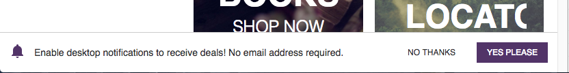

<div class="c-callout c--important">
  <p>
    <strong>Important:</strong> We've removed this article from the site navigation because Mobify projects that were generated after January 2019 do _not_ include the push messaging technology described below. If you are maintaining a project that was generated before January 2019 that _does_ include push messaging, we have left this documentation in place for you.
  </p>
</div>

<div class="c-callout">
  <p>
    <strong>Running commands:</strong> You will need to run all `npm` scripts mentioned in this article
from the `web` directory inside your project directory.
  </p>
</div>

## Before you begin

You will need to have:
- A Mobify Cloud account
- A Mobify Cloud API key
- A project created for you within Mobify Cloud

You will need to:
- Know that the minimum versions for PWA messaging support is [SDK v0.22.1](https://github.com/mobify/progressive-web-sdk/blob/develop/CHANGELOG.md) and [Scaffold v0.22.0](https://github.com/mobify/platform-scaffold/blob/develop/CHANGELOG.md).
- Set up a progressive web app project by following the steps in the [Quick
  Start](../../getting-started/quick-start) guide.
  - You must enable push messaging when running the Mobify Project Generator.
- Configure the Messaging feature for your Mobify Cloud project. Currently,
  this must be done by Mobify. Contact [Mobify support](https://support.mobify.com)
  and ask for this to be done.
- Set up your Mobify Cloud credentials for use with the command-line tools
  included in your project:
  - Run `npm run save-credentials -- -u ` _myEmail@organization.com_ `-k`
    _myAPIkey_

## Project generation
When run, the Mobify Project Generator will ask you whether you want to enable a
messaging integration. Regardless of your answer, the relevant files will still be
generated for push messaging, so you won't have to worry about your answer
if you're unsure of whether your project actually has push messaging in scope for
a future phase. Depending on your answer, the `messagingEnabled` flag in the
`web/package.json` file will be edited with the appropriate value. If you want to
disable push messaging, set that to false and vice versa.

## The messaging configuration file

The Mobify Project Generator will configure your PWA for push messaging based
on the answers you give during the setup process. You can adjust these
settings by editing the messaging configuration file in `web/messaging`
directory inside your project directory. The file is called
`<project-id>.yaml` (where `project-id` is your project's identifier).

## Additional steps for iOS apps

If you _are_ building an iOS application in addition to your PWA, you must
request a certificate file from Apple to authorize Mobify to send push messages
to your iOS app for you.

If you are _not_ building an iOS application in addition to your PWA...
- Remove the `apn_app_id` and `apn_native_certificate_name` values from the
  messaging configuration file
- You do not need to read the next section. Skip to [Uploading your messaging
  configuration](#uploading-your-messaging-configuration).

### Requesting a certificate from Apple

1. Run `npm run messaging:certificate`. This will generate a certificate-request
   file that is signed with a Mobify private key in the `web/messaging`
   directory inside your project directory. It will be named `<app-id>.csr`
   (where `<app-id>` is your iOS application's identifier).
1. Log into your Apple Developer account at
   [https://developer.apple.com/](https://developer.apple.com/).
1. Choose **Certificates, IDs and Profiles** in the sidebar.
1. If you haven't created your App ID, choose **App IDs** in the left column,
   and click the **+** button to add a new App ID.
1. Once your App ID is set up, choose **Production** under **Certificates** in
   the left column, then click the **+** button to add a new iOS certificate.
1. From the **Production** set of types, choose **Apple Push Notification
   service SSL (Sandbox & Production)**. Click **Continue** and choose your App
   ID.
1. Continue to the screen that asks you to upload your certificate request (CSR)
   file. Click **Choose File...** and upload the certificate request file you
   generated in earlier.
1. Download the resulting certificate file. It will be named `production.cer`.
1. Rename the certificate file to `<app-id>.cer` (where `<app-id>` is your iOS
   application's identifier).
1. Copy the renamed file to the `web/messaging` directory inside your project
   directory.

You can now delete the certificate request file because it is only required to
generate the certificate.

You can safely store the certificate file in a version control system since it
is not usable without Mobify's private key. The private key is held in the
Mobify Messaging System and is never downloaded as part of your project.

### Renewing certificates

Apple-issued certificates are valid for one year. When your certificate is close
to expiration, you can renew it by following the steps above to generate a new
certificate-request file, which you can then use to generate a new certificate.

## Uploading your messaging configuration

You must upload your messaging configuration file and certificate file (if used
for iOS messaging) to Mobify's push messaging server whenever you start a new
project and whenever these files are changed.

To upload the files, run `npm run messaging:upload`. The command will report any
informational, warning, and error messages from the upload process and from
validating the uploaded files. If there are any errors reported, your
configuration will not be stored, so you will need to correct the errors and run
the upload command again. If there are no errors reported, then push messaging
has been successfully configured for your project.

## Sending test messages

You can test push messaging by opting-in to push messaging and sending yourself
some messages. To do this, you'll need your `client_id` string &ndash;
a 16-character string that uniquely identifies a subscriber to Mobify push messaging.
This string is stored as `window.Mobify.WebPush.CLIENT_ID` once the
`loader.js` file has been loaded and run.

You can then send a test message using the command `npm run
messaging:testmessage` followed by the `client_id` value.

For example, to send a test message to the client with `client_id` value
`e70163bff27bf1ff`:   

```bash
npm run messaging:testmessage e70163bff27bf1ff
```

You can optionally specify the title, text and icon URL for the test message. To
see the full set of options, use:

```bash
npm run messaging:testmessage -- --help
```

Note that you must put `--` before any test message options because of how `npm
run` works. For example, to specify the title:

```bash
npm run messaging:testmessage e70163bff27bf1ff -- --title 'This is a custom title'
```

## Non-progressive Configuration

Push messaging is configured for desktop (non-PWA) browsers
by editing the `web/non-pwa/non-pwa.js` file. When a project is generated,
and the steps above have been performed to upload the configuration file,
desktop push messaging is already configured, to:

* prompt a user to subscribe for push notifications after three visits
  to the site
* if the user declines to subscribe, then defer another invitation until
  after three more visits
* prompt using an iframe containing a standard message

You can use the test message commands above to send test notifications to
opted-in PWA and non-progressive browsers.

### Customization

The `init` function of `web/non-pwa/non-pwa.js` calls `initMessaging`, passing
the `messagingConfiguration` object. This configuration object contains the
parameters that control how non-progressive Messaging presents the opt-in
prompt. This prompt is called the _ask_, and in non-progressive mode it's
done using an iframe that's displayed at the bottom of a page after a number
of site visits and page views. This is how it might appear in Chrome:



#### Customizing the ask text and styles
In a newly generated project, the HTML for the ask iframe is
taken from `web/non-pwa/default-ask.html` (the styles for this
iframe are in `web/non-pwa/styles`). You can customize these files
to replace the default message and styling. You should preserve
the existing class names such as `js-button-container` and the
`js-allow` and `js-deny` button ids, because SDK code uses them to detect
DOM elements, but you can add extra new class names to any elements.

#### Customizing the ask behaviour
In the `messagingConfiguration` object:
```javascript
const messagingConfiguration = {
    defaultAsk: {
        html: defaultAskHtml,
        auto: true,
        showOnPageCount: 3,
        deferOnDismissal: 3
    }
}
```

##### `defaultAsk`
The `defaultAsk` object contains the parameters for the standard ask iframe:

###### `html` string
This is the HTML for the iframe shown to prompt the user to
opt-in to receive push notifications. By default, this is the contents of
`web/non-pwa/default-ask.html`.

###### `showOnPageCount`
This integer (default value 3) is the number of page views
that pass before the ask is shown. A user who have viewed several pages of
the site is more engaged, and more likely to opt-in. This counter includes
page views across multiple visits to a site.

###### `deferOnDismissal`
This integer (default value 3) sets the number of separate
*site visits* that a user must make after dismissing the ask without
opting-in, before the ask may be shown again. This is set so that a
user isn't re-asked too frequently. A new site visit starts 6 hours after
the last page view on a previous visit.

###### `auto` boolean
This should be set to `true` to have the SDK code handle all
the work of displaying and hiding the ask iframe, and handling subscription
to push notifications if the user responds to the ask.

Setting `auto` to false allows you to customize when the ask is presented.
To do this, you would use the object returned from `initMessaging`. It contains two
values:
* `askFrame` is an `AskFrame` object that manages the behaviour of the standard
  ask iframe (see below). You should use this object to display the ask,
  customizing the iframe HTML as required, because the object manages internal
  state of the Messaging system.
* `currentSubscriptionState` is an object containing these useful values:
  * `pageCount` (integer) is the number of page views in the current site visit
  * `isSubscribed` (boolean) is `true` if the user is already opted-in, and
     `false` if they are not
  * `canSubscribe` (boolean) is `true` if the user can subscribe, or `false`
    if they cannot (for example, if notifications have been blocked for the
    website, or for all websites). If `canSubscribe` is `false`, you should
    not show any ask to the user, because they will be unable to opt-in.

The `AskFrame` object has the following methods (none take any parameters):
* `create` will create the `<iframe>` element
* `setupListeners` hooks up the buttons in the iframe to an event handler which
  will perform the opt-in or dismiss the iframe. Call this after `create`,
  and before `show`. See `web/non-pwa/default-ask.html` as a reference to
  which classes and ids are required on the buttons.
* `show` will show the iframe on the page

## Turning on push messaging

To turn on push messaging after configuring all the required components and setting it up within your project, you'll also need to reach out to your Mobify Customer Success Manager to enable the feature and to also set up Connection Center for your project.

<div id="toc"><p class="u-text-size-smaller u-margin-start u-margin-bottom"><b>IN THIS ARTICLE:</b></p></div>