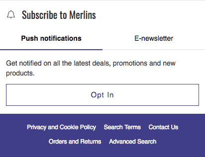
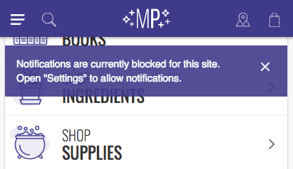

  

    <strong>Important:</strong> We've removed this article from the site navigation because Mobify projects that were generated after January 2019 do _not_ include the push messaging technology described below. If you are maintaining a project that was generated before January 2019 that _does_ include push messaging, we have left this documentation in place for you.
  

Mobify uses a 2-step sign-up flow for push notifications. You can customize the behaviour and design of this flow

Step 1: A banner on your site provides a description of the value proposition for subscribing to push notifications and a button to continue with the subscription flow. There are 2 banner options described below.

Step 2: The browser displays a modal dialog box that asks the user to give the browser permission to send push notifications. If the user blocks push messaging in the browser modal, you will not have another opportunity to ask the user to subscribe unless they specifically unblock your site.

## Banner Options

### Inline Ask

The [InlineAsk](../../components/#!/InlineAsk) component is typically included “inline” in the app as a compelling way to engage with visitors. For example, it might be presented to visitors in a newsletter email section as a way to hear about deals and news

<figure class="u-text-align-center">
    

        
    

    <figcaption>Inline Ask Component</figcaption>
</figure>

You’ll want to decide:

| Item        | Description           | Default / Recommendation  |
| ------------- |-------------| -----|
| Location      | Where on your site to put in the InlineAsk | N/A |
| Button Copy   | Copy on the button they click to subscribe      |   “Opt In” |
| Description Copy | Copy that describes what the visitor is subscribing to      | “Get notified on all the latest deals, promotions and new products.” |
| Blocked Notification Copy | Copy to display in the notification shown to visitors when tapping the opt in button after having blocked push notifications  | “Notifications are currently blocked for this site. Open "Settings" to allow notifications.”
| Success Copy | The copy to show if the visitor successfully subscribes, or if the visitor is already subscribed  | “Successfully subscribed”
| Welcome Push | The title and body for the push notification sent to confirm your shoppers has been subscribed. You can also choose not to send this welcome message | “Thank you! We’re super excited to have you here and tell you all the latest and greatest!”
| Notification Logo | This is the default logo that will appear on all your notifications including the Welcome Push. It must be 192px by 192px for Chrome (but get 256x256 for retina and we can change it ourselves) -- MUST BE SQUARE. As stated earlier, the Safari asset is inflexible and should not be changed | N/A

### Banner Ask

The [BannerAsk (aka DefaultAsk)](../../components/#!/DefaultAsk) component appears as a sheet at the bottom of the page. Uniquely, it provides a button to dismiss the subscription flow and is typically displayed after the user views a predefined number of pages.

<figure class="u-text-align-center">
    

        
    

    <figcaption>Banner Ask Component</figcaption>
</figure>

Choosing to dismiss the subscription flow will trigger a visit countdown until the DefaultAsk component is shown again. The number of visits is configured via the component’s deferOnDismissal prop.

You’ll want to decide:

| Item        | Description           | Default / Recommendation  |
| ------------- |-------------| -----|
| Accept Copy   | Copy on the button they click to subscribe | “Yes Please” |
| Dismiss Copy  | Copy on the button they click to dismiss the banner | “No Thanks” |
| Description Copy | Copy that describes what the visitor is subscribing to | “Enable push notifications to receive deals! No email address required.” |
| Defer Option | Sets the number of site visits before the visitor will be shown this ask again | 3 |
| Page Count | After how many page visits the ask should be shown | 3 |
| Color | The color on the banner | same as branding website |
| Font | The font on the banner | same as branding website |
| Placement | Whether you would like the banner to come down from the top or bottom of the screen. Bottom is recommended for the best user experience | bottom |
| Welcome Push | The title and body for the push notification sent to confirm your shoppers has been subscribed. You can also choose not to send this welcome message | “Thank you! We’re super excited to have you here and tell you all the latest and greatest!” |
| Notification Logo | This is the default logo that will appear on all your notifications including the Welcome Push. It must be 192px by 192px for Chrome (but get 256x256 for retina and we can change it ourselves) -- MUST BE SQUARE. As stated earlier, the Safari asset is inflexible and should not be changed | N/A
