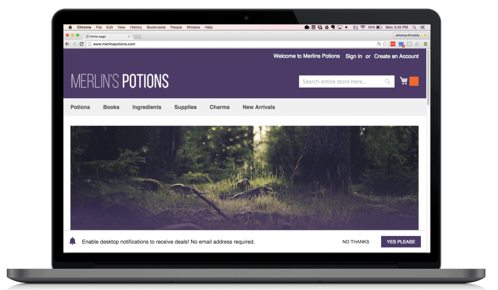

  

    <strong>Important:</strong> We've removed this article from the site navigation because Mobify projects that were generated after January 2019 do _not_ include the push messaging technology described below. If you are maintaining a project that was generated before January 2019 that _does_ include push messaging, we have left this documentation in place for you.
  

Push notifications let businesses effectively engage and re-engage visitors on
both desktop and progressive mobile with customized, compelling content.

Web push notifications act in the same way as notifications from an installed
app. The user is presented with a short message with a call to action, usually
linking to a page on your website. Users do not need to have your website or
the browser running to receive a message, and they do not need to be using
their phone to receive the message.

A key difference between web push notifications and
notifications from an installed app is the opt-in flow, in which
the user signs up for notifications. Opting in to
push notifications for an app is often done by presenting a pop-up message
the first time the app is used after installation. On the web, we want to
consider users who are experiencing your brand for the first time.
We use a 2 step signup approach that ensures users are engaged before
asking them to commit to receiving notifications, and that we
are not interrupting their shopping journey. This results in a highly engaged,
connected subscriber base.

